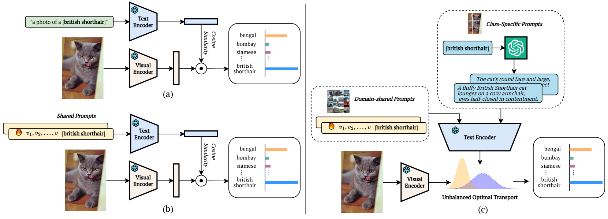
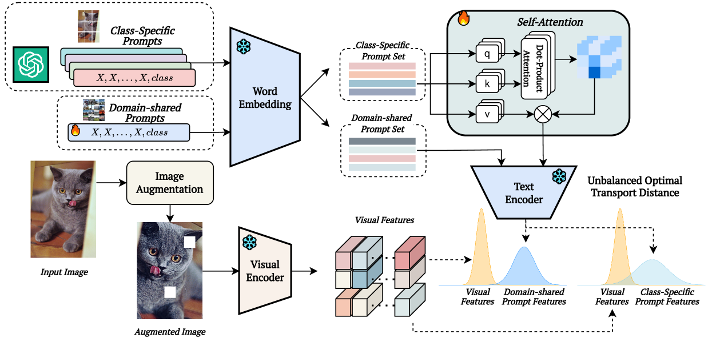
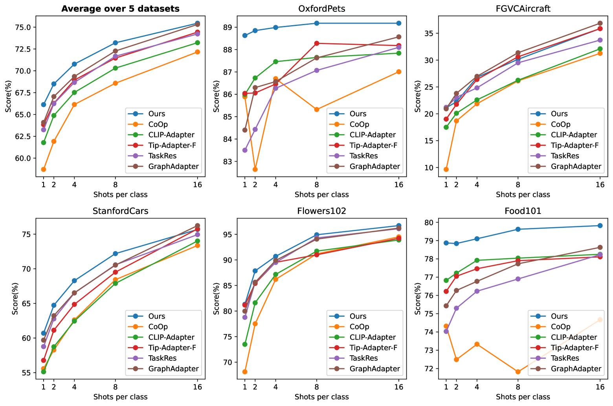
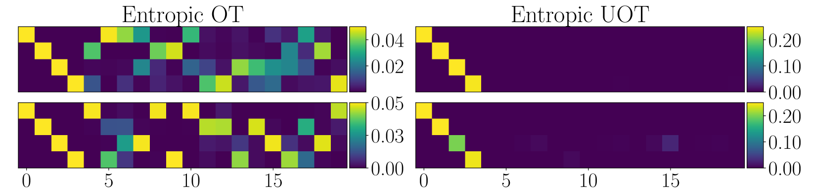

# Dude：一种双分布感知上下文提示学习方法，专为大型视觉-语言模型设计。

发布时间：2024年07月05日

`LLM应用` `计算机视觉` `机器学习`

> Dude: Dual Distribution-Aware Context Prompt Learning For Large Vision-Language Model

# 摘要

> 提示学习方法因其能够利用预训练知识和新领域少量数据定制大型视觉-语言模型而备受瞩目。然而，现有方法在细粒度分类任务上常因区分性不足而受限。为此，我们提出一个结合领域通用与类特有上下文的双重框架，后者由GPT等LLM生成，以增强特征表示。我们还引入不平衡最优传输（UOT）理论，量化提示与视觉标记关系，通过部分匹配有效对齐不同分布下的元素，尤其适用于处理噪声。UOT与图像增强结合，扩大样本池并保持输入间合理距离。实验证明，我们的模型在少样本分类等任务中表现卓越。

> Prompt learning methods are gaining increasing attention due to their ability to customize large vision-language models to new domains using pre-trained contextual knowledge and minimal training data. However, existing works typically rely on optimizing unified prompt inputs, often struggling with fine-grained classification tasks due to insufficient discriminative attributes. To tackle this, we consider a new framework based on a dual context of both domain-shared and class-specific contexts, where the latter is generated by Large Language Models (LLMs) such as GPTs. Such dual prompt methods enhance the model's feature representation by joining implicit and explicit factors encoded in LLM knowledge. Moreover, we formulate the Unbalanced Optimal Transport (UOT) theory to quantify the relationships between constructed prompts and visual tokens. Through partial matching, UOT can properly align discrete sets of visual tokens and prompt embeddings under different mass distributions, which is particularly valuable for handling irrelevant or noisy elements, ensuring that the preservation of mass does not restrict transport solutions. Furthermore, UOT's characteristics integrate seamlessly with image augmentation, expanding the training sample pool while maintaining a reasonable distance between perturbed images and prompt inputs. Extensive experiments across few-shot classification and adapter settings substantiate the superiority of our model over current state-of-the-art baselines.

[Arxiv](https://arxiv.org/abs/2407.04489)