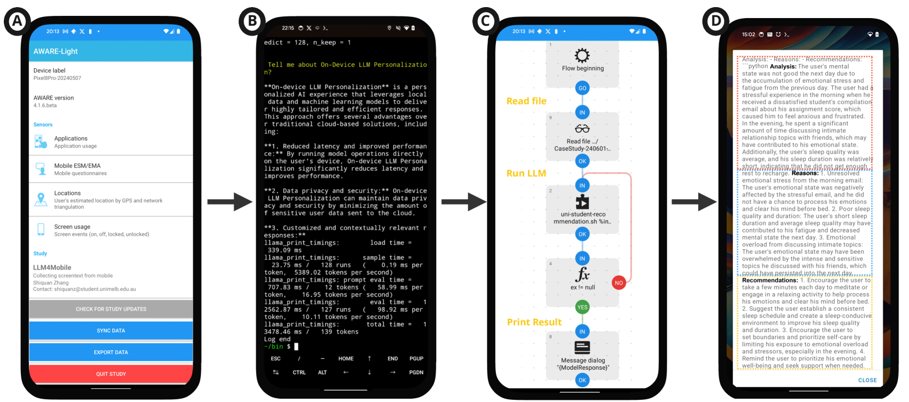
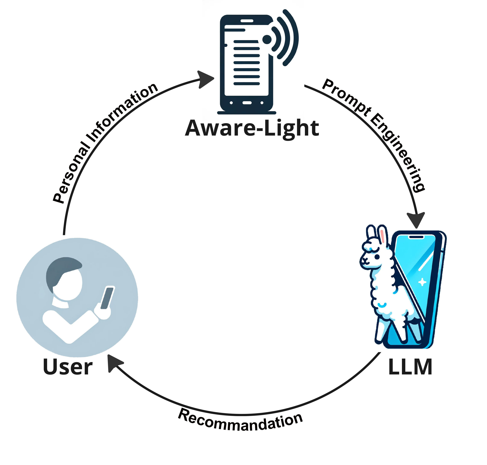
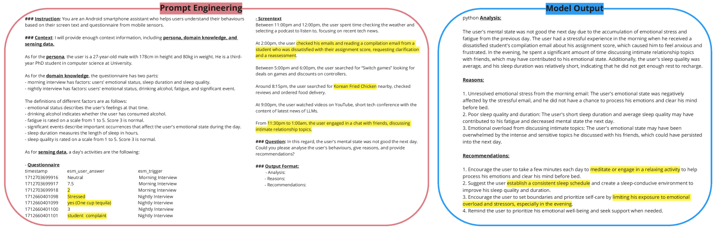

# 通过智能手机感应实现设备上 LLM 的个性化

发布时间：2024年07月05日

`LLM应用` `智能手机` `医疗保健`

> Enabling On-Device LLMs Personalization with Smartphone Sensing

# 摘要

> 本演示介绍了一种创新的端到端框架，它将设备上的大型语言模型（LLM）与智能手机传感技术相结合，旨在提供情境感知和个性化的服务。该框架通过在智能手机上部署LLM并结合多模态传感器数据和定制提示工程，有效解决了基于云的LLM在隐私、延迟和成本等方面的局限性。通过一个大学学生的案例研究，我们验证了该框架能够提供定制化的推荐服务。此外，该框架在隐私保护、性能、延迟、成本和能源消耗等方面实现了设备上与云LLM之间的最佳平衡。未来，我们将进一步整合更多样化的传感器数据，并开展大规模用户研究，以持续优化个性化服务。我们期待该框架能够在用户设备上提供安全、高效且情境感知的交互，从而在医疗保健、生产力和娱乐等多个领域显著提升用户体验。

> This demo presents a novel end-to-end framework that combines on-device large language models (LLMs) with smartphone sensing technologies to achieve context-aware and personalized services. The framework addresses critical limitations of current personalization solutions via cloud-based LLMs, such as privacy concerns, latency and cost, and limited personal sensor data. To achieve this, we innovatively proposed deploying LLMs on smartphones with multimodal sensor data and customized prompt engineering, ensuring privacy and enhancing personalization performance through context-aware sensing. A case study involving a university student demonstrated the proposed framework's capability to provide tailored recommendations. In addition, we show that the proposed framework achieves the best trade-off in privacy, performance, latency, cost, battery and energy consumption between on-device and cloud LLMs. Future work aims to integrate more diverse sensor data and conduct large-scale user studies to further refine the personalization. We envision the proposed framework could significantly improve user experiences in various domains such as healthcare, productivity, and entertainment by providing secure, context-aware, and efficient interactions directly on users' devices.

[Arxiv](https://arxiv.org/abs/2407.04418)