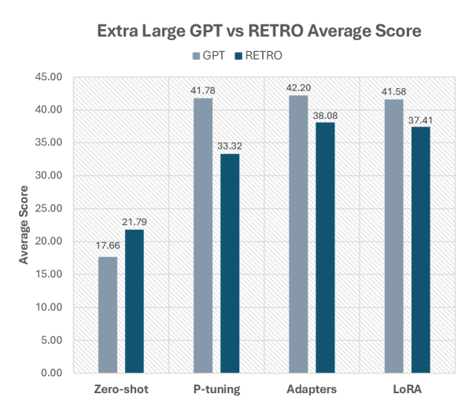

# GPT 与 RETRO：探寻检索与高效参数微调的融合之道

发布时间：2024年07月05日

`RAG` `人工智能` `计算机科学`

> GPT vs RETRO: Exploring the Intersection of Retrieval and Parameter-Efficient Fine-Tuning

# 摘要

> 参数高效微调 (PEFT) 和检索增强生成 (RAG) 已成为适应大型语言模型同时降低计算需求的流行方法。本文中，我们采用 PEFT 方法（包括 P-tuning、Adapters 和 LoRA）对不同规模的修改版 RETRO 和基准 GPT 模型进行调整，参数范围从 8.23 亿到 480 亿。结果显示，RETRO 模型因其独特预训练过程在零-shot 环境下表现更佳，而 GPT 模型通过 PEFT 展现出更高性能潜力。研究还发现，80 亿参数模型在成本与性能间取得最佳平衡，P-tuning 则稍逊于其他 PEFT 技术。此外，我们对比了 PEFT 在指令调整 RETRO 模型与基础 RETRO 模型上的应用效果。本研究首次全面比较了 PEFT 与 RAG 结合在 GPT 和 RETRO 模型上的表现，凸显了各方法的相对优势。

> Parameter-Efficient Fine-Tuning (PEFT) and Retrieval-Augmented Generation (RAG) have become popular methods for adapting large language models while minimizing compute requirements. In this paper, we apply PEFT methods (P-tuning, Adapters, and LoRA) to a modified Retrieval-Enhanced Transformer (RETRO) and a baseline GPT model across several sizes, ranging from 823 million to 48 billion parameters. We show that RETRO models outperform GPT models in zero-shot settings due to their unique pre-training process but GPT models have higher performance potential with PEFT. Additionally, our study indicates that 8B parameter models strike an optimal balance between cost and performance and P-tuning lags behind other PEFT techniques. We further provide a comparative analysis of between applying PEFT to an Instruction-tuned RETRO model and base RETRO model. This work presents the first comprehensive comparison of various PEFT methods integrated with RAG, applied to both GPT and RETRO models, highlighting their relative performance.

[Arxiv](https://arxiv.org/abs/2407.04528)