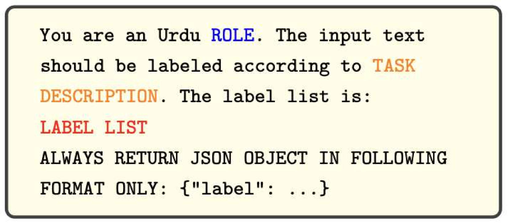

# 通用型与专家型：探究大型语言模型在乌尔都语领域的评估

发布时间：2024年07月05日

`LLM应用` `机器学习`

> Generalists vs. Specialists: Evaluating Large Language Models for Urdu

# 摘要

> 本文对比了通用预训练模型 GPT-4-Turbo 和 Llama-3-8b-Instruct 与针对特定任务优化的专用模型 XLM-Roberta-large、mT5-large 和 Llama-3-8b-Instruct，在乌尔都语的七项分类和六项生成任务上的表现。乌尔都语虽有 7000 万母语者，但在 NLP 领域代表性不足。尽管 LLMs 不断进步，其在低资源语言如乌尔都语的表现仍需探索。我们还进行了生成任务的人工评估，并与 GPT-4-Turbo 和 Llama-3-8b-Instruct 的评估结果对比。结果显示，专用模型在各任务中表现更佳，且 GPT-4-Turbo 的评估更贴近人工评估。本文为 NLP 社区提供了关于 LLMs 在低资源语言上效能的宝贵见解。

> In this paper, we compare general-purpose pretrained models, GPT-4-Turbo and Llama-3-8b-Instruct with special-purpose models fine-tuned on specific tasks, XLM-Roberta-large, mT5-large, and Llama-3-8b-Instruct. We focus on seven classification and six generation tasks to evaluate the performance of these models on Urdu language. Urdu has 70 million native speakers, yet it remains underrepresented in Natural Language Processing (NLP). Despite the frequent advancements in Large Language Models (LLMs), their performance in low-resource languages, including Urdu, still needs to be explored. We also conduct a human evaluation for the generation tasks and compare the results with the evaluations performed by GPT-4-Turbo and Llama-3-8b-Instruct. We find that special-purpose models consistently outperform general-purpose models across various tasks. We also find that the evaluation done by GPT-4-Turbo for generation tasks aligns more closely with human evaluation compared to the evaluation by Llama-3-8b-Instruct. This paper contributes to the NLP community by providing insights into the effectiveness of general and specific-purpose LLMs for low-resource languages.

[Arxiv](https://arxiv.org/abs/2407.04459)