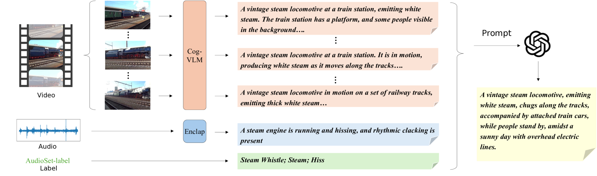
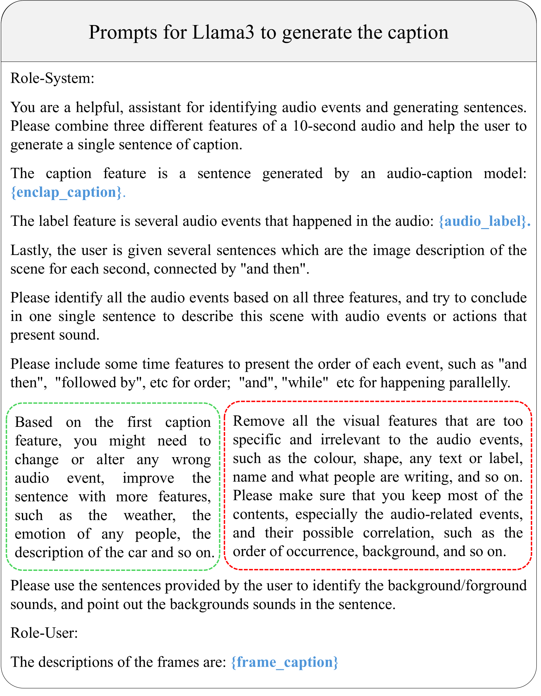

# 利用视觉增强字幕提升音频生成效果

发布时间：2024年07月05日

`LLM应用` `音频处理` `人工智能`

> Improving Audio Generation with Visual Enhanced Caption

# 摘要

> 生成模型在音频生成领域取得了显著进展，但在应对复杂详细的提示时仍显不足，可能导致性能下降。我们认为，这主要归咎于训练数据的质量与数量不足。为此，我们致力于构建一个大规模、高质量的音频数据集，并配备详尽的说明，以提升音频生成模型的表现。通过自动化流程，我们利用大型语言模型将视觉、音频描述及标签转化为全面描述，为视听数据集增添细节。我们推出的Sound-VECaps数据集，包含166万对高质量音频与详细说明，涵盖事件顺序、地点及环境等多方面信息。实验表明，该数据集能显著增强模型对复杂提示的理解与音频生成能力，全面提升系统性能。此外，我们在多个音频-语言任务中进行了深入分析，揭示了其在音频-文本表示学习领域的广阔前景。相关数据集与模型已在线开放。

> Generative models have shown significant achievements in audio generation tasks. However, existing models struggle with complex and detailed prompts, leading to potential performance degradation. We hypothesize that this problem stems from the low quality and relatively small quantity of training data. In this work, we aim to create a large-scale audio dataset with rich captions for improving audio generation models. We develop an automated pipeline to generate detailed captions for audio-visual datasets by transforming predicted visual captions, audio captions, and tagging labels into comprehensive descriptions using a Large Language Model (LLM). We introduce Sound-VECaps, a dataset comprising 1.66M high-quality audio-caption pairs with enriched details including audio event orders, occurred places and environment information. We demonstrate that training with Sound-VECaps significantly enhances the capability of text-to-audio generation models to comprehend and generate audio from complex input prompts, improving overall system performance. Furthermore, we conduct ablation studies of Sound-VECaps across several audio-language tasks, suggesting its potential in advancing audio-text representation learning. Our dataset and models are available online.

[Arxiv](https://arxiv.org/abs/2407.04416)