# Lazarus：通过自适应专家部署，实现混合专家模型的弹性与韧性训练。

发布时间：2024年07月05日

`LLM应用` `计算机科学` `云计算`

> Lazarus: Resilient and Elastic Training of Mixture-of-Experts Models with Adaptive Expert Placement

# 摘要

> 稀疏激活的专家混合（MoE）架构因其计算成本的亚线性缩放特性，越来越多地被用于扩展大型语言模型（LLMs）。然而，随着训练规模的扩大，频繁的失败仍然带来重大挑战。即使是一次失败的成本也是巨大的，因为所有GPU都需要空闲等待直到失败被解决，可能会丢失大量的训练进度，因为训练必须从检查点重新开始。现有的高效容错训练解决方案要么缺乏弹性，要么依赖于将弹性构建到流水线并行中，但由于MoE架构采用的专家并行策略，这些方案无法应用于MoE模型。我们提出了Lazarus，一个用于MoE模型的弹性训练系统。Lazarus自适应地分配专家副本以解决专家工作负载的固有不平衡问题，并加速训练，同时开发了一种可证明的最优专家放置算法，以最大化失败时的恢复概率。通过自适应专家放置和灵活的令牌调度器，Lazarus在失败后也能充分利用所有可用节点，不留任何GPU空闲。我们的评估显示，在频繁节点失败和实际现货实例跟踪下，Lazarus的表现优于现有的MoE训练系统，分别高达5.7倍和3.4倍。

> Sparsely-activated Mixture-of-Experts (MoE) architecture has increasingly been adopted to further scale large language models (LLMs) due to its sub-linear scaling for computation costs. However, frequent failures still pose significant challenges as training scales. The cost of even a single failure is significant, as all GPUs need to wait idle until the failure is resolved, potentially losing considerable training progress as training has to restart from checkpoints. Existing solutions for efficient fault-tolerant training either lack elasticity or rely on building resiliency into pipeline parallelism, which cannot be applied to MoE models due to the expert parallelism strategy adopted by the MoE architecture.
  We present Lazarus, a system for resilient and elastic training of MoE models. Lazarus adaptively allocates expert replicas to address the inherent imbalance in expert workload and speeds-up training, while a provably optimal expert placement algorithm is developed to maximize the probability of recovery upon failures. Through adaptive expert placement and a flexible token dispatcher, Lazarus can also fully utilize all available nodes after failures, leaving no GPU idle. Our evaluation shows that Lazarus outperforms existing MoE training systems by up to 5.7x under frequent node failures and 3.4x on a real spot instance trace.

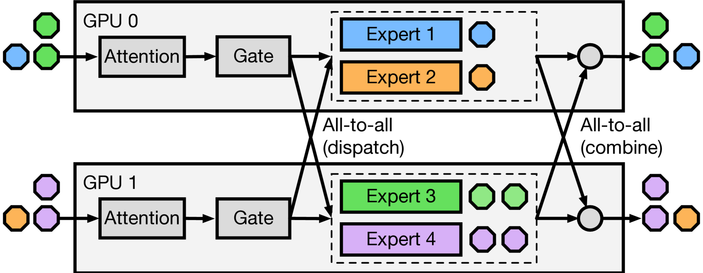

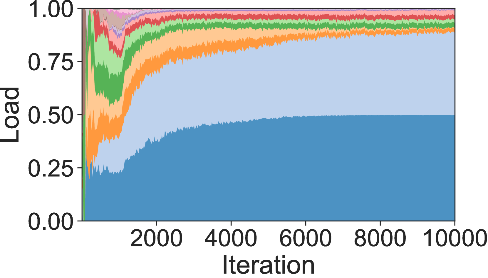

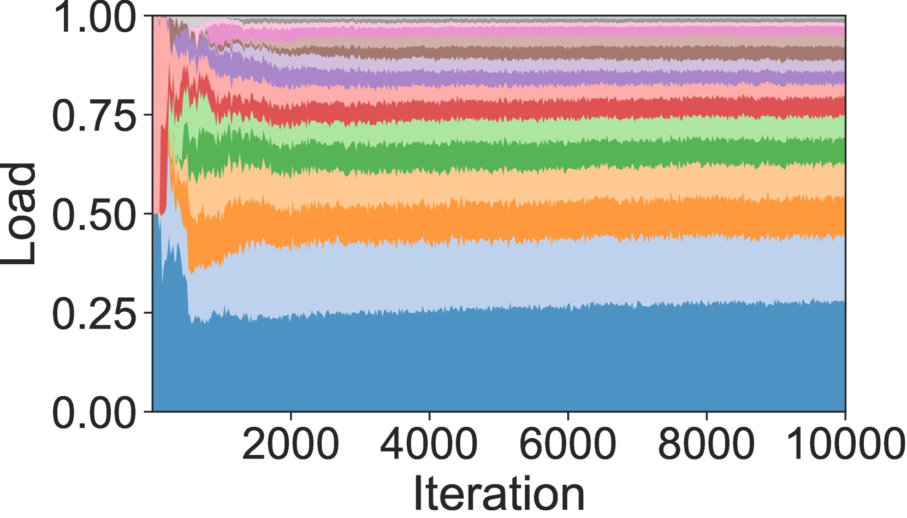

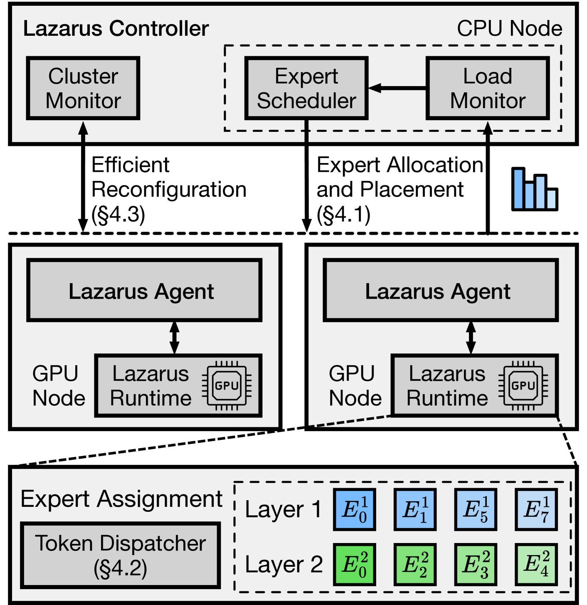

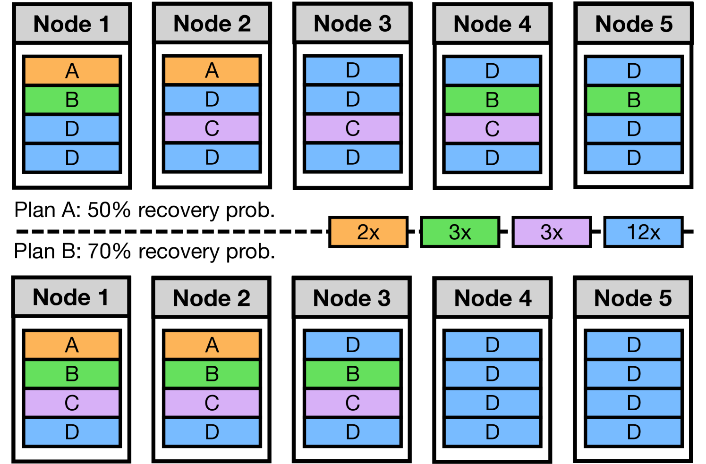

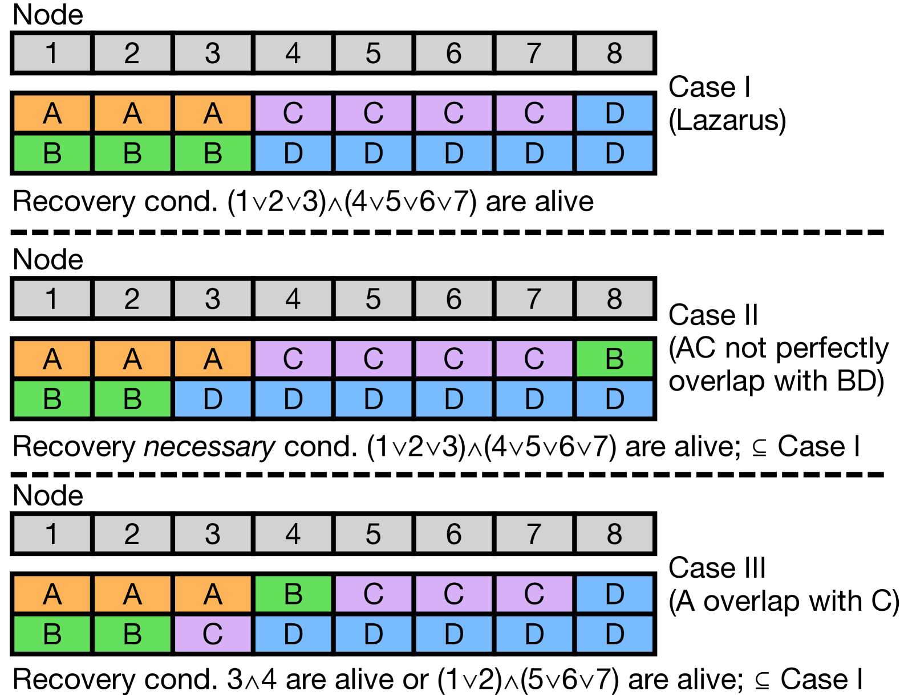

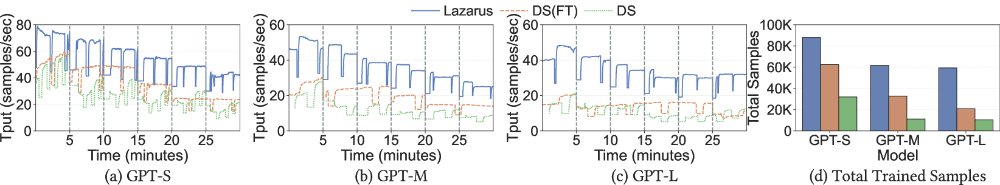

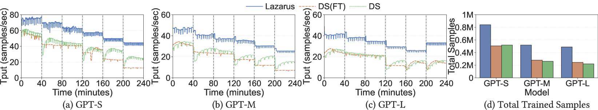

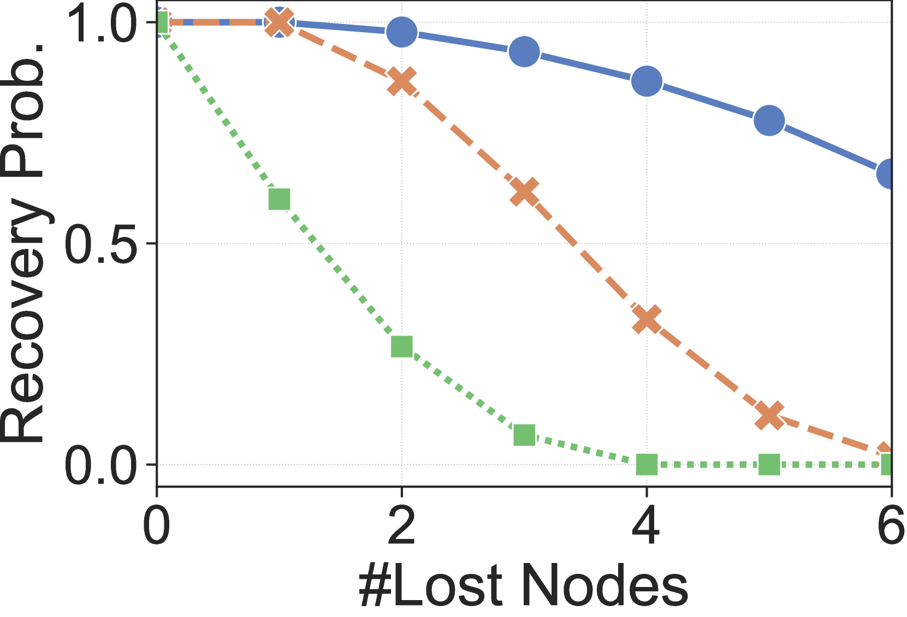

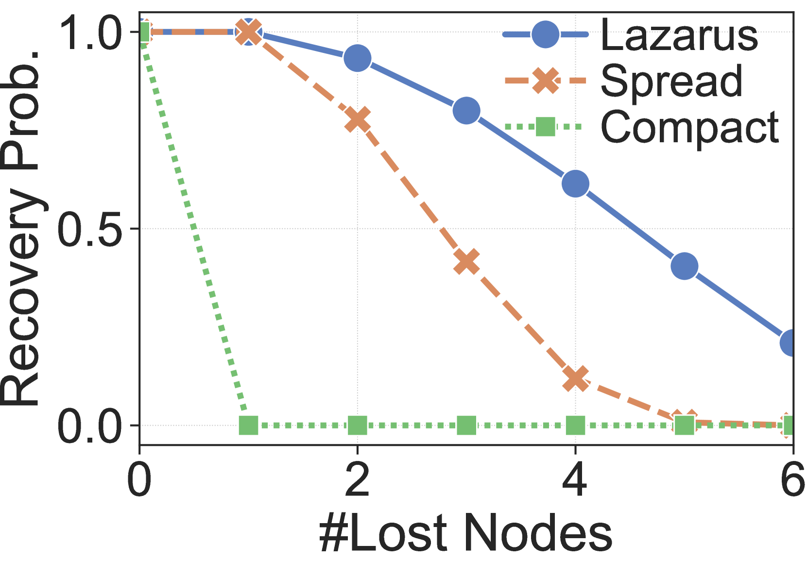

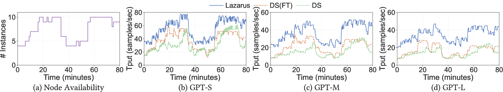

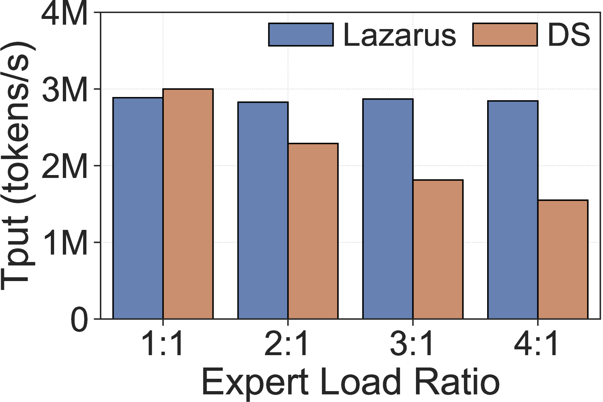

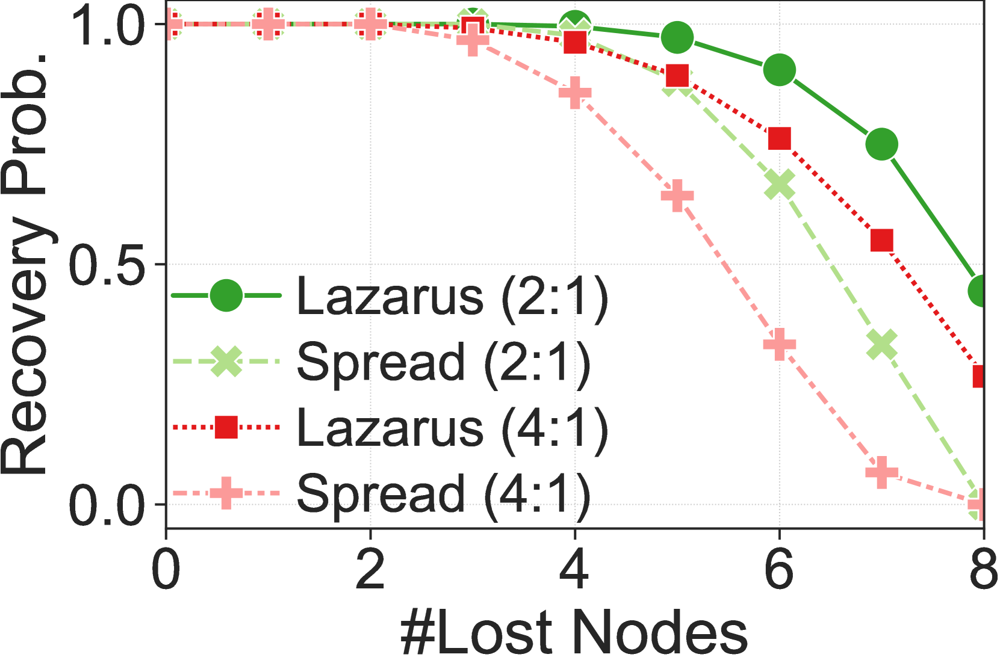

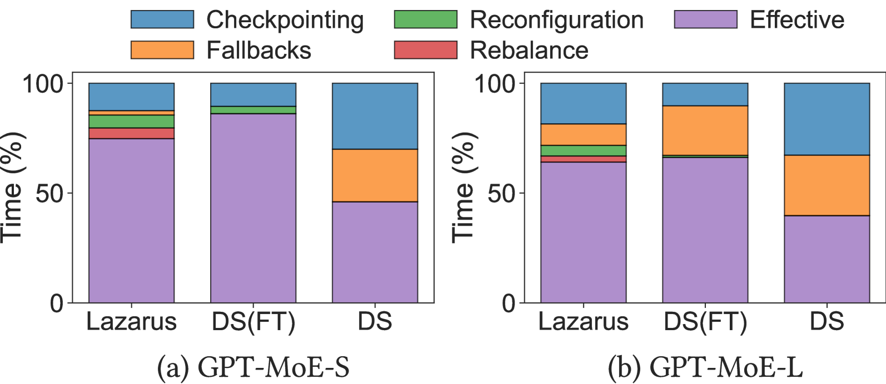

[Arxiv](https://arxiv.org/abs/2407.04656)