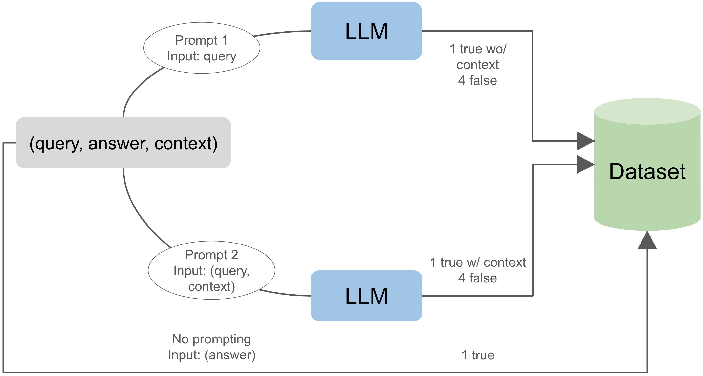

# 借助图结构，我们能够精准识别大型语言模型中的幻觉现象。

发布时间：2024年07月05日

`LLM应用` `客户服务`

> Leveraging Graph Structures to Detect Hallucinations in Large Language Models

# 摘要

> 大型语言模型在多个领域大显身手，如客户服务、内容创作、教育辅导和财务指导。但它们的一个明显缺陷是容易产生“幻觉”，这降低了信息的可信度，影响了决策和用户信任。为此，我们提出了一种新方法，通过分析潜在空间的结构，识别幻觉与非幻觉生成之间的关联。我们构建了一个图结构，连接嵌入空间中相近的生成内容。同时，我们采用图注意力网络，通过消息传递机制整合邻近节点的信息，并根据相关性赋予不同节点不同的重要性。研究显示：1) 潜在空间中确实存在区分两种生成的结构，2) 图注意力网络能学习并泛化这一结构至新内容，3) 结合对比学习能增强方法的稳健性。在基于证据的基准测试中，即使不依赖搜索方法，我们的模型表现依旧出色。

> Large language models are extensively applied across a wide range of tasks, such as customer support, content creation, educational tutoring, and providing financial guidance. However, a well-known drawback is their predisposition to generate hallucinations. This damages the trustworthiness of the information these models provide, impacting decision-making and user confidence. We propose a method to detect hallucinations by looking at the structure of the latent space and finding associations within hallucinated and non-hallucinated generations. We create a graph structure that connects generations that lie closely in the embedding space. Moreover, we employ a Graph Attention Network which utilizes message passing to aggregate information from neighboring nodes and assigns varying degrees of importance to each neighbor based on their relevance. Our findings show that 1) there exists a structure in the latent space that differentiates between hallucinated and non-hallucinated generations, 2) Graph Attention Networks can learn this structure and generalize it to unseen generations, and 3) the robustness of our method is enhanced when incorporating contrastive learning. When evaluated against evidence-based benchmarks, our model performs similarly without access to search-based methods.

[Arxiv](https://arxiv.org/abs/2407.04485)