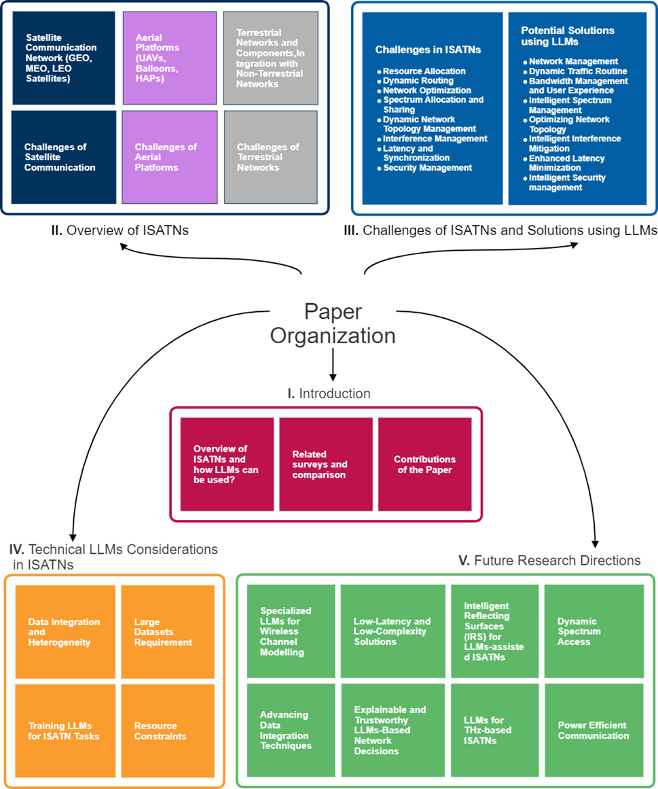
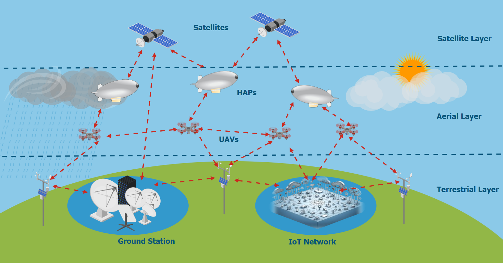
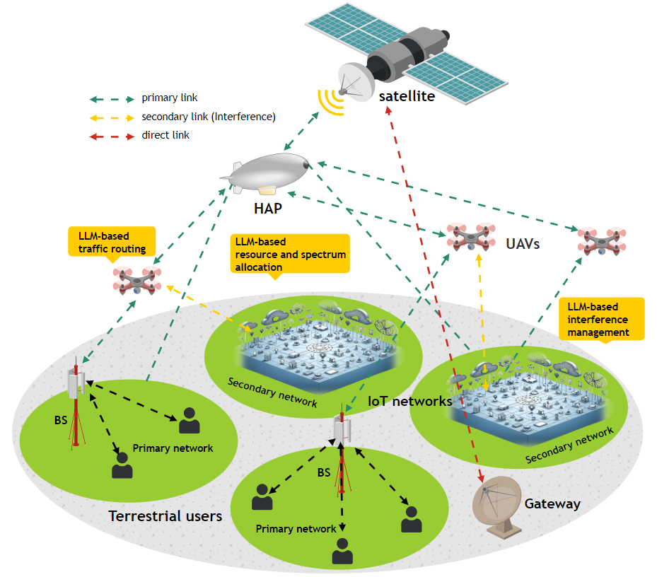
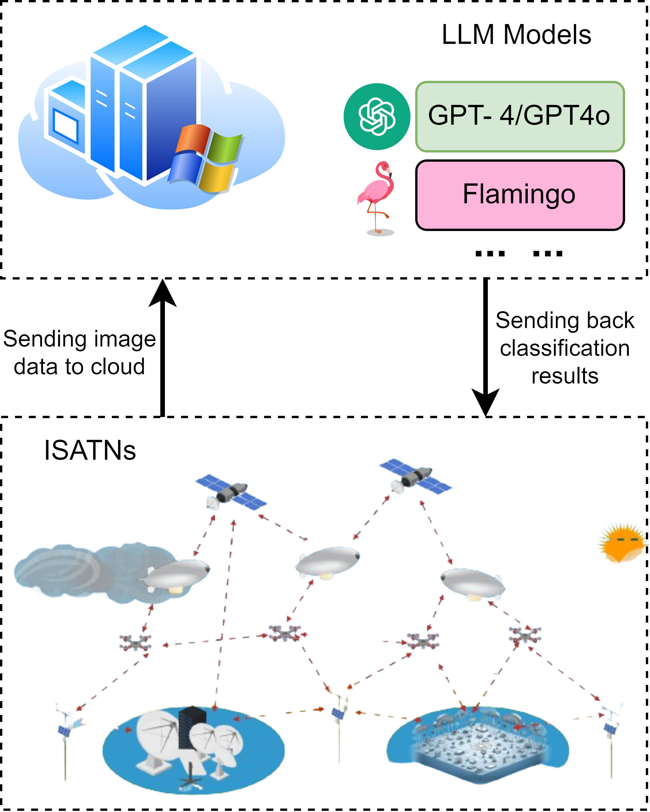
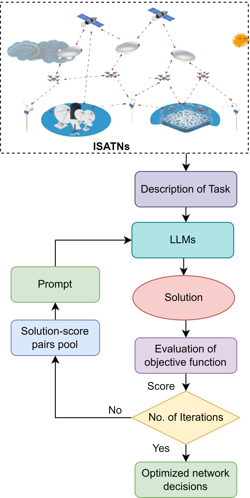
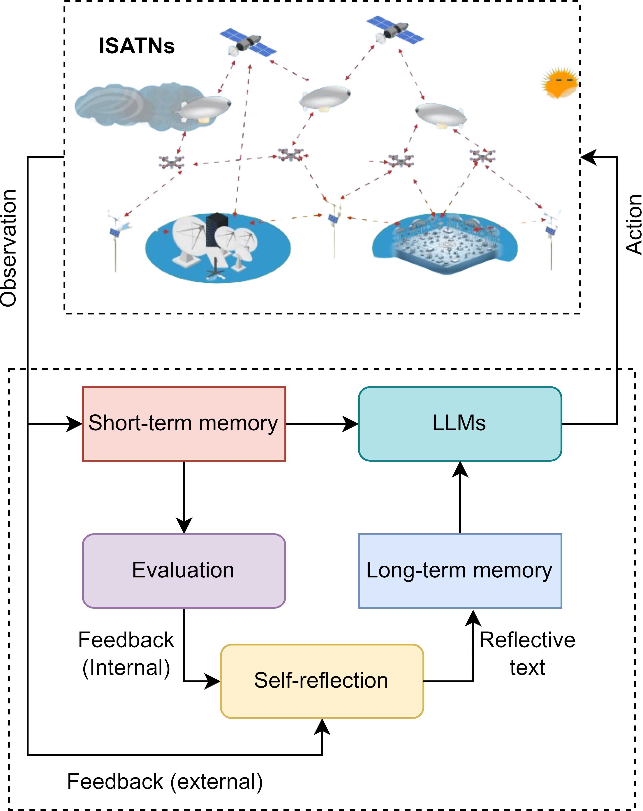

# 大型语言模型在综合卫星-空中-地面网络中的应用：探索最新进展与未来发展方向

发布时间：2024年07月05日

`LLM应用` `网络管理`

> Leveraging Large Language Models for Integrated Satellite-Aerial-Terrestrial Networks: Recent Advances and Future Directions

# 摘要

> 集成卫星、航空和地面网络（ISATNs）通过融合多种通信技术，确保了不同高度和平台间的无缝连接。本文探讨了将大型语言模型（LLMs）融入ISATNs的变革潜力，借助先进的人工智能和机器学习技术，提升网络性能。我们概述了ISATNs的架构，并强调LLMs在优化数据流、信号处理和网络管理中的关键作用，助力5G/6G通信技术的发展。通过全面分析ISATN组件，我们评估了LLMs如何突破传统数据传输和处理的瓶颈。本文还深入探讨了ISATNs中的网络管理挑战，强调了复杂资源分配、流量路由和安全管理的必要性，以确保在各种条件下实现无缝连接和最佳性能。同时，我们考察了LLMs集成中的技术难题，如数据集成、可扩展性、决策延迟及系统健壮性和容错设计。研究还指出了未来研究方向，以充分发挥LLMs在ISATNs中的潜力，这对于提升网络可靠性、优化性能及构建真正互联智能的全球网络系统至关重要。

> Integrated satellite, aerial, and terrestrial networks (ISATNs) represent a sophisticated convergence of diverse communication technologies to ensure seamless connectivity across different altitudes and platforms. This paper explores the transformative potential of integrating Large Language Models (LLMs) into ISATNs, leveraging advanced Artificial Intelligence (AI) and Machine Learning (ML) capabilities to enhance these networks. We outline the current architecture of ISATNs and highlight the significant role LLMs can play in optimizing data flow, signal processing, and network management to advance 5G/6G communication technologies through advanced predictive algorithms and real-time decision-making. A comprehensive analysis of ISATN components is conducted, assessing how LLMs can effectively address traditional data transmission and processing bottlenecks. The paper delves into the network management challenges within ISATNs, emphasizing the necessity for sophisticated resource allocation strategies, traffic routing, and security management to ensure seamless connectivity and optimal performance under varying conditions. Furthermore, we examine the technical challenges and limitations associated with integrating LLMs into ISATNs, such as data integration for LLM processing, scalability issues, latency in decision-making processes, and the design of robust, fault-tolerant systems. The study also identifies key future research directions for fully harnessing LLM capabilities in ISATNs, which is crucial for enhancing network reliability, optimizing performance, and achieving a truly interconnected and intelligent global network system.

[Arxiv](https://arxiv.org/abs/2407.04581)