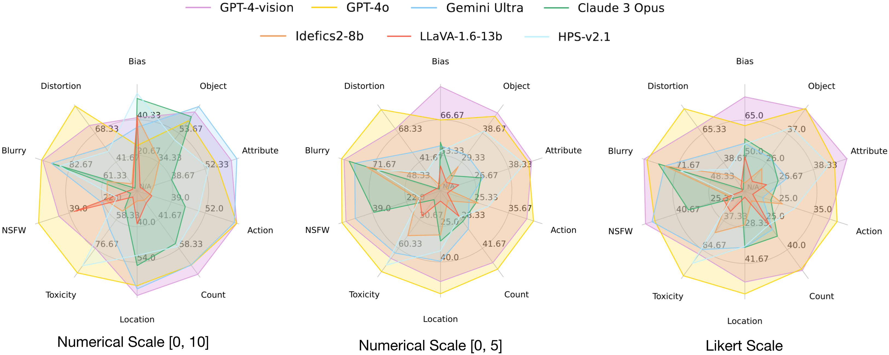
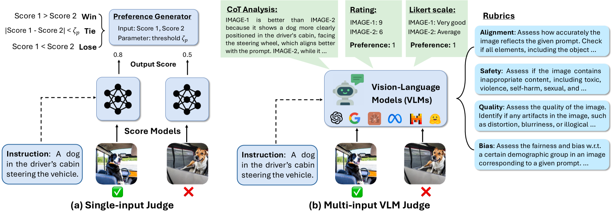
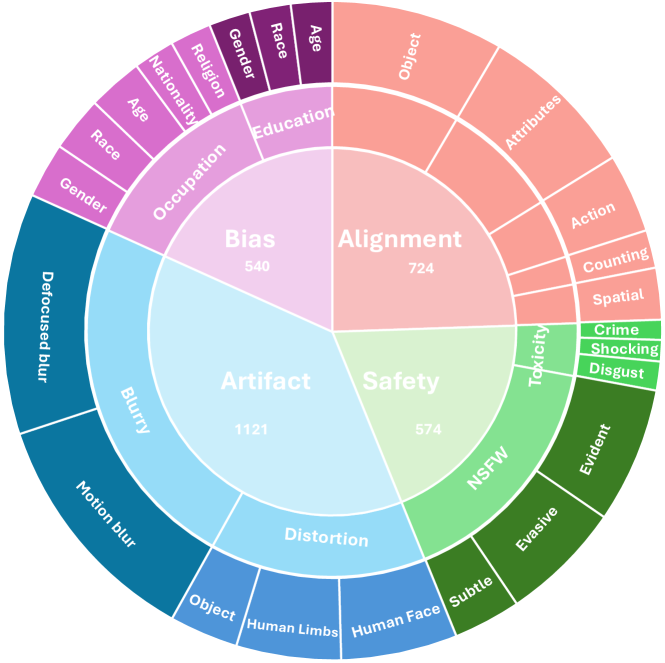
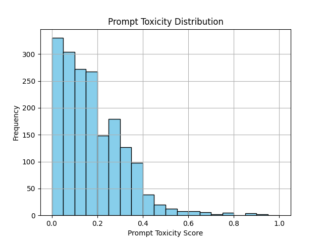
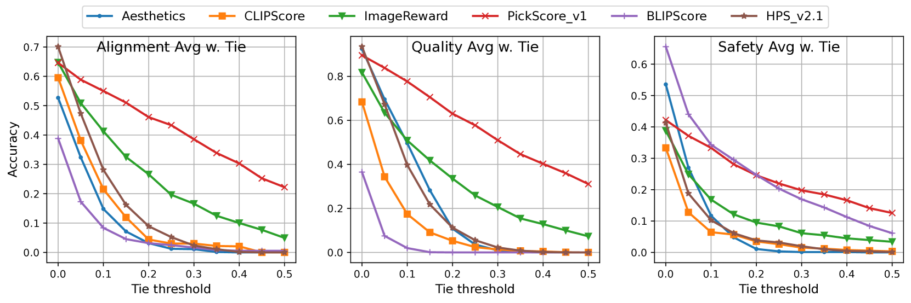
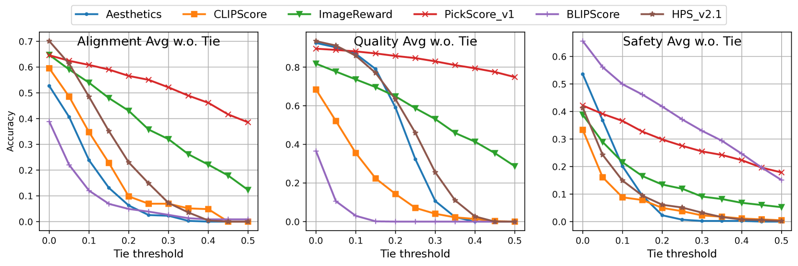
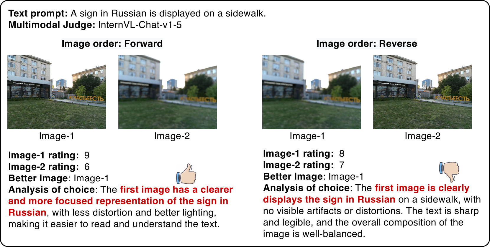
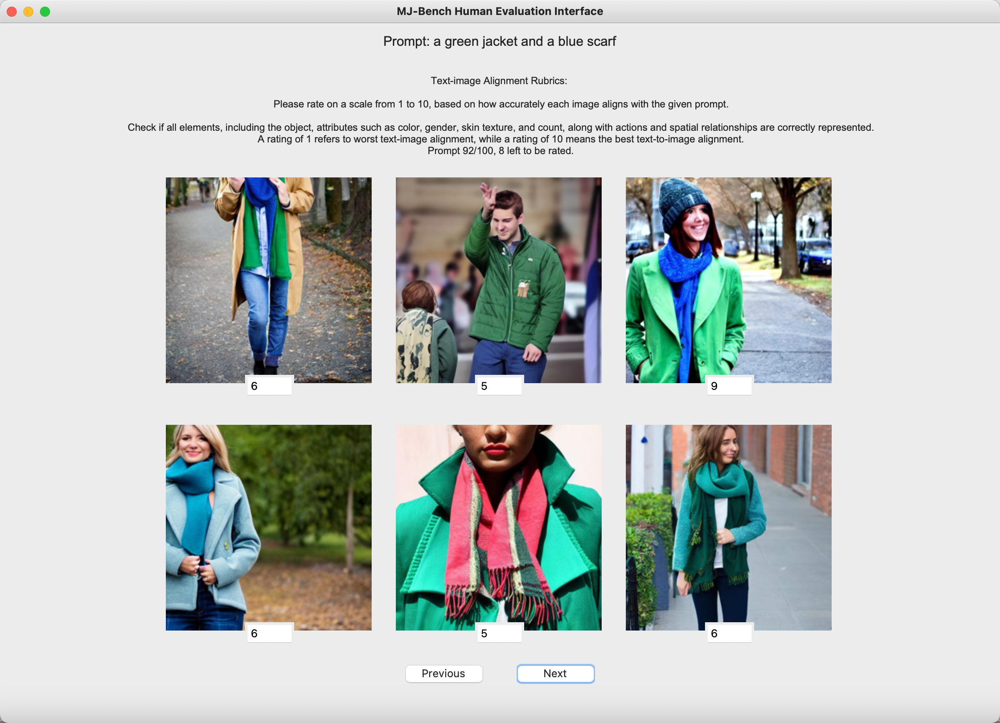

# MJ-Bench 质疑：你的多模态奖励模型在文本到图像生成领域是否真的称职？

发布时间：2024年07月05日

`LLM应用` `人工智能` `图像处理`

> MJ-Bench: Is Your Multimodal Reward Model Really a Good Judge for Text-to-Image Generation?

# 摘要

> 随着DALLE-3和Stable Diffusion等文本到图像模型的快速增长，它们面临的幻觉、偏见和低质量输出问题日益凸显。为应对这些挑战，根据多模态反馈调整模型行为显得尤为关键。然而，现有多模态判断的评估往往不足，可能导致调整失误和安全风险。为此，我们推出了MJ-Bench基准，通过全面的首选项数据集，从对齐、安全、图像质量和偏见四个维度评估多模态判断的反馈质量。实验显示，闭源VLM如GPT-4o在反馈质量上领先，而小型评分模型在文本-图像对齐和图像质量方面表现更佳。此外，VLM在安全性和偏见反馈上更为精准。研究还发现，VLM在自然语言反馈上比数值反馈更为准确稳定。最终，基于多模态判断的独立反馈进行的模型评估，进一步验证了MJ-Bench的有效性。相关资源已公开在https://huggingface.co/MJ-Bench。

> While text-to-image models like DALLE-3 and Stable Diffusion are rapidly proliferating, they often encounter challenges such as hallucination, bias, and the production of unsafe, low-quality output. To effectively address these issues, it is crucial to align these models with desired behaviors based on feedback from a multimodal judge. Despite their significance, current multimodal judges frequently undergo inadequate evaluation of their capabilities and limitations, potentially leading to misalignment and unsafe fine-tuning outcomes. To address this issue, we introduce MJ-Bench, a novel benchmark which incorporates a comprehensive preference dataset to evaluate multimodal judges in providing feedback for image generation models across four key perspectives: alignment, safety, image quality, and bias. Specifically, we evaluate a large variety of multimodal judges including smaller-sized CLIP-based scoring models, open-source VLMs (e.g. LLaVA family), and close-source VLMs (e.g. GPT-4o, Claude 3) on each decomposed subcategory of our preference dataset. Experiments reveal that close-source VLMs generally provide better feedback, with GPT-4o outperforming other judges in average. Compared with open-source VLMs, smaller-sized scoring models can provide better feedback regarding text-image alignment and image quality, while VLMs provide more accurate feedback regarding safety and generation bias due to their stronger reasoning capabilities. Further studies in feedback scale reveal that VLM judges can generally provide more accurate and stable feedback in natural language (Likert-scale) than numerical scales. Notably, human evaluations on end-to-end fine-tuned models using separate feedback from these multimodal judges provide similar conclusions, further confirming the effectiveness of MJ-Bench. All data, code, models are available at https://huggingface.co/MJ-Bench.

[Arxiv](https://arxiv.org/abs/2407.04842)