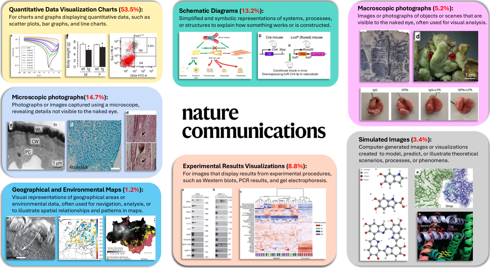
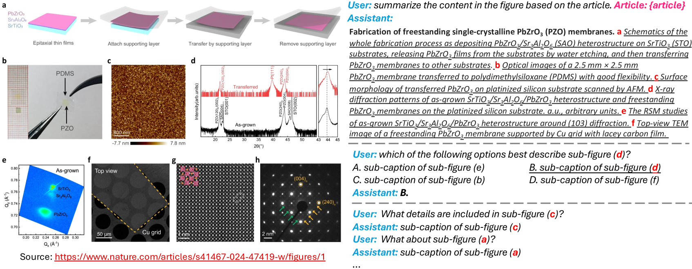
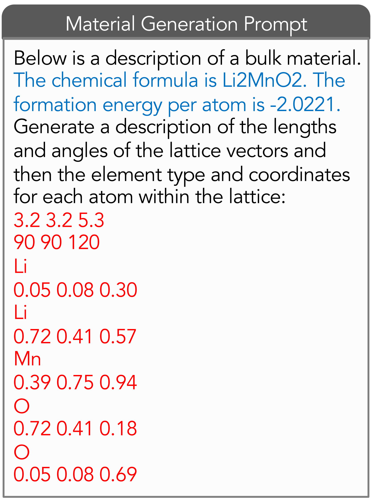
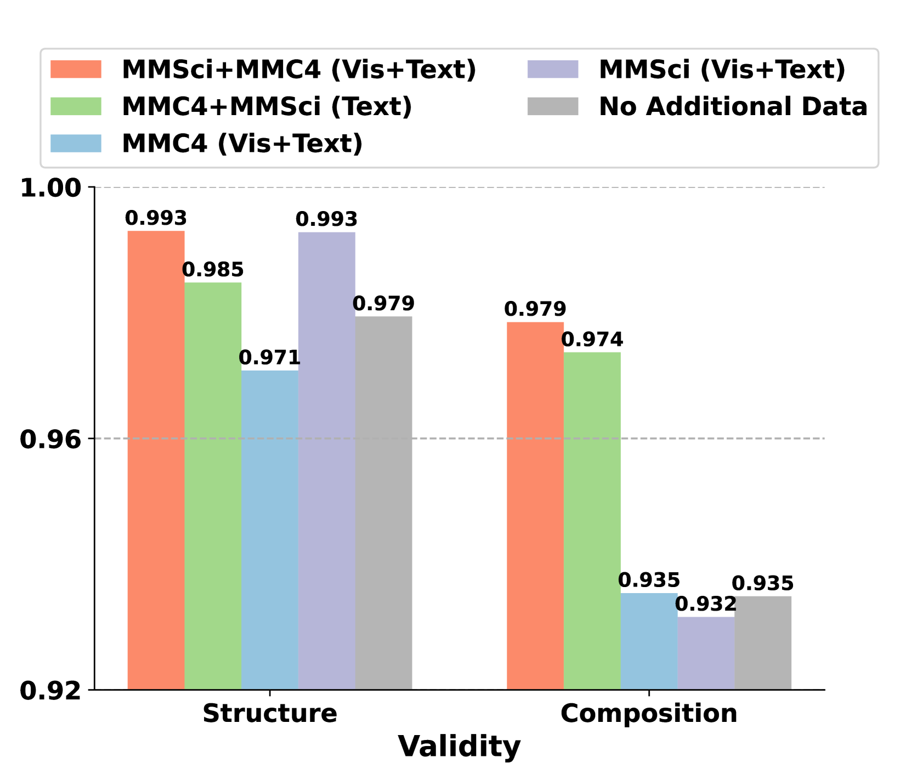
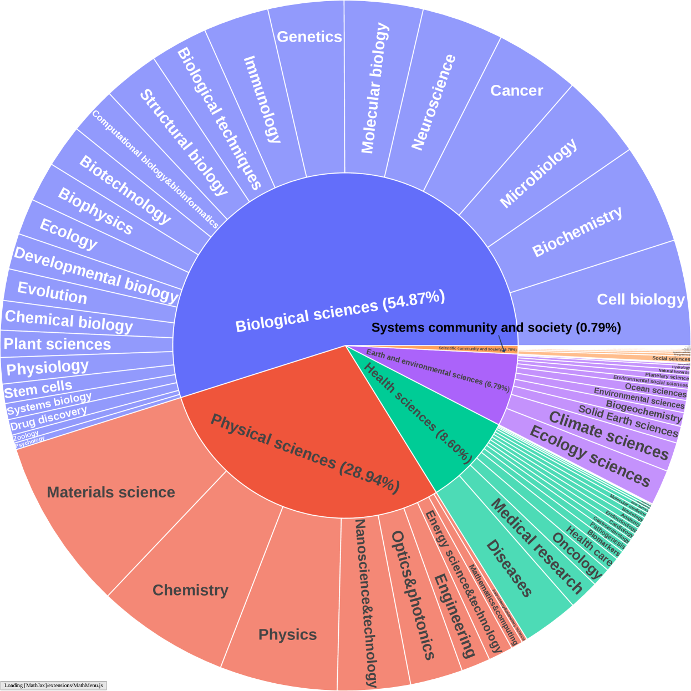
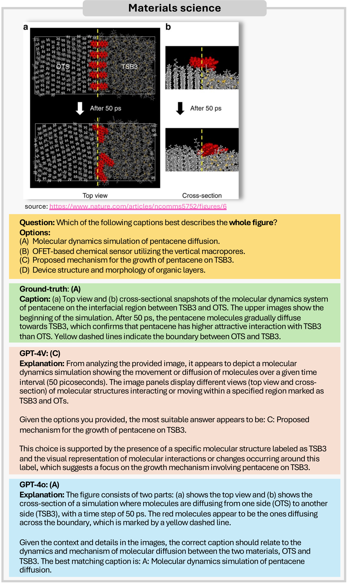
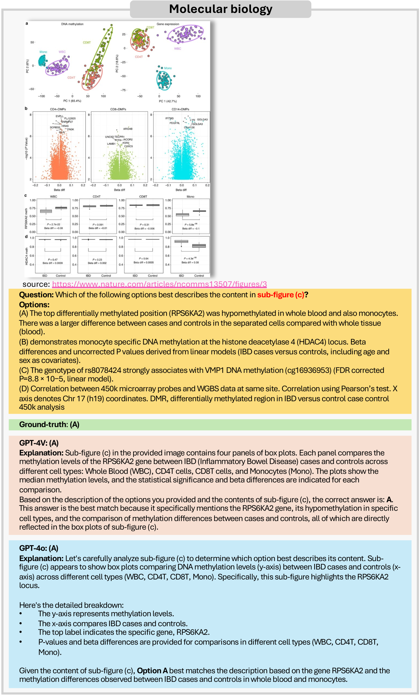
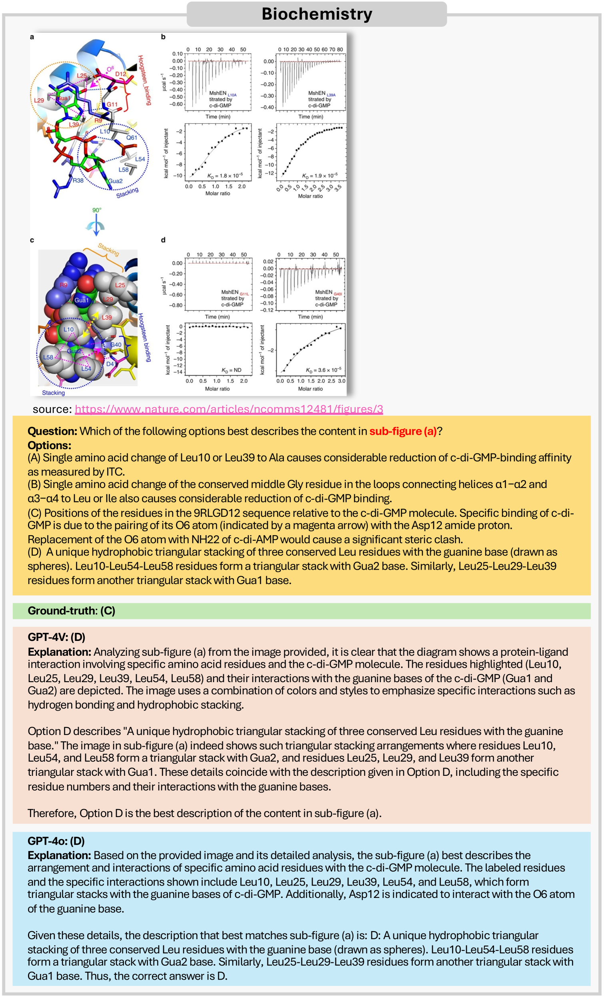
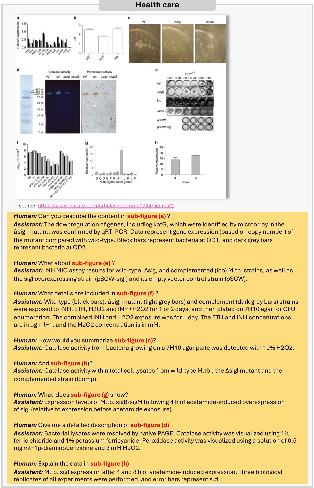

# MMSci：专为博士级科学理解设计的多模态多学科数据集

发布时间：2024年07月05日

`LLM应用` `科学研究` `人工智能`

> MMSci: A Multimodal Multi-Discipline Dataset for PhD-Level Scientific Comprehension

# 摘要

> 随着大型语言模型（LLM）和大型多模态模型（LMM）的迅猛发展，市场对能够深入理解科学文献和图表的AI助手需求日益增长。然而，在评估模型对高难度科学内容的理解能力方面，现有数据集和基准仍显不足。为此，我们从《自然通讯》期刊中精选了一个跨72个学科的多模态数据集，旨在全面评估LMM在科学领域的应用能力。我们的研究发现，这些任务难度极大，众多开源模型表现不佳，GPT-4V和GPT-4o也遭遇挑战。此外，我们利用该数据集进行模型训练，成功提升了7B LLaVA模型在特定任务上的表现，并探索了预训练方法以进一步优化模型性能。所有相关资源，包括文章、图表、基准测试和训练数据，均已公开，以促进科学AI领域的发展。

> The rapid advancement of Large Language Models (LLMs) and Large Multimodal Models (LMMs) has heightened the demand for AI-based scientific assistants capable of understanding scientific articles and figures. Despite progress, there remains a significant gap in evaluating models' comprehension of professional, graduate-level, and even PhD-level scientific content. Current datasets and benchmarks primarily focus on relatively simple scientific tasks and figures, lacking comprehensive assessments across diverse advanced scientific disciplines. To bridge this gap, we collected a multimodal, multidisciplinary dataset from open-access scientific articles published in Nature Communications journals. This dataset spans 72 scientific disciplines, ensuring both diversity and quality. We created benchmarks with various tasks and settings to comprehensively evaluate LMMs' capabilities in understanding scientific figures and content. Our evaluation revealed that these tasks are highly challenging: many open-source models struggled significantly, and even GPT-4V and GPT-4o faced difficulties. We also explored using our dataset as training resources by constructing visual instruction-following data, enabling the 7B LLaVA model to achieve performance comparable to GPT-4V/o on our benchmark. Additionally, we investigated the use of our interleaved article texts and figure images for pre-training LMMs, resulting in improvements on the material generation task. The source dataset, including articles, figures, constructed benchmarks, and visual instruction-following data, is open-sourced.

[Arxiv](https://arxiv.org/abs/2407.04903)