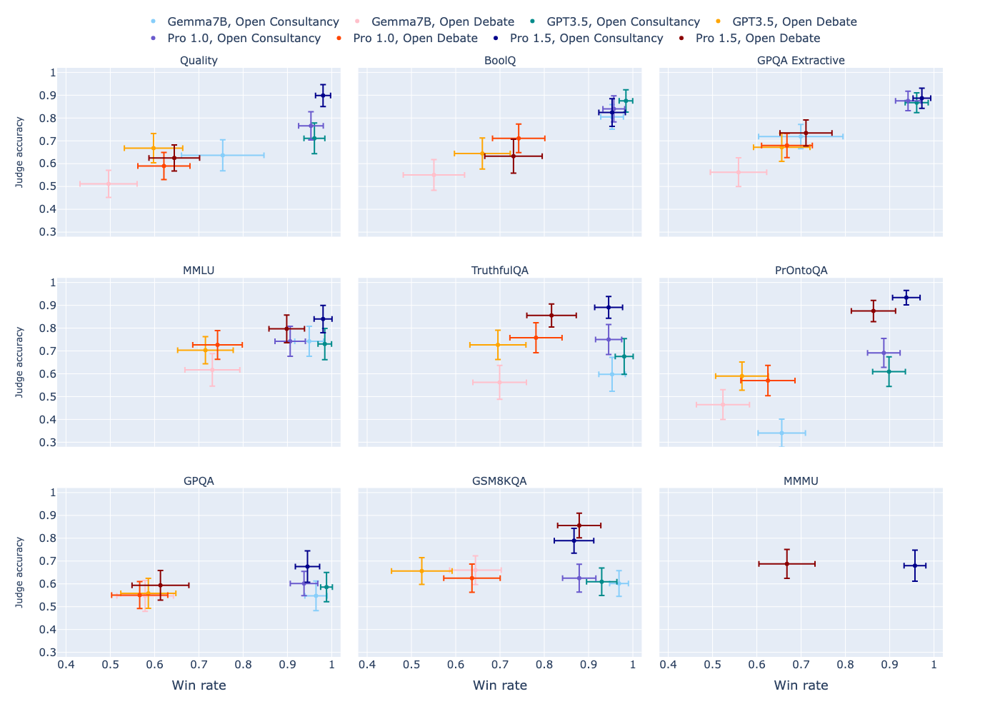
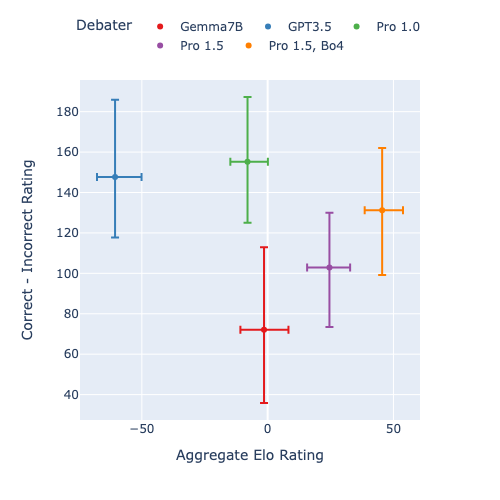

# 探讨如何利用较弱的LLMs来监督更强的LLMs，实现监督的可扩展性。

发布时间：2024年07月05日

`LLM应用` `人工智能`

> On scalable oversight with weak LLMs judging strong LLMs

# 摘要

> 本文探讨了可扩展监督协议，旨在帮助人类有效监管超人AI。我们通过辩论、咨询和直接问答三种模式进行研究。在辩论中，两个AI竞争说服裁判；在咨询中，单个AI回答裁判提问；而直接问答则不涉及AI。我们利用大型语言模型（LLM）模拟AI和人类裁判，发现辩论在所有任务中均优于咨询，尤其是在信息不对称的抽取式QA任务中。然而，在其他任务中，结果不一。此外，允许AI选择辩护答案时，辩论中裁判被错误答案误导的情况较少。更强的辩论者模型虽能提升裁判准确性，但效果不如预期显著。

> Scalable oversight protocols aim to enable humans to accurately supervise superhuman AI. In this paper we study debate, where two AI's compete to convince a judge; consultancy, where a single AI tries to convince a judge that asks questions; and compare to a baseline of direct question-answering, where the judge just answers outright without the AI. We use large language models (LLMs) as both AI agents and as stand-ins for human judges, taking the judge models to be weaker than agent models. We benchmark on a diverse range of asymmetries between judges and agents, extending previous work on a single extractive QA task with information asymmetry, to also include mathematics, coding, logic and multimodal reasoning asymmetries. We find that debate outperforms consultancy across all tasks when the consultant is randomly assigned to argue for the correct/incorrect answer. Comparing debate to direct question answering, the results depend on the type of task: in extractive QA tasks with information asymmetry debate outperforms direct question answering, but in other tasks without information asymmetry the results are mixed. Previous work assigned debaters/consultants an answer to argue for. When we allow them to instead choose which answer to argue for, we find judges are less frequently convinced by the wrong answer in debate than in consultancy. Further, we find that stronger debater models increase judge accuracy, though more modestly than in previous studies.

[Arxiv](https://arxiv.org/abs/2407.04622)