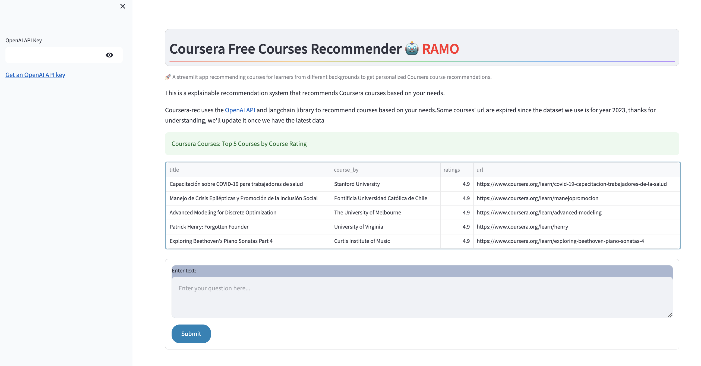
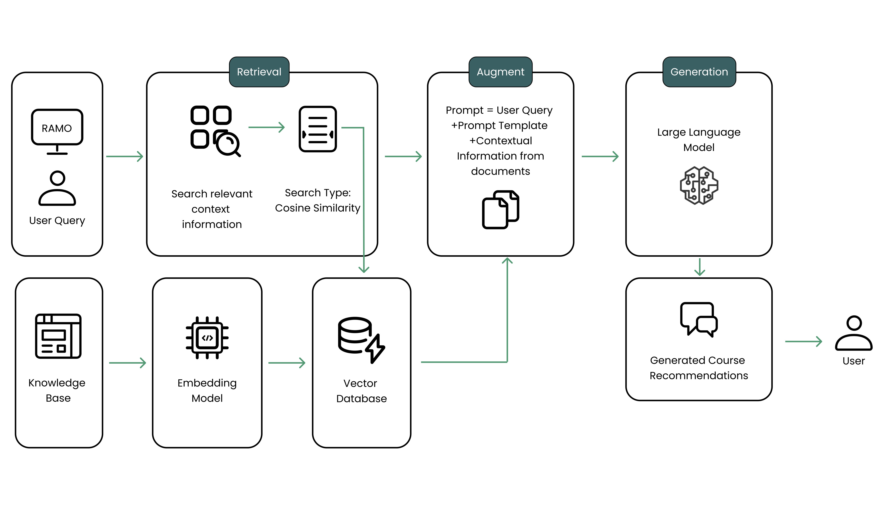
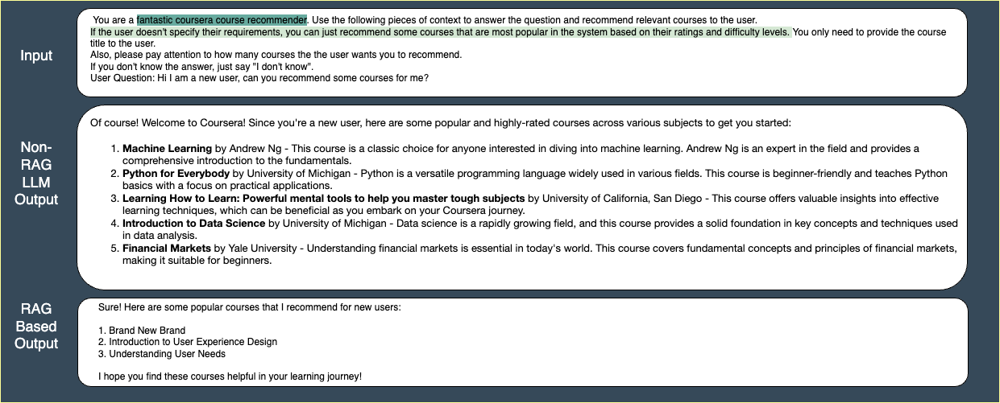
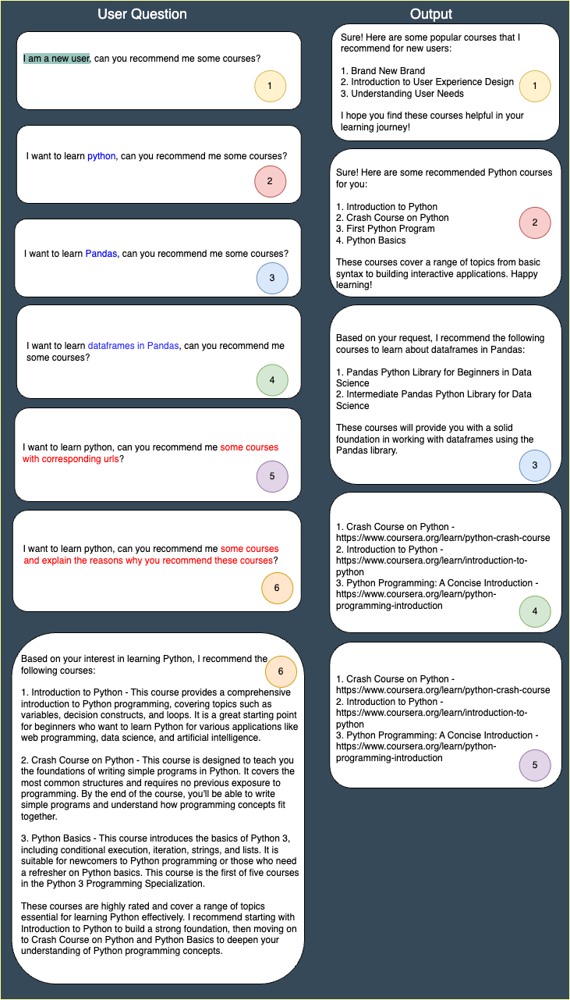
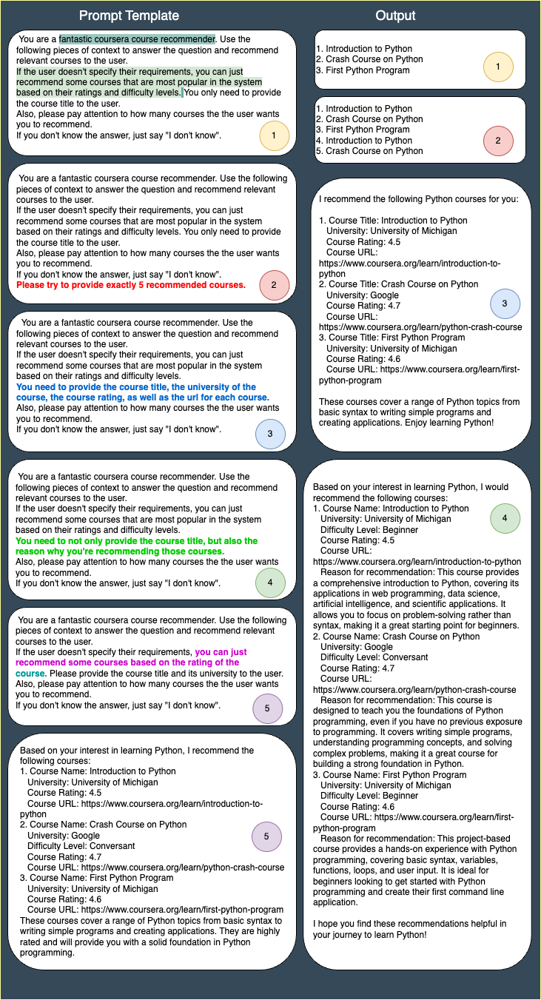

# RAMO：通过检索增强生成技术，提升 MOOCs 推荐效果

发布时间：2024年07月05日

`LLM应用` `在线学习`

> RAMO: Retrieval-Augmented Generation for Enhancing MOOCs Recommendations

# 摘要

> MOOCs通过提供多样课程，打破了地理、经济和时间的限制，极大地提升了教育普及率。然而，学生在面对海量课程时往往感到迷茫，尤其是在涉足新领域时。为此，研究者们开发了课程推荐系统，旨在根据个人学习倾向和职业目标提供定制化建议。这些系统在解决新用户“冷启动”问题上存在挑战。最新技术进展显示，将LLMs融入推荐流程能提升个性化推荐并解决“冷启动”问题。基于此，我们推出了RAMO系统，该系统结合LLMs和RAG技术，通过对话式界面提供课程推荐，致力于优化在线学习体验。

> Massive Open Online Courses (MOOCs) have significantly enhanced educational accessibility by offering a wide variety of courses and breaking down traditional barriers related to geography, finance, and time. However, students often face difficulties navigating the vast selection of courses, especially when exploring new fields of study. Driven by this challenge, researchers have been exploring course recommender systems to offer tailored guidance that aligns with individual learning preferences and career aspirations. These systems face particular challenges in effectively addressing the ``cold start'' problem for new users. Recent advancements in recommender systems suggest integrating large language models (LLMs) into the recommendation process to enhance personalized recommendations and address the ``cold start'' problem. Motivated by these advancements, our study introduces RAMO (Retrieval-Augmented Generation for MOOCs), a system specifically designed to overcome the ``cold start'' challenges of traditional course recommender systems. The RAMO system leverages the capabilities of LLMs, along with Retrieval-Augmented Generation (RAG)-facilitated contextual understanding, to provide course recommendations through a conversational interface, aiming to enhance the e-learning experience.

[Arxiv](https://arxiv.org/abs/2407.04925)