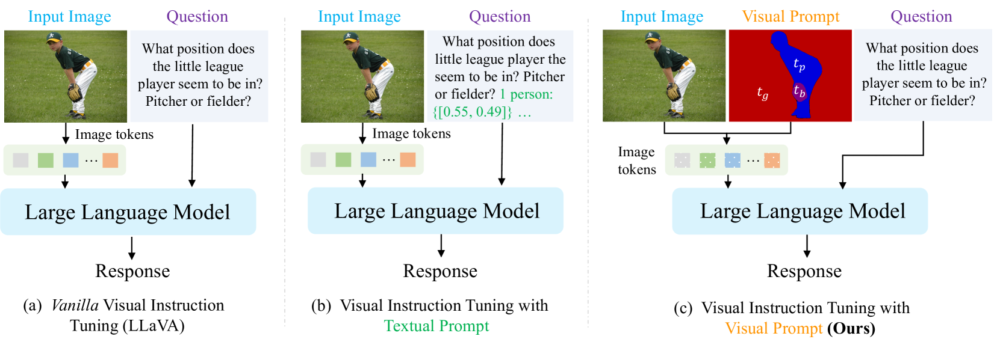

# 探索视觉提示在多模态大型语言模型中的新角色，并研究外部知识如何增强其效能。

发布时间：2024年07月05日

`RAG` `计算机视觉` `人工智能`

> Rethinking Visual Prompting for Multimodal Large Language Models with External Knowledge

# 摘要

> 近年来，多模态大型语言模型 (MLLMs) 在处理图像方面取得了显著进展，但文本在传达细粒度或空间密集信息（如掩码）方面的局限性，限制了它们在理解详细视觉元素方面的能力。本文受检索增强生成 (RAG) 概念启发，提出一种新视觉提示方法，将专业视觉模型的细粒度知识融入 MLLMs，这是一个有前景但未充分探索的提升方向。与将外部知识转化为文本提示的方法不同，我们直接将细粒度知识嵌入空间嵌入图，作为视觉提示，可轻松融入多种 MLLMs，如 LLaVA 和 Mipha，大幅提升视觉理解性能。实验证明，我们的方法在九个基准上有效提升 MLLM 的细粒度上下文感知能力。

> In recent years, multimodal large language models (MLLMs) have made significant strides by training on vast high-quality image-text datasets, enabling them to generally understand images well. However, the inherent difficulty in explicitly conveying fine-grained or spatially dense information in text, such as masks, poses a challenge for MLLMs, limiting their ability to answer questions requiring an understanding of detailed or localized visual elements. Drawing inspiration from the Retrieval-Augmented Generation (RAG) concept, this paper proposes a new visual prompt approach to integrate fine-grained external knowledge, gleaned from specialized vision models (e.g., instance segmentation/OCR models), into MLLMs. This is a promising yet underexplored direction for enhancing MLLMs' performance. Our approach diverges from concurrent works, which transform external knowledge into additional text prompts, necessitating the model to indirectly learn the correspondence between visual content and text coordinates. Instead, we propose embedding fine-grained knowledge information directly into a spatial embedding map as a visual prompt. This design can be effortlessly incorporated into various MLLMs, such as LLaVA and Mipha, considerably improving their visual understanding performance. Through rigorous experiments, we demonstrate that our method can enhance MLLM performance across nine benchmarks, amplifying their fine-grained context-aware capabilities.

[Arxiv](https://arxiv.org/abs/2407.04681)