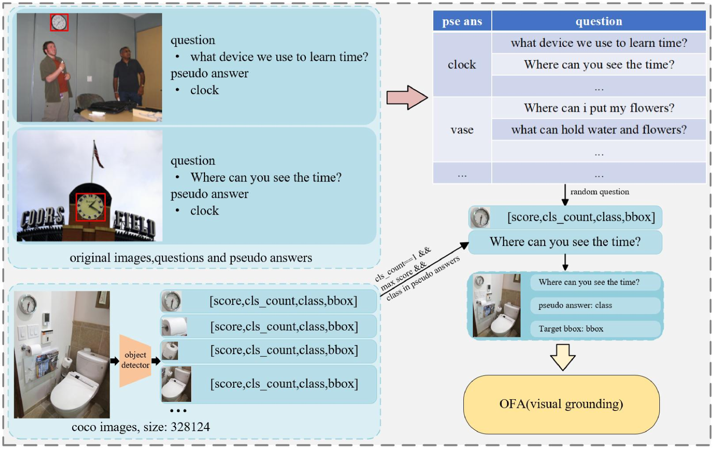
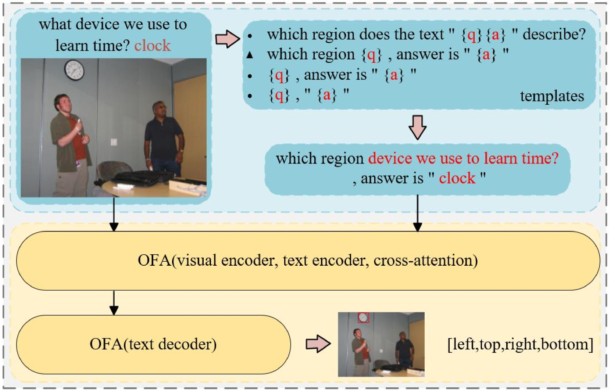
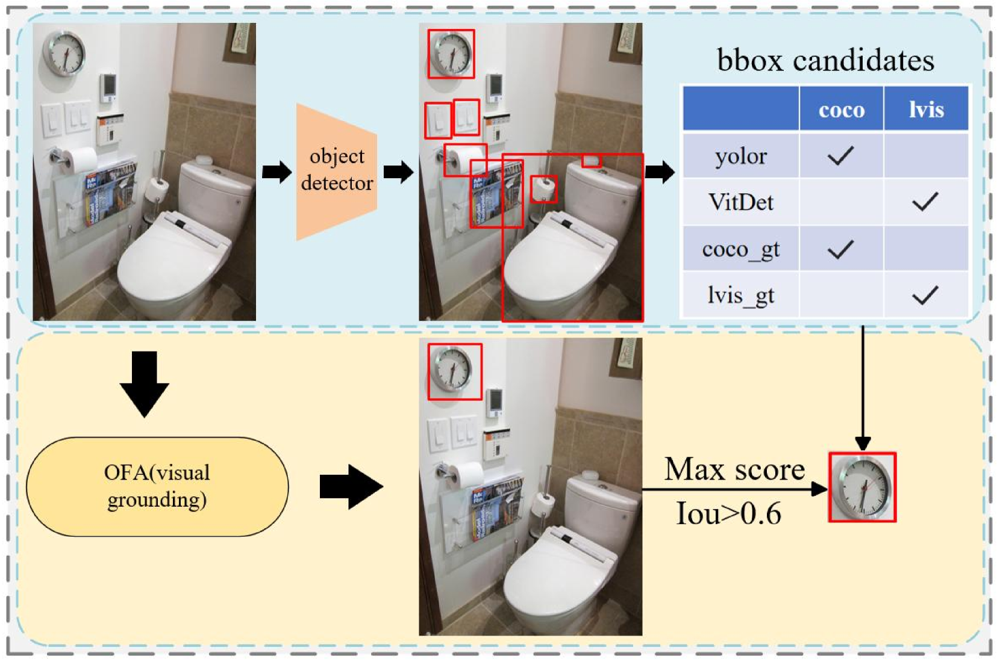

# WSDM2023 Toloka 视觉问答挑战亚军方案

发布时间：2024年07月05日

`LLM应用

解释：这篇论文描述了一个针对特定挑战赛的三阶段解决方案，其中使用了多模态预训练模型（可能是大型语言模型的一种应用）来处理视觉问答任务。尽管论文中没有直接提到“大型语言模型”（LLM），但使用了多模态预训练模型，这可以被视为LLM在特定应用场景中的使用。因此，我将这篇论文分类为“LLM应用”。` `计算机视觉` `人工智能`

> Second Place Solution of WSDM2023 Toloka Visual Question Answering Challenge

# 摘要

> 本文中，我们针对WSDM2023 Toloka视觉问答挑战赛，提出了一套三阶段的解决方案。借鉴多模态预训练模型在多种下游任务中的应用，我们将比赛视为视觉定位任务，通过图像和问题引导模型以边界框形式回答问题。首先，我们构建了一个大规模合成数据集，对OFA模型进行粗调，学习通用语义信息。接着，将任务转换为视觉定位，加载前阶段权重，在竞赛数据集上进一步微调，迁移语义知识。最后，通过边界框匹配替换策略优化预测结果。我们团队在排行榜上以76.342分位列第二。

> In this paper, we present our solution for the WSDM2023 Toloka Visual Question Answering Challenge. Inspired by the application of multimodal pre-trained models to various downstream tasks(e.g., visual question answering, visual grounding, and cross-modal retrieval), we approached this competition as a visual grounding task, where the input is an image and a question, guiding the model to answer the question and display the answer as a bounding box on the image. We designed a three-stage solution for this task. Specifically, we used the visual-language pre-trained model OFA as the foundation. In the first stage, we constructed a large-scale synthetic dataset similar to the competition dataset and coarse-tuned the model to learn generalized semantic information. In the second stage, we treated the competition task as a visual grounding task, loaded the weights from the previous stage, and continued to fine-tune the model on the competition dataset, transferring the semantic information learned in the first stage to the competition task. Finally, we designed a bounding box matching and replacing post-processing strategy to correct the model's prediction results. Our team achieved a score of 76.342 on the final leaderboard, ranking second.

[Arxiv](https://arxiv.org/abs/2407.04255)