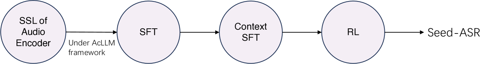
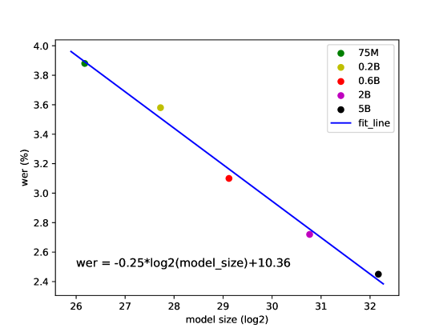
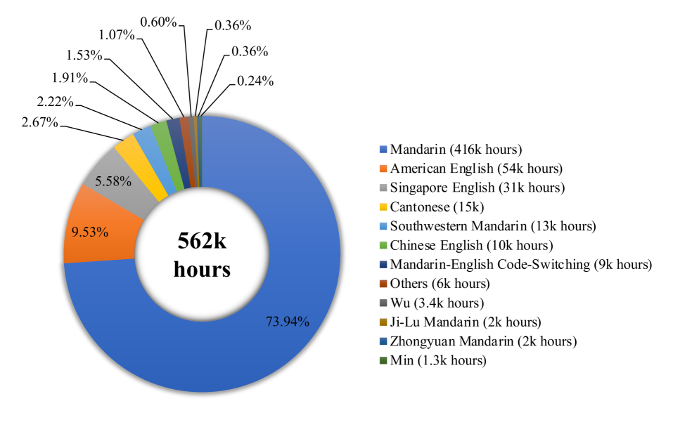

# Seed-ASR：借助 LLM 技术，深入探索多样语音与复杂上下文的识别奥秘

发布时间：2024年07月05日

`LLM应用` `语音识别` `人工智能`

> Seed-ASR: Understanding Diverse Speech and Contexts with LLM-based Speech Recognition

# 摘要

> 现代ASR模型需精准转录多样的语音信号，涵盖不同领域、语言及口音，并在多变场景中结合特定上下文信息。传统端到端模型虽与额外语言模型结合表现不俗，但主要局限于数据匹配场景，渐显瓶颈。为此，我们推出Seed-ASR，一款基于大型语言模型的语音识别系统。Seed-ASR依托音频条件LLM框架，通过整合连续语音与上下文信息至LLM，充分发挥其潜能。经过分阶段大规模训练及上下文感知能力激发，Seed-ASR在跨领域、口音/方言及多语言的综合评测中，显著超越端到端模型。更值得一提的是，Seed-ASR无需额外语言模型即可灵活适应各类场景特定需求。相较于近期问世的大型ASR模型，Seed-ASR在中英文公共测试集上，将词（或汉字）错误率大幅降低10%-40%，实力尽显。

> Modern automatic speech recognition (ASR) model is required to accurately transcribe diverse speech signals (from different domains, languages, accents, etc) given the specific contextual information in various application scenarios. Classic end-to-end models fused with extra language models perform well, but mainly in data matching scenarios and are gradually approaching a bottleneck. In this work, we introduce Seed-ASR, a large language model (LLM) based speech recognition model. Seed-ASR is developed based on the framework of audio conditioned LLM (AcLLM), leveraging the capabilities of LLMs by inputting continuous speech representations together with contextual information into the LLM. Through stage-wise large-scale training and the elicitation of context-aware capabilities in LLM, Seed-ASR demonstrates significant improvement over end-to-end models on comprehensive evaluation sets, including multiple domains, accents/dialects and languages. Additionally, Seed-ASR can be further deployed to support specific needs in various scenarios without requiring extra language models. Compared to recently released large ASR models, Seed-ASR achieves 10%-40% reduction in word (or character, for Chinese) error rates on Chinese and English public test sets, further demonstrating its powerful performance.

[Arxiv](https://arxiv.org/abs/2407.04675)