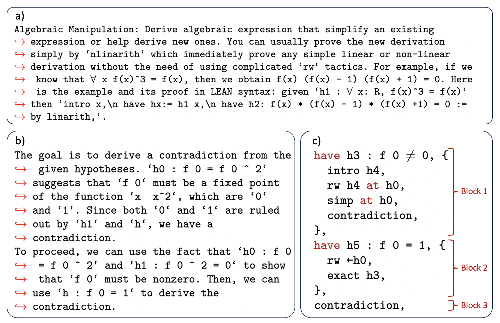

# 迈向自动化功能方程证明：推出一个基准数据集及特定领域的上下文智能代理

发布时间：2024年07月05日

`Agent` `人工智能`

> Towards Automated Functional Equation Proving: A Benchmark Dataset and A Domain-Specific In-Context Agent

# 摘要

> 自动定理证明 (ATP) 因其复杂性和高计算需求而面临挑战。最新研究尝试利用大型语言模型 (LLM) 进行 ATP 动作选择，但这些方法往往资源消耗大。本研究推出的 FEAS 代理，在 Lean 系统中强化了 COPRA 的上下文学习框架。FEAS 通过优化提示生成、响应解析，并融入针对函数方程的领域知识，显著提升了性能。此外，FEAS 还引入了 FunEq 数据集，涵盖多种难度的函数方程问题。实证结果表明，FEAS 不仅在 FunEq 上表现优异，尤其在结合领域知识后，更能有效将高级证明策略转化为 Lean 证明，彰显了定制化方法在解决特定 ATP 难题中的潜力。

> Automated Theorem Proving (ATP) faces challenges due to its complexity and computational demands. Recent work has explored using Large Language Models (LLMs) for ATP action selection, but these methods can be resource-intensive. This study introduces FEAS, an agent that enhances the COPRA in-context learning framework within Lean. FEAS refines prompt generation, response parsing, and incorporates domain-specific heuristics for functional equations. It introduces FunEq, a curated dataset of functional equation problems with varying difficulty. FEAS outperforms baselines on FunEq, particularly with the integration of domain-specific heuristics. The results demonstrate FEAS's effectiveness in generating and formalizing high-level proof strategies into Lean proofs, showcasing the potential of tailored approaches for specific ATP challenges.

[Arxiv](https://arxiv.org/abs/2407.14521)