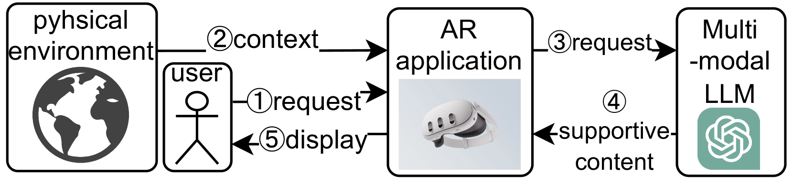
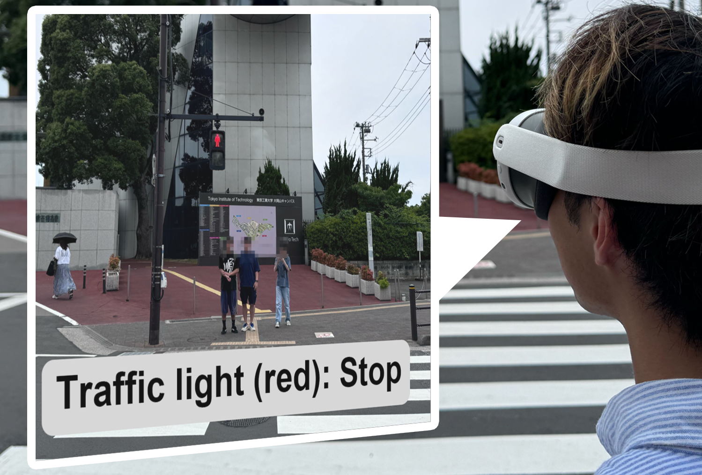

# 探索色觉缺陷的上下文感知支持：融合 LLM 与 AR 的创新途径

发布时间：2024年07月05日

`LLM应用` `辅助技术`

> Towards Context-aware Support for Color Vision Deficiency: An Approach Integrating LLM and AR

# 摘要

> 色觉缺陷者在区分红绿等颜色时常常遇到困难，这使得日常任务变得复杂，需要借助辅助工具或调整环境。目前，辅助工具多聚焦于呈现层面的帮助，例如iPhone的色觉模式。然而，提供情境感知支持，如判断肉类熟度，仍是一大挑战，因为特定任务的解决方案难以覆盖所有场景。为此，我们提出了一款结合增强现实界面和多模态大型语言模型推理器的应用程序，旨在提供情境感知和自主辅助。初步实验显示，该应用在多种场景下均表现出色，有效辅助了色觉缺陷者的日常生活。

> People with color vision deficiency often face challenges in distinguishing colors such as red and green, which can complicate daily tasks and require the use of assistive tools or environmental adjustments. Current support tools mainly focus on presentation-based aids, like the color vision modes found in iPhone accessibility settings. However, offering context-aware support, like indicating the doneness of meat, remains a challenge since task-specific solutions are not cost-effective for all possible scenarios. To address this, our paper proposes an application that provides contextual and autonomous assistance. This application is mainly composed of: (i) an augmented reality interface that efficiently captures context; and (ii) a multi-modal large language model-based reasoner that serves to cognitize the context and then reason about the appropriate support contents. Preliminary user experiments with two color vision deficient users across five different scenarios have demonstrated the effectiveness and universality of our application.

[Arxiv](https://arxiv.org/abs/2407.04362)