# VCoME：融合多模态编辑效果的口头视频创作

发布时间：2024年07月05日

`LLM应用` `视频制作` `多媒体`

> VCoME: Verbal Video Composition with Multimodal Editing Effects

# 摘要

> 本文介绍了一项新颖任务——带有编辑效果的口头视频构图，旨在通过整合多模态编辑效果，创造出既连贯又吸引眼球的口头视频。我们构建了一个大规模视频效果数据集，并将任务定义为生成问题，涉及内容中适当位置的识别及相应编辑效果的推荐。为此，我们设计了VCoME框架，利用大型多模态模型智能生成编辑效果，支持灵活的构图控制。实验证明，VCoME不仅效果显著，而且效率惊人，比专业编辑快85倍，同时保持了专业级的视频质量。

> Verbal videos, featuring voice-overs or text overlays, provide valuable content but present significant challenges in composition, especially when incorporating editing effects to enhance clarity and visual appeal. In this paper, we introduce the novel task of verbal video composition with editing effects. This task aims to generate coherent and visually appealing verbal videos by integrating multimodal editing effects across textual, visual, and audio categories. To achieve this, we curate a large-scale dataset of video effects compositions from publicly available sources. We then formulate this task as a generative problem, involving the identification of appropriate positions in the verbal content and the recommendation of editing effects for these positions. To address this task, we propose VCoME, a general framework that employs a large multimodal model to generate editing effects for video composition. Specifically, VCoME takes in the multimodal video context and autoregressively outputs where to apply effects within the verbal content and which effects are most appropriate for each position. VCoME also supports prompt-based control of composition density and style, providing substantial flexibility for diverse applications. Through extensive quantitative and qualitative evaluations, we clearly demonstrate the effectiveness of VCoME. A comprehensive user study shows that our method produces videos of professional quality while being 85$\times$ more efficient than professional editors.

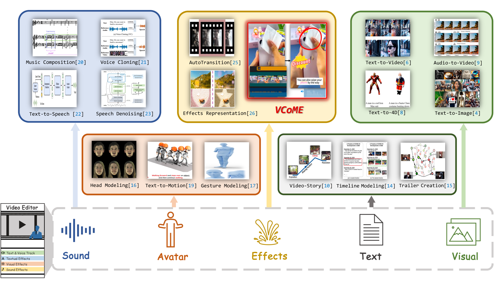

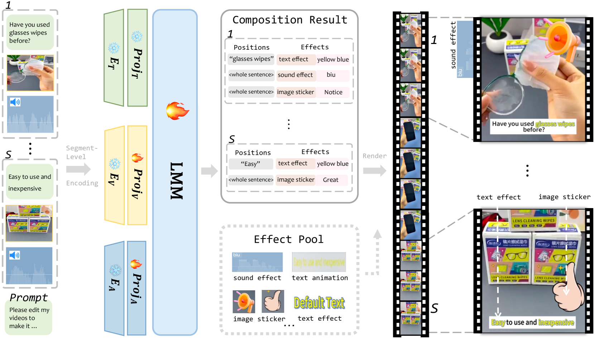

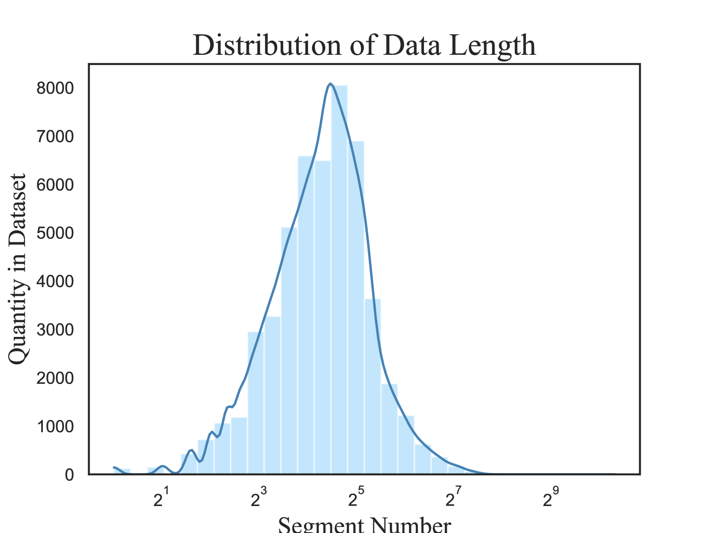

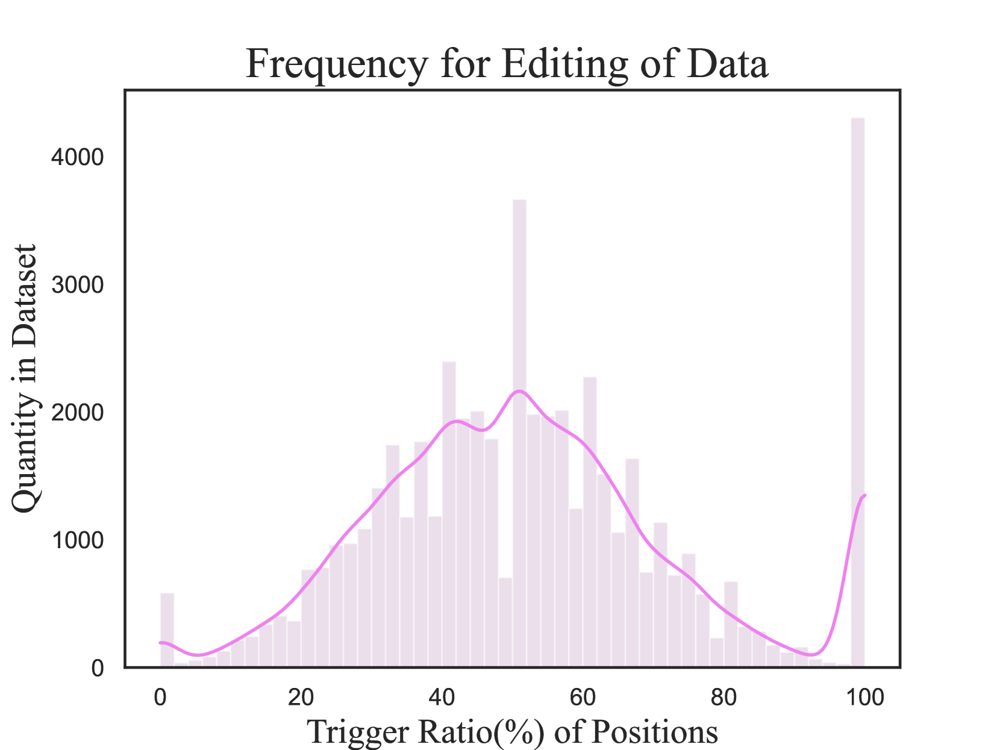

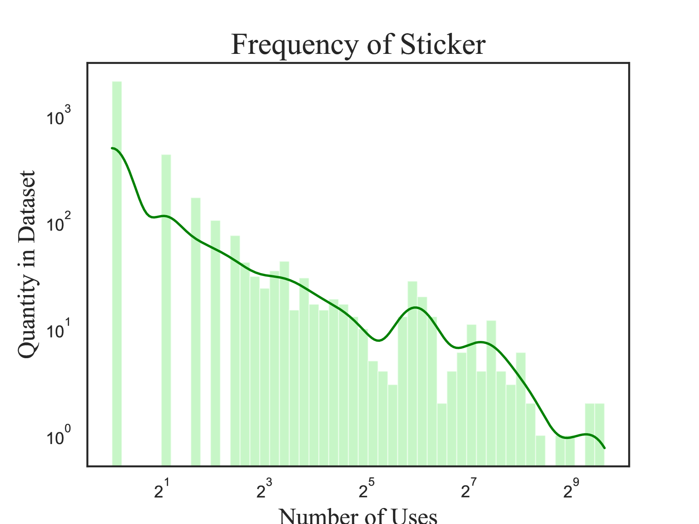

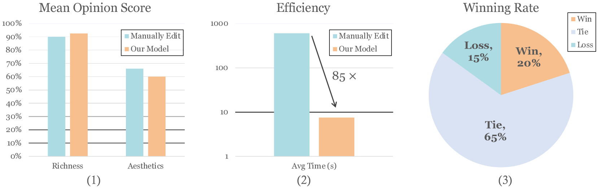

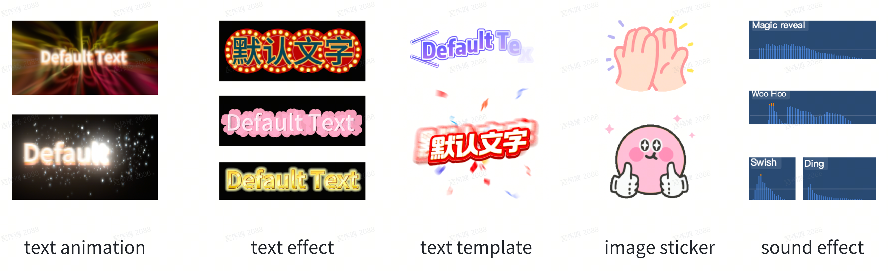

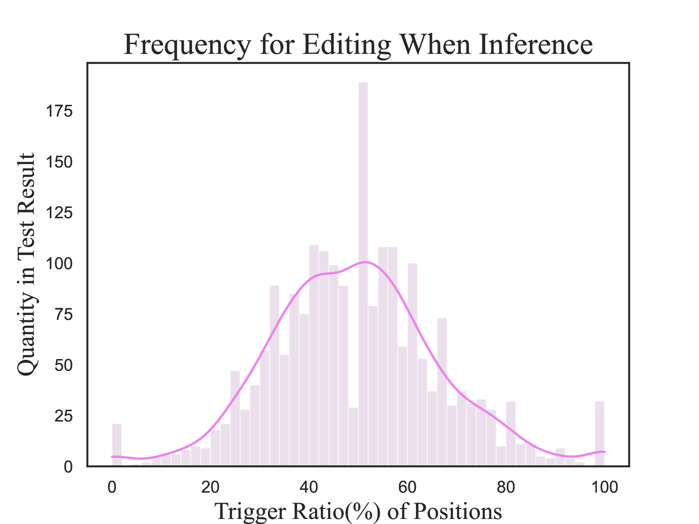

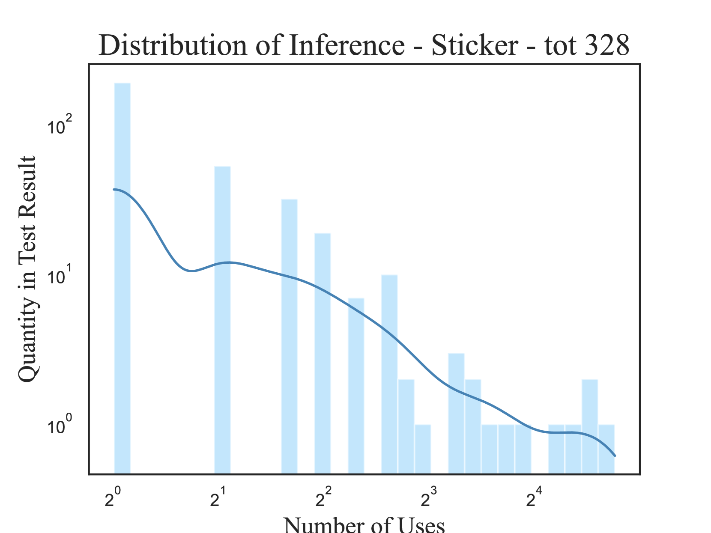

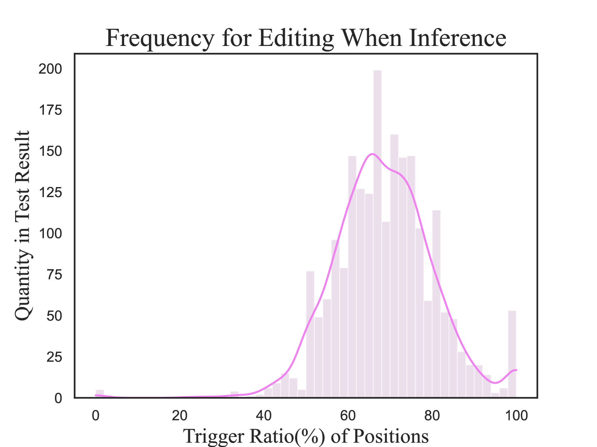

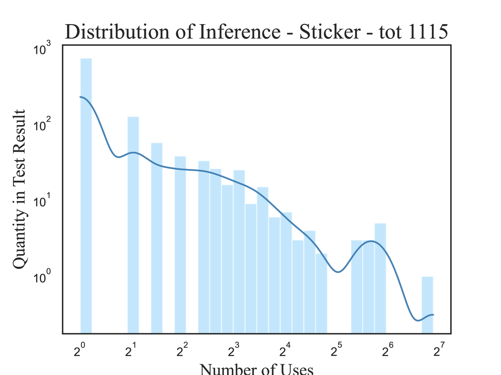

[Arxiv](https://arxiv.org/abs/2407.04697)