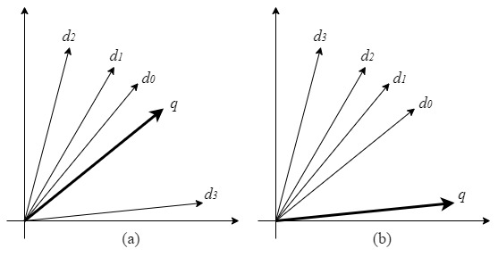
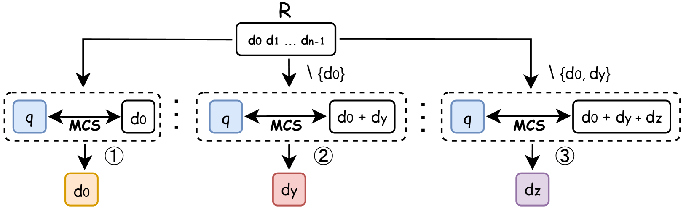

# VRSD：在大规模语言模型中，重新审视检索的相似性与多样性

发布时间：2024年07月05日

`LLM理论` `人工智能` `数据检索`

> VRSD: Rethinking Similarity and Diversity for Retrieval in Large Language Models

# 摘要

> 在大型语言模型（LLM）领域，向量检索算法对语义查询至关重要。同时满足相似性和多样性的向量检索，能显著提升LLM代理的能力。尽管最大边际相关性（MMR）在需要相关性和多样性的检索场景中广泛应用，但其参数$λ$的变化导致优化轨迹难以确定，进而影响增强方向的明确性。此外，对于检索过程中相似性和多样性的约束，理论分析尚显不足。本文通过总向量与查询向量之间的关系，巧妙地描述了这两种约束：向量的接近性确保了相似性，而总向量中各向量与查询向量的发散对齐则满足了多样性。我们还提出了一项新的组合优化挑战，即从候选集中选择$k$个向量，使总向量与查询向量最大程度对齐，并证明这是一个NP完全问题。这不仅揭示了同时追求相似性和多样性的难度，也为后续研究奠定了理论基础。此外，我们提出的启发式算法VRSD，不仅目标明确、无需预设参数，还在时间复杂度上优于MMR。实证验证显示，VRSD在多个数据集上均显著超越MMR。

> Vector retrieval algorithms are vital for semantic queries in the evolving landscape of Large Language Models (LLMs). Retrieving vectors that simultaneously meet criteria for both similarity and diversity significantly enhances the capabilities of LLM-based agents. Despite the widespread use of the Maximal Marginal Relevance (MMR) in retrieval scenarios with relevance and diversity requirements, fluctuations caused by variations in the parameter $ λ$ within the MMR complicate the determination of the optimization trajectory in vector spaces, thus obscuring the direction of enhancement. Moreover, there is a lack of a robust theoretical analysis for the constraints of similarity and diversity in retrieval processes. This paper introduces a novel approach to characterizing both constraints through the relationship between the sum vector and the query vector. The proximity of these vectors addresses the similarity constraint, while necessitating that individual vectors within the sum vector divergently align with the query vector to satisfy the diversity constraint. We also formulate a new combinatorial optimization challenge, taking a selection of $k$ vectors from a set of candidates such that their sum vector maximally aligns with the query vector, a problem we demonstrate to be NP-complete. This establishes the profound difficulty of pursuing similarity and diversity simultaneously in vector retrieval and lays a theoretical groundwork for further research. Additionally, we present the heuristic algorithm Vectors Retrieval with Similarity and Diversity (VRSD) which not only has a definitive optimization goal and eschews the need for preset parameters but also offers a modest reduction in time complexity compared to MMR. Empirical validation further confirm that VRSD significantly surpasses MMR across various datasets.

[Arxiv](https://arxiv.org/abs/2407.04573)