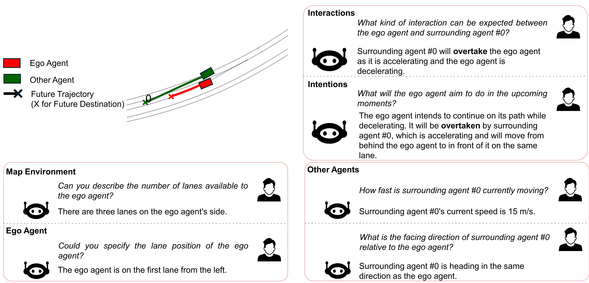
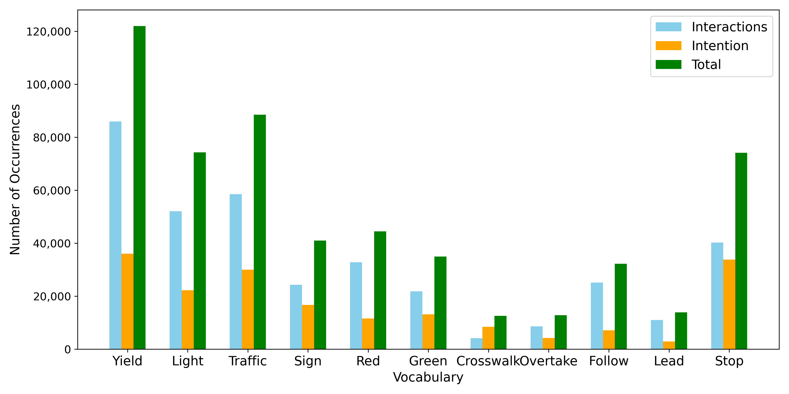
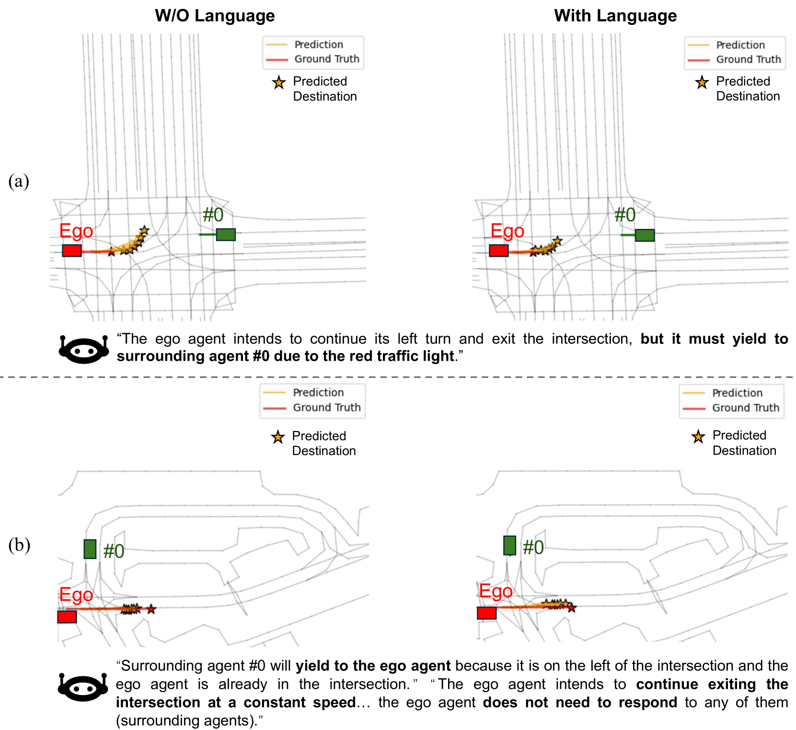

# WOMD-Reasoning：专为交互与驾驶意图推理设计的大规模语言数据集

发布时间：2024年07月05日

`LLM应用` `自动驾驶`

> WOMD-Reasoning: A Large-Scale Language Dataset for Interaction and Driving Intentions Reasoning

# 摘要

> 我们推出了Waymo开放运动数据集-推理（WOMD-Reasoning），这是一个专注于驾驶场景中交互与意图描述和推理的语言标注数据集。与以往主要关注近距离交互的数据集不同，WOMD-Reasoning深入探讨了由交通规则和人类意图引发的远距离交互，这些交互虽常见但更具挑战性。数据集包含409k个Q&A，全面覆盖各类交互。此外，WOMD-Reasoning拥有约300万个Q&A，是目前最大的真实驾驶场景问答数据集，内容涵盖自动驾驶的多个方面，如地图描述、运动状态、交互行为及意图分析等。这些丰富的文本数据有助于微调大型语言模型（LLMs），提升其在场景描述、预测和规划等领域的应用能力。实验证明，结合WOMD-Reasoning的交互与意图信息后，最先进的轨迹预测模型Multipath++在性能上显著提升，$MR_6$和$minFDE_6$分别提高了10.14%和6.90%。我们期待WOMD-Reasoning能助力LLMs在驾驶领域实现更精准的交互理解和行为推理。数据集已开放下载，网址为https://waymo.com/open/download。

> We propose Waymo Open Motion Dataset-Reasoning (WOMD-Reasoning), a language annotation dataset built on WOMD, with a focus on describing and reasoning interactions and intentions in driving scenarios. Previous language datasets primarily captured interactions caused by close distances. However, interactions induced by traffic rules and human intentions, which can occur over long distances, are yet sufficiently covered, despite being very common and more challenging for prediction or planning models to understand. Therefore, our WOMD-Reasoning focuses extensively on these interactions, providing a total of 409k Q&As for varying types of interactions. Additionally, WOMD-Reasoning presents by far the largest Q&A dataset on real-world driving scenarios, with around 3 million Q&As covering various topics of autonomous driving from map descriptions, motion status descriptions, to narratives and analyses of agents' interactions, behaviors, and intentions. This extensive textual information enables fine-tuning driving-related Large Language Models (LLMs) for a wide range of applications like scene description, prediction, planning, etc. By incorporating interaction and intention language from WOMD-Reasoning, we see significant enhancements in the performance of the state-of-the-art trajectory prediction model, Multipath++, with improvements of 10.14% in $MR_6$ and 6.90% in $minFDE_6$, proving the effectiveness of WOMD-Reasoning. We hope WOMD-Reasoning would empower LLMs in driving to offer better interaction understanding and behavioral reasoning. The dataset is available on https://waymo.com/open/download .

[Arxiv](https://arxiv.org/abs/2407.04281)