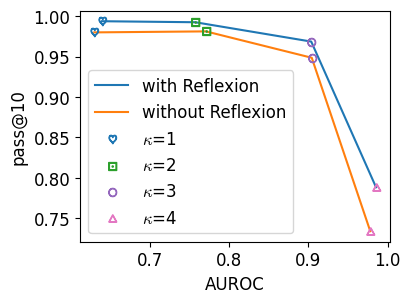

# Waterfall：一个专为文本水印设计的鲁棒且可扩展的框架

发布时间：2024年07月05日

`LLM应用` `知识产权保护` `网络安全`

> Waterfall: Framework for Robust and Scalable Text Watermarking

# 摘要

> 随着复杂攻击手段的出现，如利用大型语言模型（LLM）进行文本改述或未经授权训练LLM侵犯版权，保护文章和代码等文本的知识产权变得尤为关键。然而，现有文本水印技术在抵御这些攻击和扩展至大规模用户方面存在不足。为此，我们引入了Waterfall框架，这是首个无需训练、适用于多种文本类型和语言的强大且可扩展的文本水印解决方案。Waterfall的创新之处在于利用LLM作为改述工具，并结合一系列高效技术，显著提升了可验证性和可扩展性。实证研究表明，Waterfall在可扩展性、验证强度和计算效率上均优于现有技术，并能直接应用于代码水印。

> Protecting intellectual property (IP) of text such as articles and code is increasingly important, especially as sophisticated attacks become possible, such as paraphrasing by large language models (LLMs) or even unauthorized training of LLMs on copyrighted text to infringe such IP. However, existing text watermarking methods are not robust enough against such attacks nor scalable to millions of users for practical implementation. In this paper, we propose Waterfall, the first training-free framework for robust and scalable text watermarking applicable across multiple text types (e.g., articles, code) and languages supportable by LLMs, for general text and LLM data provenance. Waterfall comprises several key innovations, such as being the first to use LLM as paraphrasers for watermarking along with a novel combination of techniques that are surprisingly effective in achieving robust verifiability and scalability. We empirically demonstrate that Waterfall achieves significantly better scalability, robust verifiability, and computational efficiency compared to SOTA article-text watermarking methods, and also showed how it could be directly applied to the watermarking of code.

[Arxiv](https://arxiv.org/abs/2407.04411)