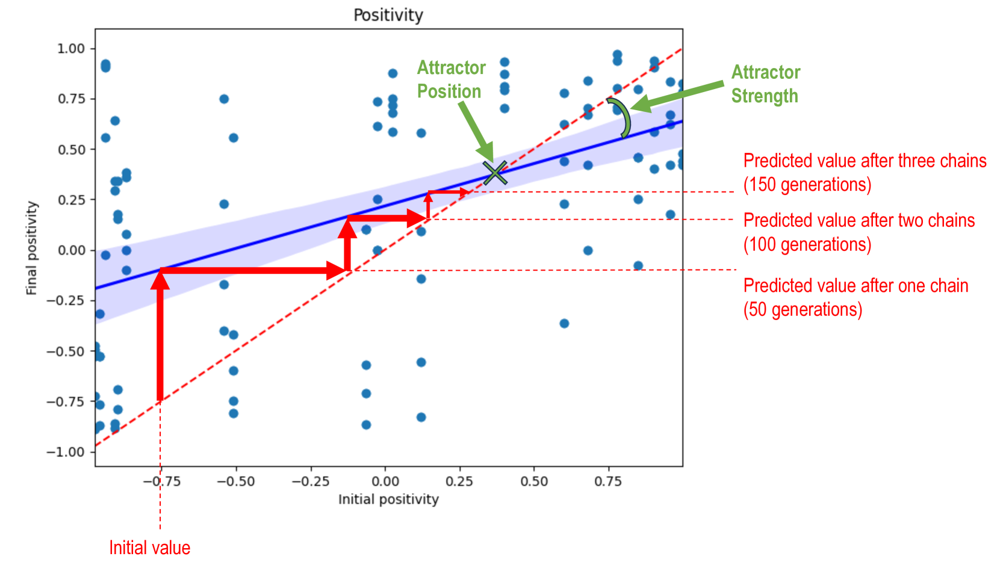

# LLM 参与“电话游戏”时，迭代文化传播中显现出累积变化与吸引子现象。

发布时间：2024年07月05日

`LLM应用` `人工智能` `通信技术`

> When LLMs Play the Telephone Game: Cumulative Changes and Attractors in Iterated Cultural Transmissions

# 摘要

> 随着 LLM 间的互动日益频繁，线上文本生成量激增，深入探究信息在 LLM 间传递时的变化显得尤为关键。尽管单个 LLM 的行为已得到广泛研究，但集体行为及信息扭曲在迭代交互中的影响却鲜被关注。微小的偏差，在单次输出中或许无足轻重，但在迭代交互中可能被放大，进而推动内容向特定状态演化。通过一系列电话游戏实验，我们借鉴人类文化进化理论，构建了传递链模型：LLM 代理依次接收、生成并传递文本。我们追踪了文本在传递过程中的毒性、积极性、难度和长度变化，揭示了偏差与吸引态的存在，并探讨了它们与初始文本、指令、模型类型及规模的关联。例如，开放式指令比约束性任务更易引发强吸引效应。此外，不同文本属性对吸引效应的敏感度各异，毒性比长度更易形成强吸引态。这些发现凸显了多步传输动态研究的重要性，为全面理解 LLM 文化动态奠定了基础。

> As large language models (LLMs) start interacting with each other and generating an increasing amount of text online, it becomes crucial to better understand how information is transformed as it passes from one LLM to the next. While significant research has examined individual LLM behaviors, existing studies have largely overlooked the collective behaviors and information distortions arising from iterated LLM interactions. Small biases, negligible at the single output level, risk being amplified in iterated interactions, potentially leading the content to evolve towards attractor states. In a series of telephone game experiments, we apply a transmission chain design borrowed from the human cultural evolution literature: LLM agents iteratively receive, produce, and transmit texts from the previous to the next agent in the chain. By tracking the evolution of text toxicity, positivity, difficulty, and length across transmission chains, we uncover the existence of biases and attractors, and study their dependence on the initial text, the instructions, language model, and model size. For instance, we find that more open-ended instructions lead to stronger attraction effects compared to more constrained tasks. We also find that different text properties display different sensitivity to attraction effects, with toxicity leading to stronger attractors than length. These findings highlight the importance of accounting for multi-step transmission dynamics and represent a first step towards a more comprehensive understanding of LLM cultural dynamics.

[Arxiv](https://arxiv.org/abs/2407.04503)