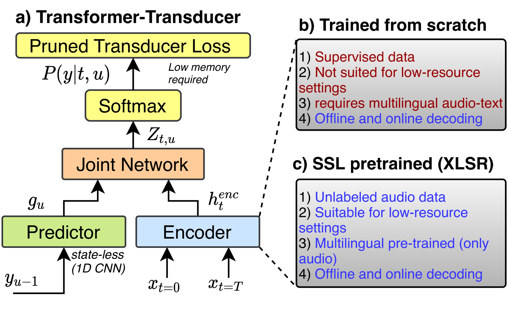

# XLSR-Transducer：为自监督预训练模型设计的流式自动语音识别技术

发布时间：2024年07月05日

`LLM应用` `语音识别` `人工智能`

> XLSR-Transducer: Streaming ASR for Self-Supervised Pretrained Models

# 摘要

> 自监督预训练模型在自动语音识别的微调中表现出色，即便训练数据有限。但这些流行的预训练模型因采用全注意力上下文训练而不适用于流式ASR。本文中，我们提出了XLSR-Transducer，利用XLSR-53模型作为转录器编码器。实验显示，XLSR-Transducer在AMI数据集上分别比Whisper large-v2和从头训练的Zipformer转录器模型提升了4%和8%的WER。为实现流式处理，我们探索了XLSR-53模型变换器层中不同的注意力掩蔽模式。在低资源环境下，XLSR-Transducer在AMI及CommonVoice的五种语言上表现优异。通过引入注意力汇聚点，我们不仅将左上下文减半，还实现了WER相对提升12%。

> Self-supervised pretrained models exhibit competitive performance in automatic speech recognition on finetuning, even with limited in-domain supervised data for training. However, popular pretrained models are not suitable for streaming ASR because they are trained with full attention context. In this paper, we introduce XLSR-Transducer, where the XLSR-53 model is used as encoder in transducer setup. Our experiments on the AMI dataset reveal that the XLSR-Transducer achieves 4% absolute WER improvement over Whisper large-v2 and 8% over a Zipformer transducer model trained from scratch.To enable streaming capabilities, we investigate different attention masking patterns in the self-attention computation of transformer layers within the XLSR-53 model. We validate XLSR-Transducer on AMI and 5 languages from CommonVoice under low-resource scenarios. Finally, with the introduction of attention sinks, we reduce the left context by half while achieving a relative 12% improvement in WER.

[Arxiv](https://arxiv.org/abs/2407.04439)