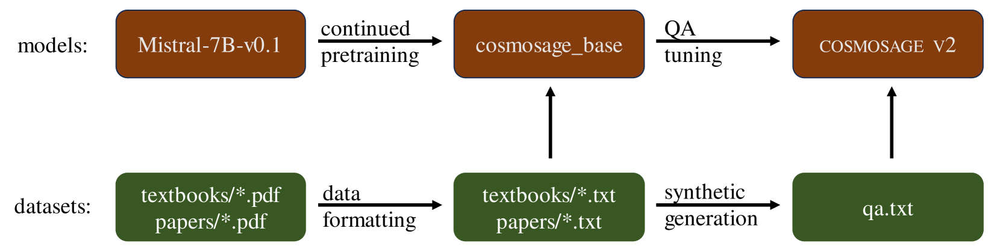

# cosmosage：专为宇宙学家打造的自然语言助手

发布时间：2024年07月05日

`LLM应用` `宇宙学`

> cosmosage: A Natural-Language Assistant for Cosmologists

# 摘要

> cosmosage，一款面向各层次用户的自然语言助手，从宇宙学爱好者到专业人士，都提供了独特的知识获取与推理途径。借助大型语言模型的强大功能，cosmosage 汲取了众多开放资源的精华，包括教科书与学术论文。在解答宇宙学问题这一细分领域，cosmosage 表现卓越，超越了其他通用模型。其模型参数与代码已公开，供公众使用。

> cosmosage is a natural-language assistant intended for a wide audience, from laypersons interested in cosmology to students, teachers, and professional cosmologists. cosmosage provides a novel way to access knowledge and reason about cosmology. Leveraging the power of advanced large language models (LLMs), cosmosage has learned from a vast corpus of open-access source texts, including textbooks and papers. cosmosage is found to be state-of-the-art on the narrow task of answering questions about cosmology, outperforming all general-purpose models. The model parameters and code are publicly available.

[Arxiv](https://arxiv.org/abs/2407.04420)