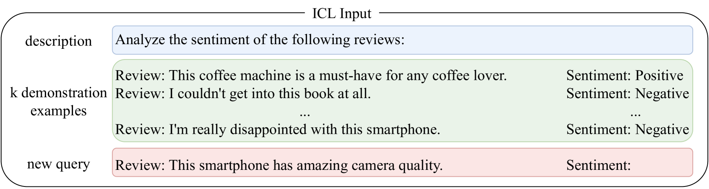

# 生成式 AI 大型语言模型中的 AI 安全：调查报告

发布时间：2024年07月06日

`LLM理论` `人工智能` `网络安全`

> AI Safety in Generative AI Large Language Models: A Survey

# 摘要

> ChatGPT等大型语言模型（LLMs）因其生成式AI能力正迅速被采用和创新。然而，生成式AI（GAI）的普及也引发了对其风险和安全性的担忧。本文从技术角度深入探讨了GAI-LLMs在AI安全领域的最新研究趋势。我们分析了LLMs作为生成模型所面临的具体风险，并强调了在研究和应用中统一安全理论的重要性。文章首先简述了LLMs的工作机制，并回顾了早期研究中关于生成模型限制的发现。接着，我们详细探讨了LLM对齐的多种方法及其面临的挑战，旨在填补文献中的空白，并推动开发更安全、更符合人类偏好的模型。最后，我们展望了LLMs在AI安全领域的未来发展方向，为相关研究提供了前瞻性见解。

> Large Language Model (LLMs) such as ChatGPT that exhibit generative AI capabilities are facing accelerated adoption and innovation. The increased presence of Generative AI (GAI) inevitably raises concerns about the risks and safety associated with these models. This article provides an up-to-date survey of recent trends in AI safety research of GAI-LLMs from a computer scientist's perspective: specific and technical. In this survey, we explore the background and motivation for the identified harms and risks in the context of LLMs being generative language models; our survey differentiates by emphasising the need for unified theories of the distinct safety challenges in the research development and applications of LLMs. We start our discussion with a concise introduction to the workings of LLMs, supported by relevant literature. Then we discuss earlier research that has pointed out the fundamental constraints of generative models, or lack of understanding thereof (e.g., performance and safety trade-offs as LLMs scale in number of parameters). We provide a sufficient coverage of LLM alignment -- delving into various approaches, contending methods and present challenges associated with aligning LLMs with human preferences. By highlighting the gaps in the literature and possible implementation oversights, our aim is to create a comprehensive analysis that provides insights for addressing AI safety in LLMs and encourages the development of aligned and secure models. We conclude our survey by discussing future directions of LLMs for AI safety, offering insights into ongoing research in this critical area.

[Arxiv](https://arxiv.org/abs/2407.18369)