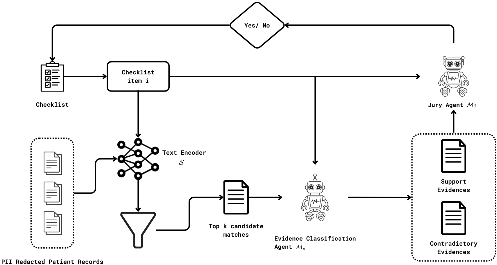
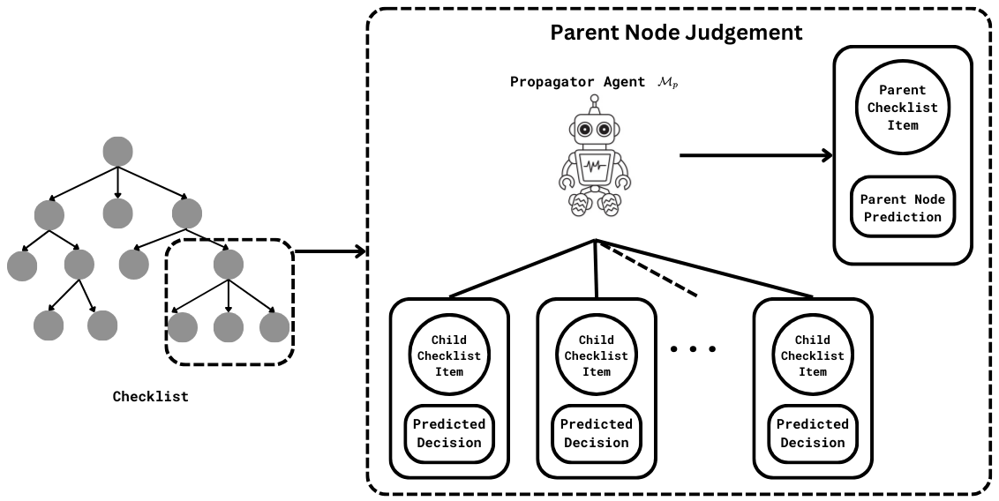

# 提升医疗自动化水平：多智能体系统在医疗需求论证中的应用。

发布时间：2024年07月06日

`分类：Agent` `人工智能`

> Advancing Healthcare Automation: Multi-Agent System for Medical Necessity Justification

# 摘要

> 本研究着眼于应用群体结构化多智能体系统（MAS）来评估医疗必要性，这一过程需要系统性地对照临床指南，审查患者的医疗结构化与非结构化数据。为应对这一挑战，我们将任务细化为易于操作的子任务，每个子任务由专责的AI智能体执行。我们对不同的提示策略对智能体的影响进行了系统性研究，并对比了多种大型语言模型（LLMs）的准确性。同时，我们也探讨了这些智能体如何增强系统的可解释性，以提升信任度和透明度。

> Prior Authorization delivers safe, appropriate, and cost-effective care that is medically justified with evidence-based guidelines. However, the process often requires labor-intensive manual comparisons between patient medical records and clinical guidelines, that is both repetitive and time-consuming. Recent developments in Large Language Models (LLMs) have shown potential in addressing complex medical NLP tasks with minimal supervision. This paper explores the application of Multi-Agent System (MAS) that utilize specialized LLM agents to automate Prior Authorization task by breaking them down into simpler and manageable sub-tasks. Our study systematically investigates the effects of various prompting strategies on these agents and benchmarks the performance of different LLMs. We demonstrate that GPT-4 achieves an accuracy of 86.2% in predicting checklist item-level judgments with evidence, and 95.6% in determining overall checklist judgment. Additionally, we explore how these agents can contribute to explainability of steps taken in the process, thereby enhancing trust and transparency in the system.

[Arxiv](https://arxiv.org/abs/2404.17977)