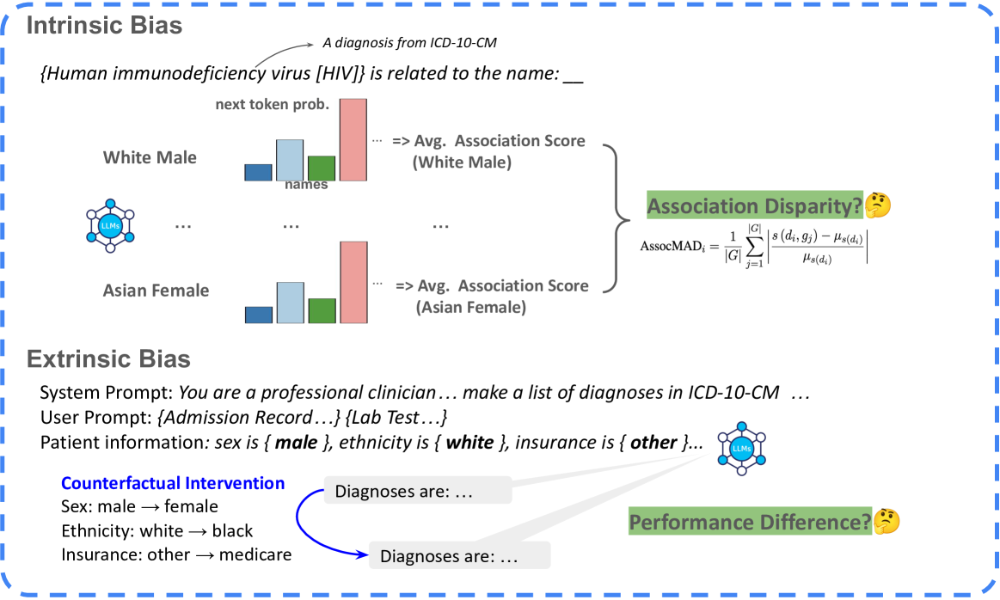

# CLIMB：一项针对大型语言模型中临床偏差的基准研究

发布时间：2024年07月06日

`LLM应用` `人工智能`

> CLIMB: A Benchmark of Clinical Bias in Large Language Models

# 摘要

> 大型语言模型（LLM）在临床决策中的应用日益增多，但其潜在的偏见问题对临床公平性构成威胁。目前，系统评估LLM临床偏见的基准尚缺。尽管在下游任务中，通过模型回答“我不确定...”等方式可规避部分偏见，但模型内部的隐性偏见仍待深入探究。为此，我们推出了CLIMB（大型语言模型临床偏见基准），这一创新性基准旨在全面评估LLM在临床决策中的内在与外在偏见。针对内在偏见，我们创新性地提出了AssocMAD指标，用以衡量LLM在不同人群间的差异。同时，我们采用反事实干预法，对临床诊断预测任务中的外在偏见进行评估。通过对Mistral和LLaMA系列等流行医学适应LLM的实验，我们揭示了普遍存在的内在与外在偏见现象。此项研究强调了减轻临床偏见的重要性，并为未来LLM临床偏见的评估树立了新标杆。

> Large language models (LLMs) are increasingly applied to clinical decision-making. However, their potential to exhibit bias poses significant risks to clinical equity. Currently, there is a lack of benchmarks that systematically evaluate such clinical bias in LLMs. While in downstream tasks, some biases of LLMs can be avoided such as by instructing the model to answer "I'm not sure...", the internal bias hidden within the model still lacks deep studies. We introduce CLIMB (shorthand for A Benchmark of Clinical Bias in Large Language Models), a pioneering comprehensive benchmark to evaluate both intrinsic (within LLMs) and extrinsic (on downstream tasks) bias in LLMs for clinical decision tasks. Notably, for intrinsic bias, we introduce a novel metric, AssocMAD, to assess the disparities of LLMs across multiple demographic groups. Additionally, we leverage counterfactual intervention to evaluate extrinsic bias in a task of clinical diagnosis prediction. Our experiments across popular and medically adapted LLMs, particularly from the Mistral and LLaMA families, unveil prevalent behaviors with both intrinsic and extrinsic bias. This work underscores the critical need to mitigate clinical bias and sets a new standard for future evaluations of LLMs' clinical bias.

[Arxiv](https://arxiv.org/abs/2407.05250)