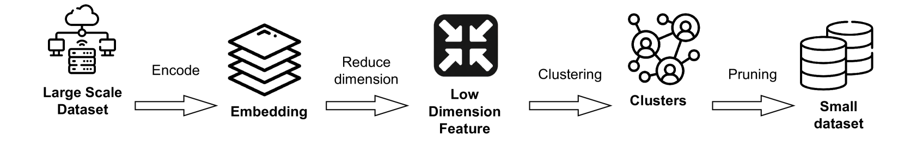
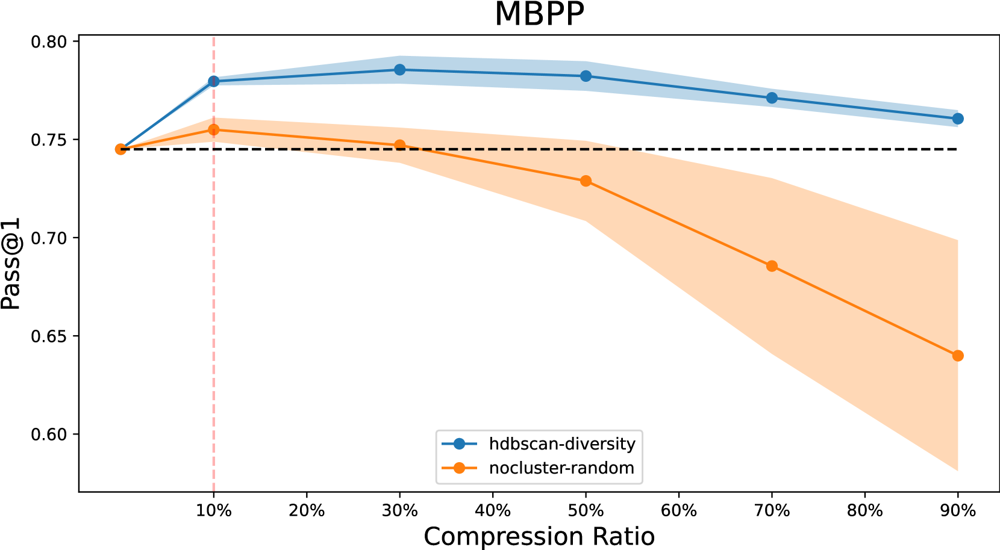
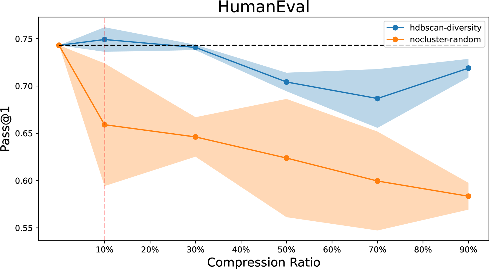
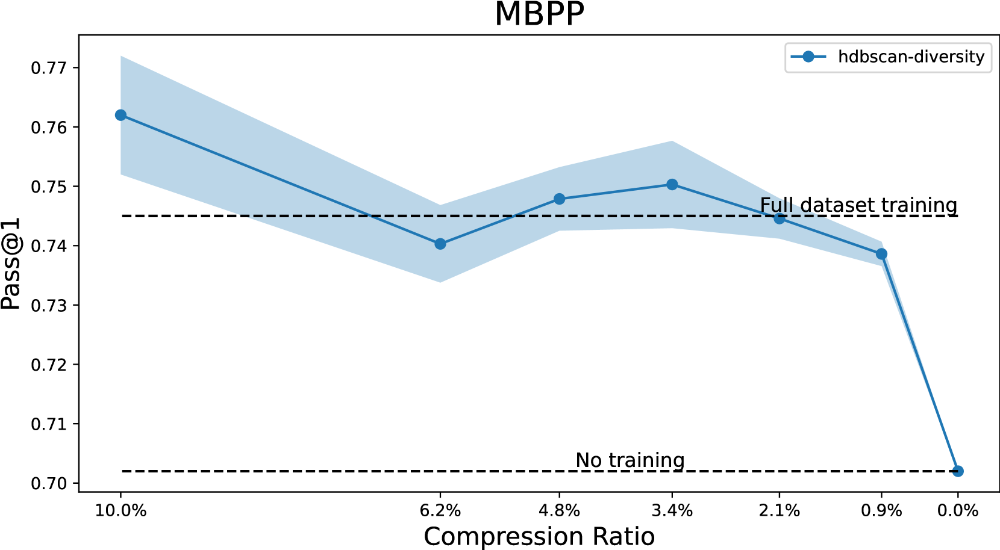
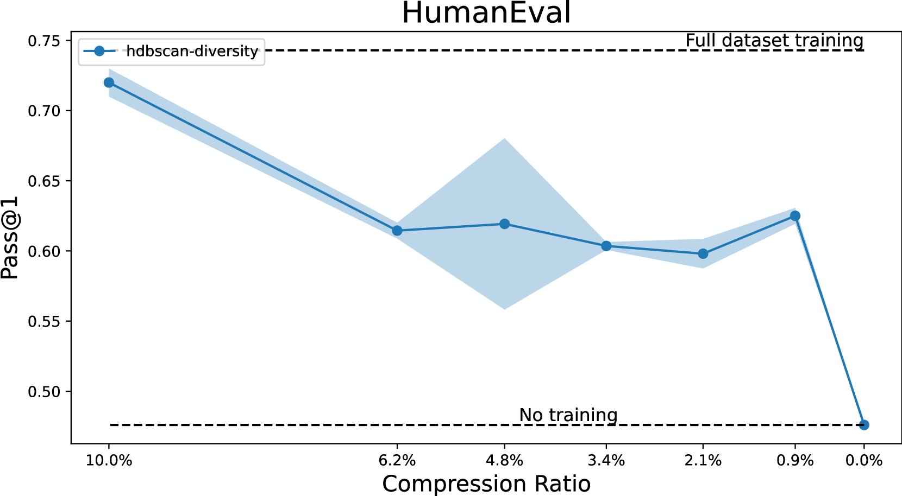
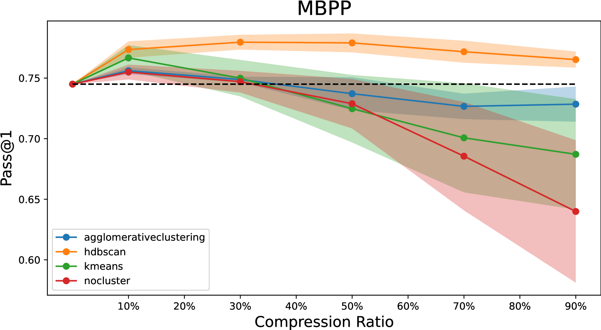
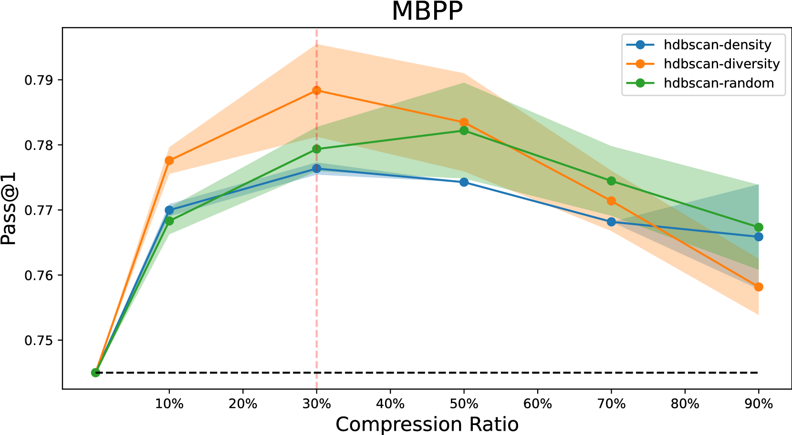

# 精简代码，强化对齐：利用数据修剪提升代码生成的 LLM 微调效率

发布时间：2024年07月06日

`LLM应用` `软件开发` `人工智能`

> Code Less, Align More: Efficient LLM Fine-tuning for Code Generation with Data Pruning

# 摘要

> 最新研究表明，通过合成代码生成增加训练数据量，大型语言模型在代码生成方面表现卓越。本文探讨了提高代码 LLM 训练效率的数据修剪方法，提出集成多种聚类和修剪指标的技术，确保在减少训练数据的同时，不牺牲生成代码的准确性和功能性。实验发现，仅用10%的数据训练即可大致保持基准性能，适度修剪训练数据还能持续提升基准结果。这些策略不仅节省计算资源，还提升了代码生成的质量。

> Recent work targeting large language models (LLMs) for code generation demonstrated that increasing the amount of training data through synthetic code generation often leads to exceptional performance. In this paper we explore data pruning methods aimed at enhancing the efficiency of model training specifically for code LLMs. We present techniques that integrate various clustering and pruning metrics to selectively reduce training data without compromising the accuracy and functionality of the generated code. We observe significant redundancies in synthetic training data generation, where our experiments demonstrate that benchmark performance can be largely preserved by training on only 10% of the data. Moreover, we observe consistent improvements in benchmark results through moderate pruning of the training data. Our experiments show that these pruning strategies not only reduce the computational resources needed but also enhance the overall quality code generation.

[Arxiv](https://arxiv.org/abs/2407.05040)