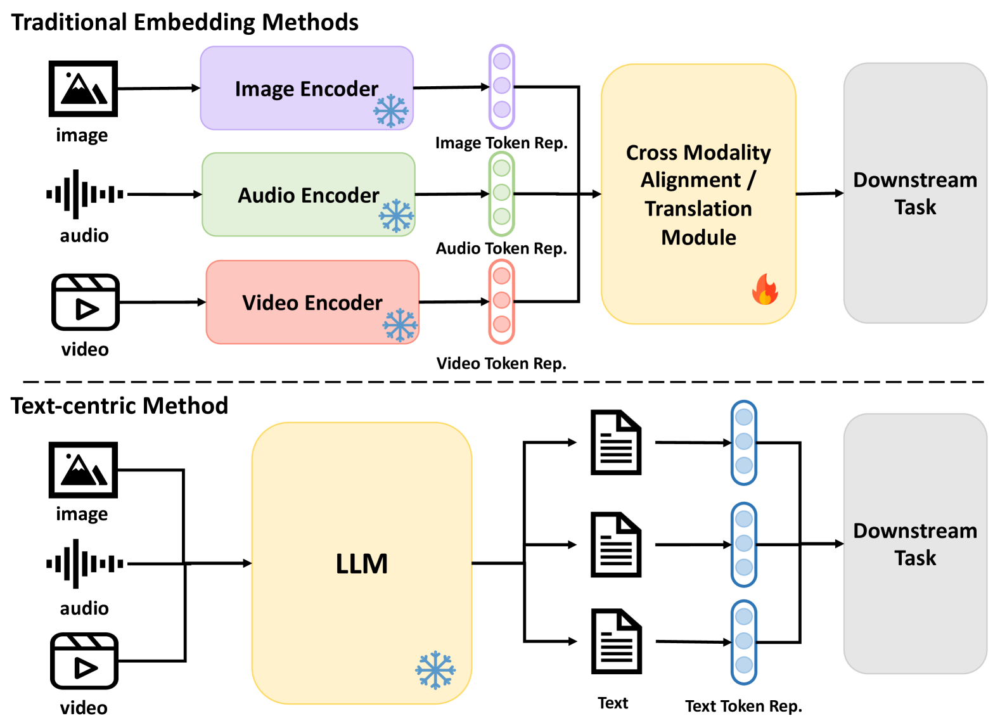
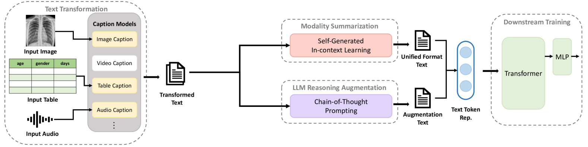
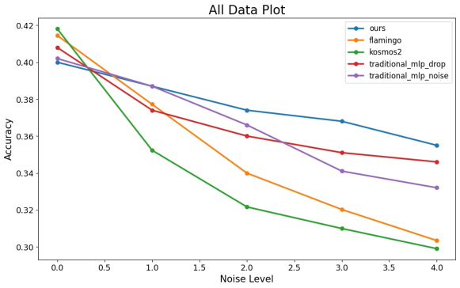
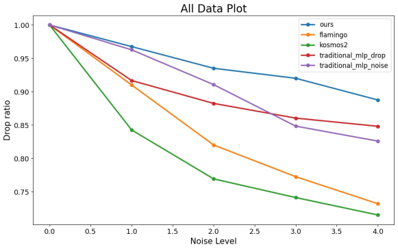
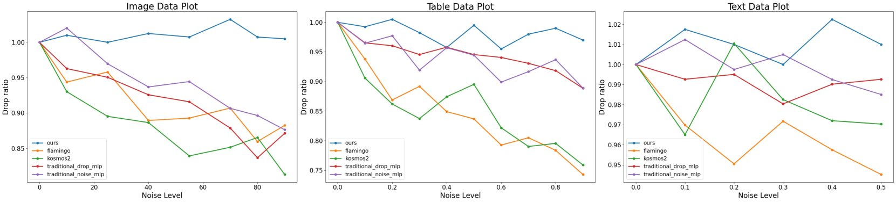
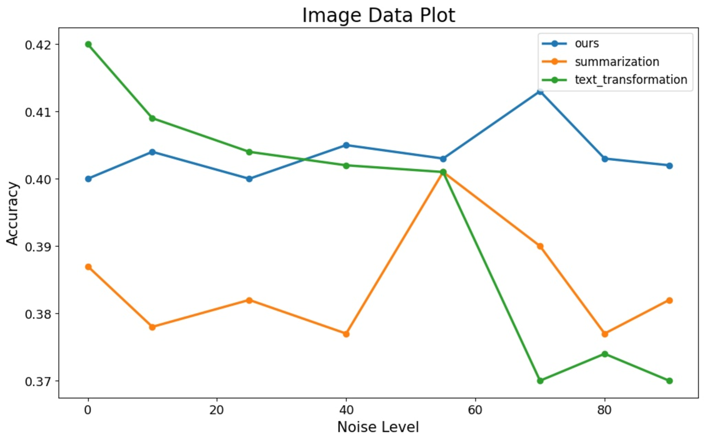

# 提升文本主导型多模态对齐的稳健性

发布时间：2024年07月06日

`LLM应用` `人工智能` `多模态系统`

> Enhance the Robustness of Text-Centric Multimodal Alignments

# 摘要

> 在多模态模型对齐中，将不同模态数据转换为通用文本输入是一种常见策略，尤其在成对数据有限时。这种方法通过利用文本的独特性，将多样输入统一为文本形式，便于下游模型处理。然而，研究显示，现有方法在面对数据缺失、噪声或模态不全时，下游鲁棒性受损。为此，我们提出了一种新方法，显著提升了在各种模态和场景下的鲁棒性。这一进展不仅增强了多模态系统的适应性，也为复杂现实应用提供了有力支持。

> Converting different modalities into general text, serving as input prompts for large language models (LLMs), is a common method to align multimodal models when there is limited pairwise data. This text-centric approach leverages the unique properties of text as a modality space, transforming diverse inputs into a unified textual representation. This enables downstream models to effectively interpret various modal inputs. This study assesses the quality and robustness of multimodal representations in the presence of missing entries, noise, or absent modalities, revealing that current text-centric alignment methods compromise downstream robustness. To address this issue, we propose a new text-centric approach that achieves superior robustness compared to previous methods across various modalities in different settings. Our findings highlight the potential of this approach to enhance the robustness and adaptability of multimodal representations, offering a promising solution for dynamic and real-world applications.

[Arxiv](https://arxiv.org/abs/2407.05036)