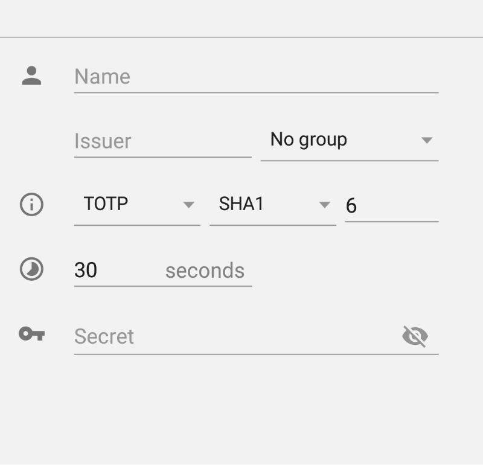

# 安卓应用的反馈驱动自动化错误报告重现

发布时间：2024年07月06日

`LLM应用` `软件开发` `移动应用`

> Feedback-Driven Automated Whole Bug Report Reproduction for Android Apps

# 摘要

> 在软件开发领域，错误报告的重现一直是个难题。本文提出的 ReBL 方法，借助 GPT-4 这一大型语言模型，能自动重现 Android 错误报告，且无需依赖传统的“重现步骤”实体。通过全面利用错误报告文本并创新提示设计，ReBL 的上下文推理能力更强，灵活性和准确性也更高。不仅限于崩溃报告，ReBL 还能处理非崩溃错误报告。实验表明，ReBL 在 96 份报告中成功重现了 90.63%，平均处理时间仅 74.98 秒，且在成功率和速度上均超越了三种现有工具。

> In software development, bug report reproduction is a challenging task. This paper introduces ReBL, a novel feedback-driven approach that leverages GPT-4, a large-scale language model, to automatically reproduce Android bug reports. Unlike traditional methods, ReBL bypasses the use of Step to Reproduce (S2R) entities. Instead, it leverages the entire textual bug report and employs innovative prompts to enhance GPT's contextual reasoning. This approach is more flexible and context-aware than the traditional step-by-step entity matching approach, resulting in improved accuracy and effectiveness. In addition to handling crash reports, ReBL has the capability of handling non-crash bug reports. Our evaluation of 96 Android bug reports (73 crash and 23 non-crash) demonstrates that ReBL successfully reproduced 90.63% of these reports, averaging only 74.98 seconds per bug report. Additionally, ReBL outperformed three existing tools in both success rate and speed.

[Arxiv](https://arxiv.org/abs/2407.05165)