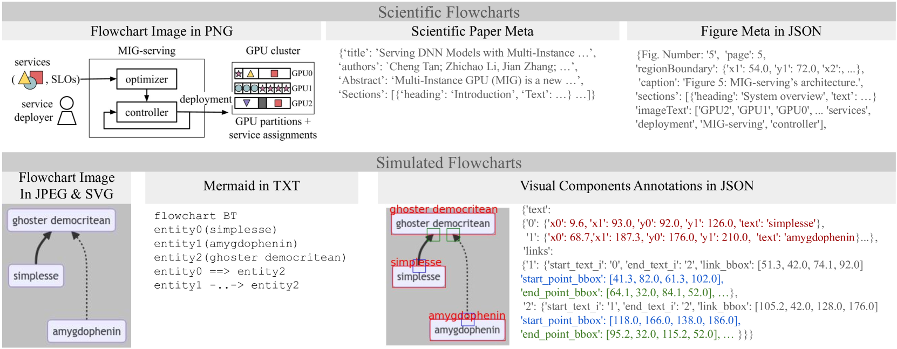

# FlowLearn：评估大型视觉-语言模型在流程图理解方面的表现

发布时间：2024年07月06日

`LLM应用` `科学研究`

> FlowLearn: Evaluating Large Vision-Language Models on Flowchart Understanding

# 摘要

> 流程图，作为简化复杂概念的视觉工具，本文引入了FlowLearn数据集，旨在深化对流程图的理解。该数据集不仅收录了3,858个来自科学文献的复杂流程图，还包含了10,000个模拟流程图。通过详尽的视觉组件、OCR、Mermaid代码及VQA问答对标注，FlowLearn为研究提供了丰富资源。尽管大型视觉-语言模型（LVLMs）在视觉理解领域表现卓越，但其在解读科学交流核心——流程图——的能力仍待全面探索。FlowLearn测试集正是为此设计，用以检验LVLMs在流程图理解上的表现。我们的研究不仅全面评估了当前最先进的LVLMs，揭示了其局限性，更为这一领域未来的发展奠定了基础。例如，GPT-4V在模拟流程图节点计数中准确率高达58%，而Claude在OCR任务中准确率则达到83%。然而，没有任何模型能在FlowLearn框架的所有任务中独占鳌头，这无疑为未来的研究与开发提供了广阔空间。

> Flowcharts are graphical tools for representing complex concepts in concise visual representations. This paper introduces the FlowLearn dataset, a resource tailored to enhance the understanding of flowcharts. FlowLearn contains complex scientific flowcharts and simulated flowcharts. The scientific subset contains 3,858 flowcharts sourced from scientific literature and the simulated subset contains 10,000 flowcharts created using a customizable script. The dataset is enriched with annotations for visual components, OCR, Mermaid code representation, and VQA question-answer pairs. Despite the proven capabilities of Large Vision-Language Models (LVLMs) in various visual understanding tasks, their effectiveness in decoding flowcharts - a crucial element of scientific communication - has yet to be thoroughly investigated. The FlowLearn test set is crafted to assess the performance of LVLMs in flowchart comprehension. Our study thoroughly evaluates state-of-the-art LVLMs, identifying existing limitations and establishing a foundation for future enhancements in this relatively underexplored domain. For instance, in tasks involving simulated flowcharts, GPT-4V achieved the highest accuracy (58%) in counting the number of nodes, while Claude recorded the highest accuracy (83%) in OCR tasks. Notably, no single model excels in all tasks within the FlowLearn framework, highlighting significant opportunities for further development.

[Arxiv](https://arxiv.org/abs/2407.05183)