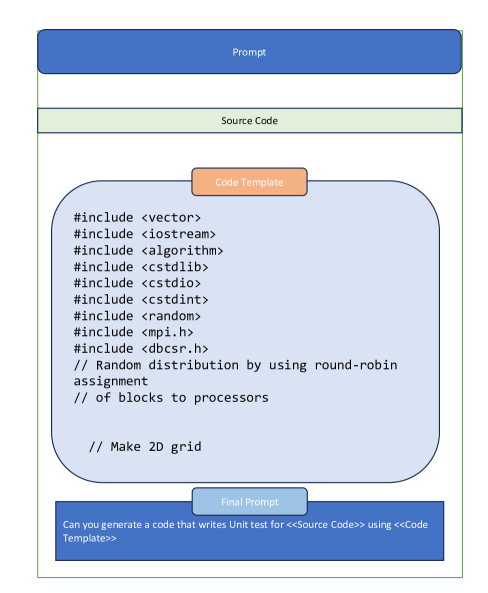

# 驾驭 LLM 之力：自动生成高性能计算的单元测试

发布时间：2024年07月06日

`LLM应用` `软件工程` `高性能计算`

> Harnessing the Power of LLMs: Automating Unit Test Generation for High-Performance Computing

# 摘要

> 单元测试在软件工程中至关重要，但在并行和高性能计算软件中使用较少，尤其是科学应用，因其用户基础小且逻辑复杂。这使得单元测试既具挑战性又成本高昂，需要专业知识且现有工具常无效。为此，我们提出了一种自动化方法，针对这类软件的独特特性如复杂逻辑和并行处理，生成单元测试。近期，大型语言模型（LLMs）在编码和测试领域展现出潜力。我们研究了Davinci和ChatGPT在C++并行程序单元测试生成中的应用，发现它们能生成大部分正确且全面的测试，但也有局限，如重复断言和空白测试用例。

> Unit testing is crucial in software engineering for ensuring quality. However, it's not widely used in parallel and high-performance computing software, particularly scientific applications, due to their smaller, diverse user base and complex logic. These factors make unit testing challenging and expensive, as it requires specialized knowledge and existing automated tools are often ineffective.
  To address this, we propose an automated method for generating unit tests for such software, considering their unique features like complex logic and parallel processing. Recently, large language models (LLMs) have shown promise in coding and testing. We explored the capabilities of Davinci (text-davinci-002) and ChatGPT (gpt-3.5-turbo) in creating unit tests for C++ parallel programs. Our results show that LLMs can generate mostly correct and comprehensive unit tests, although they have some limitations, such as repetitive assertions and blank test cases.

[Arxiv](https://arxiv.org/abs/2407.05202)