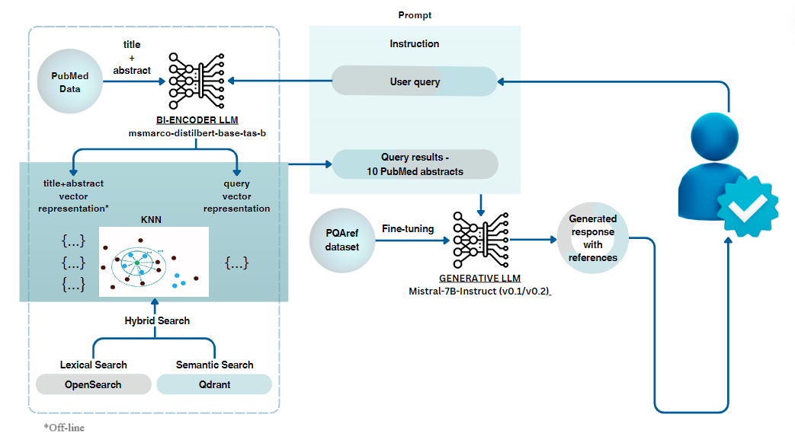
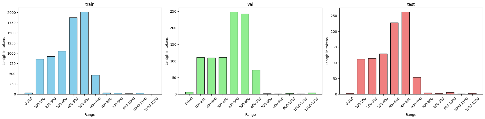

# 如何得知？引导生成语言模型参照生物医学问题的答案

发布时间：2024年07月06日

`RAG` `生物医学` `搜索引擎`

> How do you know that? Teaching Generative Language Models to Reference Answers to Biomedical Questions

# 摘要

> 大型语言模型 (LLM) 已成为在线解答用户疑问的首选，但其答案的准确性和可靠性在生物医学等敏感领域尤为关键。为此，我们设计了一种生物医学检索增强生成 (RAG) 系统，通过微调 LLM 并结合 PubMed 相关摘要，确保答案的可靠性。用户可直接验证每条陈述的来源。与 PubMed 搜索引擎相比，我们的系统性能提升了 23%。在小规模评估中，我们的微调 LLM 在摘要引用方面与 GPT-4 Turbo 表现相当。我们还公开了微调所需的数据集及模型。

> Large language models (LLMs) have recently become the leading source of answers for users' questions online. Despite their ability to offer eloquent answers, their accuracy and reliability can pose a significant challenge. This is especially true for sensitive domains such as biomedicine, where there is a higher need for factually correct answers. This paper introduces a biomedical retrieval-augmented generation (RAG) system designed to enhance the reliability of generated responses. The system is based on a fine-tuned LLM for the referenced question-answering, where retrieved relevant abstracts from PubMed are passed to LLM's context as input through a prompt. Its output is an answer based on PubMed abstracts, where each statement is referenced accordingly, allowing the users to verify the answer. Our retrieval system achieves an absolute improvement of 23% compared to the PubMed search engine. Based on the manual evaluation on a small sample, our fine-tuned LLM component achieves comparable results to GPT-4 Turbo in referencing relevant abstracts. We make the dataset used to fine-tune the models and the fine-tuned models based on Mistral-7B-instruct-v0.1 and v0.2 publicly available.

[Arxiv](https://arxiv.org/abs/2407.05015)