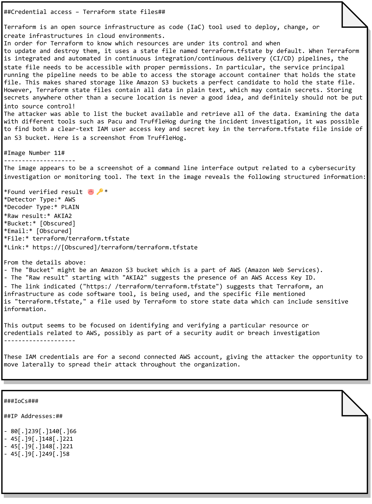

# LLMCloudHunter：借助 LLM 之力，自动化提炼云端 CTI 的检测规则

发布时间：2024年07月06日

`LLM应用` `网络安全` `云计算`

> LLMCloudHunter: Harnessing LLMs for Automated Extraction of Detection Rules from Cloud-Based CTI

# 摘要

> 随着网络攻击的增多和复杂化，威胁狩猎在主动安全中变得至关重要，它能在威胁造成重大损害前进行主动检测和缓解。开源网络威胁情报（OS-CTI）虽为威胁猎人提供了宝贵资源，但常以非结构化形式出现，需手动分析。以往研究在自动化OSCTI分析方面存在局限，如未能提供可操作输出、未利用图像信息、忽视云环境重要性。为此，我们提出LLMCloudHunter框架，利用大型语言模型从文本和视觉OSCTI数据中自动生成检测规则候选。通过12份真实云威胁报告的评估，该框架在提取API调用和IoCs方面分别达到92%精确度和98%召回率，以及99%精确度和98%召回率。此外，99.18%的规则候选成功转换为Splunk查询。

> As the number and sophistication of cyber attacks have increased, threat hunting has become a critical aspect of active security, enabling proactive detection and mitigation of threats before they cause significant harm. Open-source cyber threat intelligence (OS-CTI) is a valuable resource for threat hunters, however, it often comes in unstructured formats that require further manual analysis. Previous studies aimed at automating OSCTI analysis are limited since (1) they failed to provide actionable outputs, (2) they did not take advantage of images present in OSCTI sources, and (3) they focused on on-premises environments, overlooking the growing importance of cloud environments. To address these gaps, we propose LLMCloudHunter, a novel framework that leverages large language models (LLMs) to automatically generate generic-signature detection rule candidates from textual and visual OSCTI data. We evaluated the quality of the rules generated by the proposed framework using 12 annotated real-world cloud threat reports. The results show that our framework achieved a precision of 92% and recall of 98% for the task of accurately extracting API calls made by the threat actor and a precision of 99% with a recall of 98% for IoCs. Additionally, 99.18% of the generated detection rule candidates were successfully compiled and converted into Splunk queries.

[Arxiv](https://arxiv.org/abs/2407.05194)