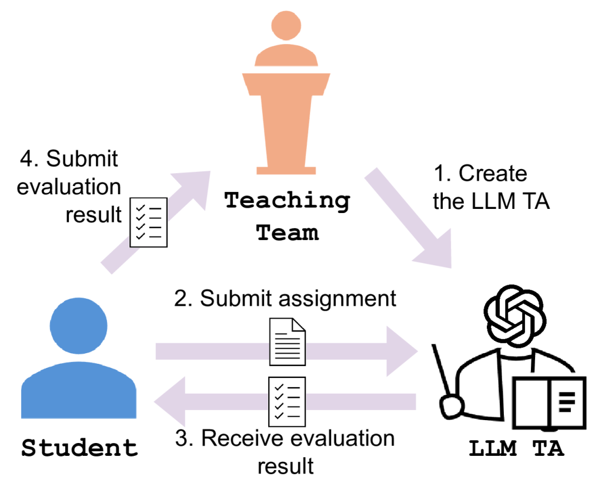
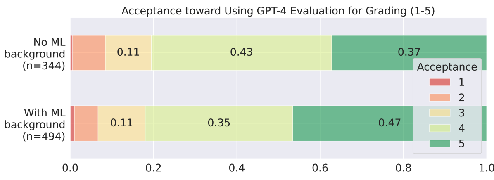
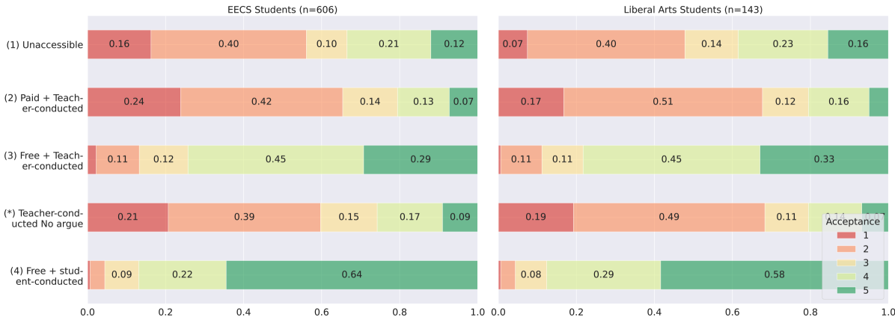
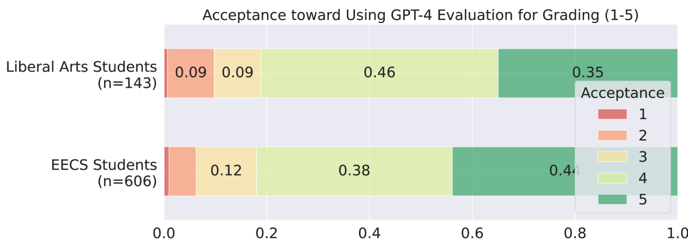
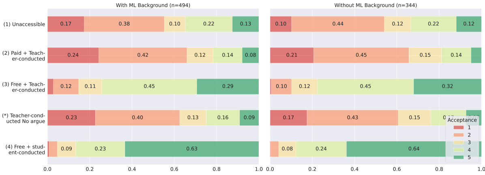
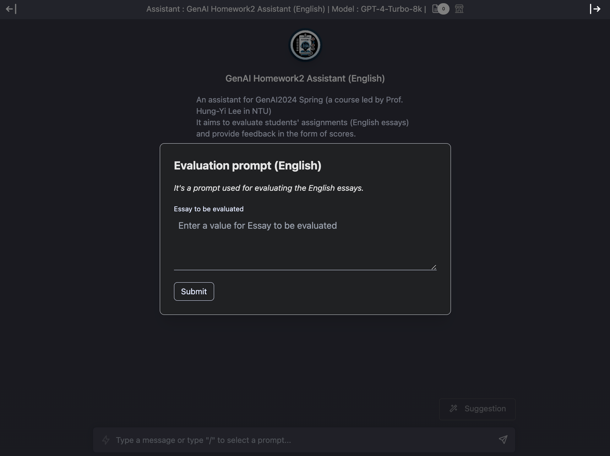
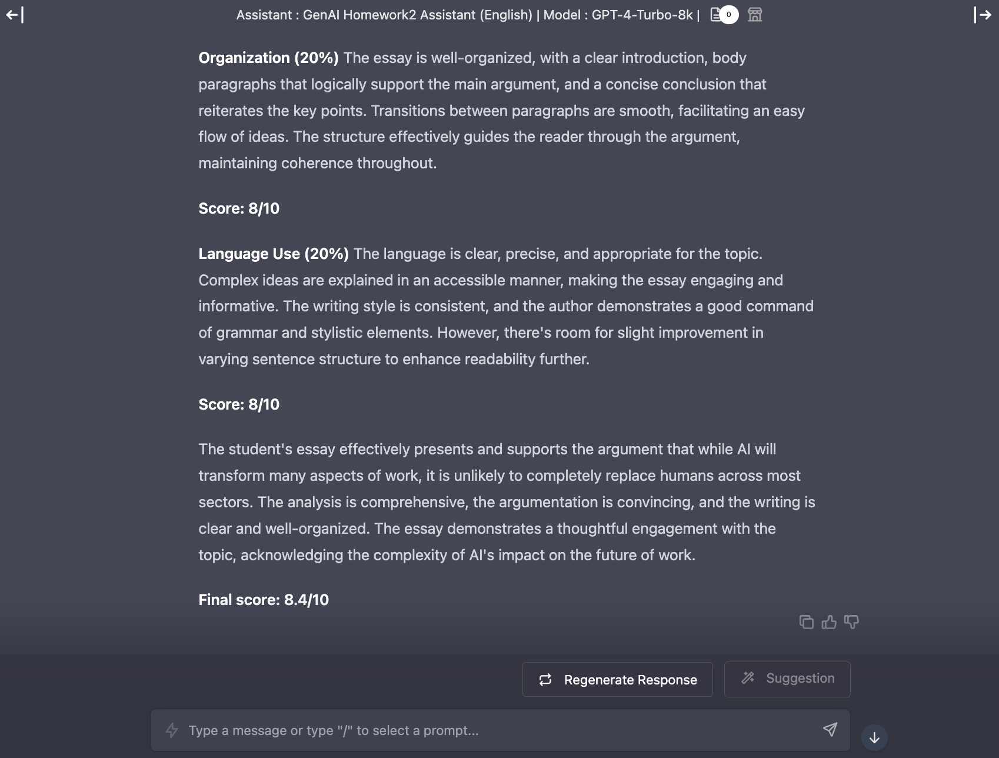

# 大型语言模型在评估作业方面提供了宝贵的见解和反馈，但在处理超过1000名学生的课程时也面临挑战。

发布时间：2024年07月06日

`LLM应用` `人工智能`

> Large Language Model as an Assignment Evaluator: Insights, Feedback, and Challenges in a 1000+ Student Course

# 摘要

> 在 NLP 研究中，利用大型语言模型 (LLM) 进行自动评估已变得至关重要。但这些基于 LLM 的评估器能否在实际课堂中用于学生作业评估尚存疑问。本报告展示了我们如何在一门包含 1,028 名学生的课程中运用 GPT-4 进行自动作业评估。调查显示，当学生能自由使用这些评估工具时，它们颇受欢迎。不过，学生也反映 LLM 有时会偏离评估指南。更有甚者，学生发现通过操控评估器输出特定内容，即便未达标也能获得高分。结合学生意见与实践经验，我们提出了一系列建议，旨在优化未来课堂中 LLM 评估器的应用。

> Using large language models (LLMs) for automatic evaluation has become an important evaluation method in NLP research. However, it is unclear whether these LLM-based evaluators can be applied in real-world classrooms to assess student assignments. This empirical report shares how we use GPT-4 as an automatic assignment evaluator in a university course with 1,028 students. Based on student responses, we find that LLM-based assignment evaluators are generally acceptable to students when students have free access to these LLM-based evaluators. However, students also noted that the LLM sometimes fails to adhere to the evaluation instructions. Additionally, we observe that students can easily manipulate the LLM-based evaluator to output specific strings, allowing them to achieve high scores without meeting the assignment rubric. Based on student feedback and our experience, we provide several recommendations for integrating LLM-based evaluators into future classrooms.

[Arxiv](https://arxiv.org/abs/2407.05216)