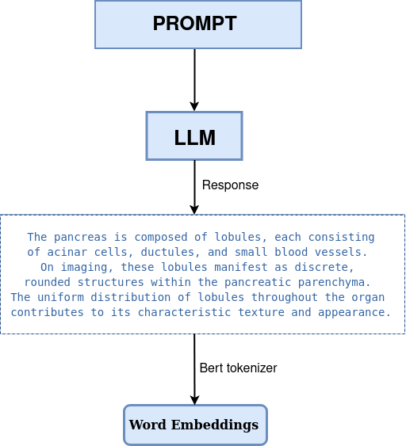
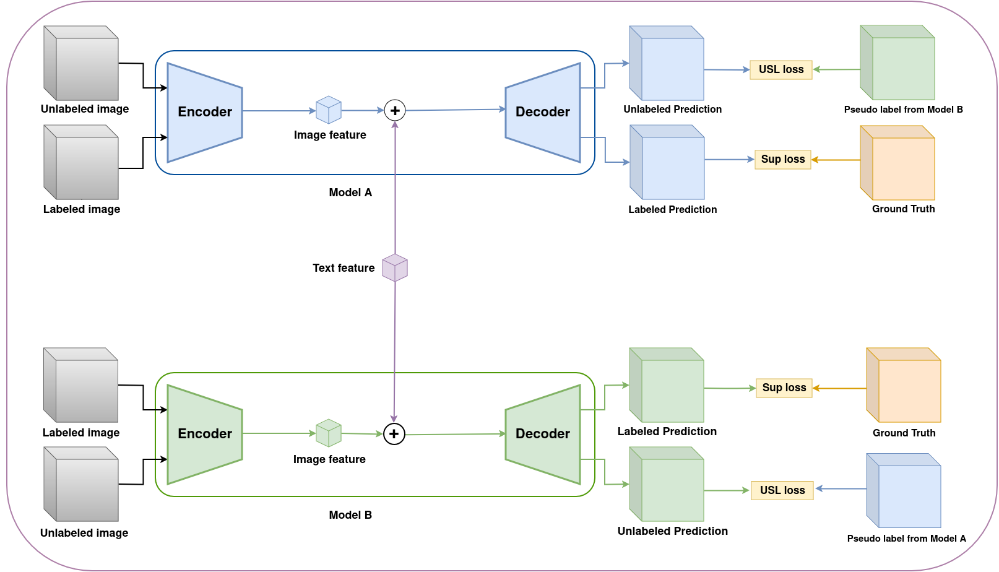
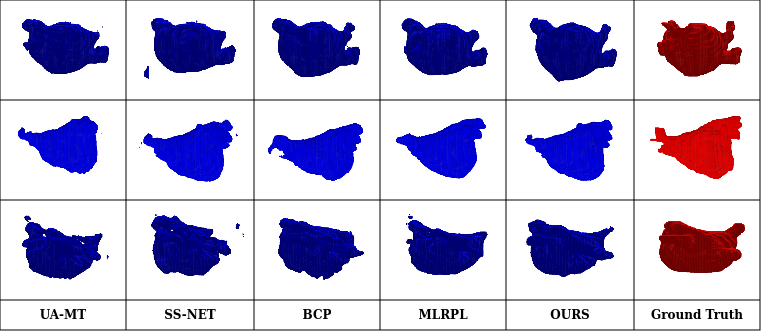
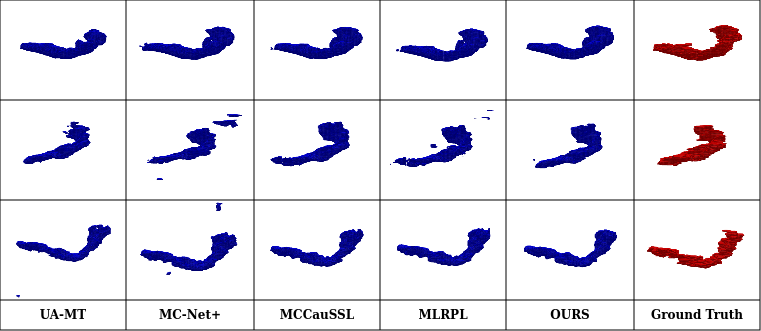
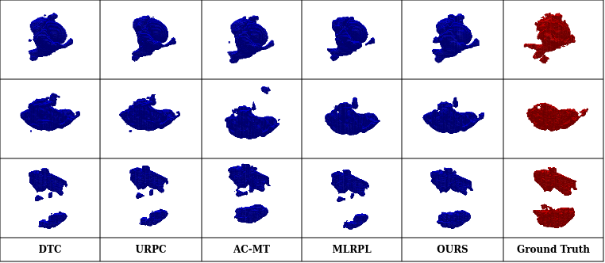
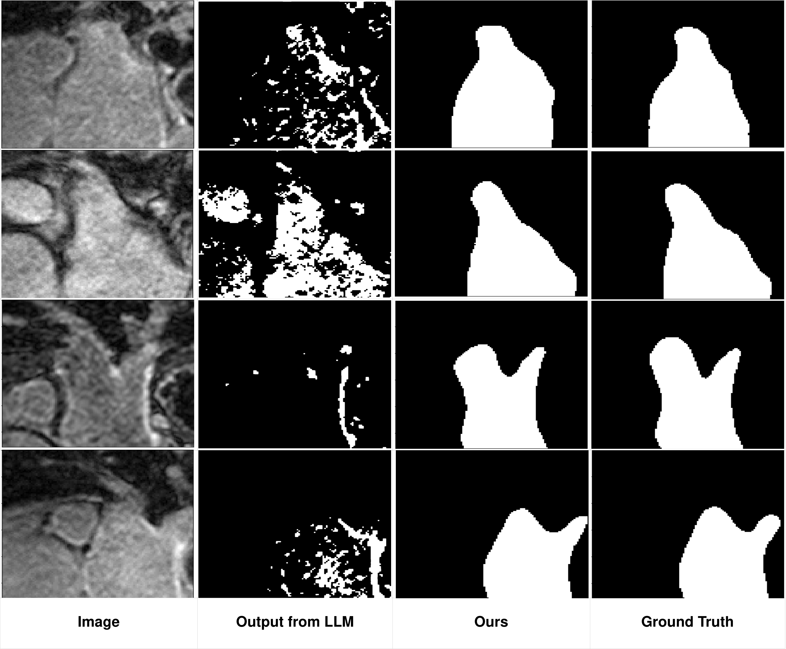

# 借助 LLM 中的任务特定知识，实现半监督式 3D 医学图像分割

发布时间：2024年07月06日

`LLM应用` `人工智能`

> Leveraging Task-Specific Knowledge from LLM for Semi-Supervised 3D Medical Image Segmentation

# 摘要

> 传统的3D医学图像分割需要大量体素级标注，耗时且成本高昂。半监督学习（SSL）虽能缓解这一问题，但现有SSL模型仍难以充分挖掘未标注数据的潜力。为此，我们推出了LLM-SegNet，该模型借助大型语言模型（LLM）将专业知识融入协同训练框架，助力模型深入理解感兴趣区域（ROI）特征，实现更精准的分割。同时，我们设计了一种统一的分割损失函数，通过优化模型在自信与不确定区域的预测，进一步降低分割错误。在Left Atrium、Pancreas-CT和Brats-19等公开数据集上的实验显示，LLM-SegNet性能卓越，超越了现有顶尖模型。此外，消融研究也证实了LLM-SegNet各模块及损失函数的有效性。

> Traditional supervised 3D medical image segmentation models need voxel-level annotations, which require huge human effort, time, and cost. Semi-supervised learning (SSL) addresses this limitation of supervised learning by facilitating learning with a limited annotated and larger amount of unannotated training samples. However, state-of-the-art SSL models still struggle to fully exploit the potential of learning from unannotated samples. To facilitate effective learning from unannotated data, we introduce LLM-SegNet, which exploits a large language model (LLM) to integrate task-specific knowledge into our co-training framework. This knowledge aids the model in comprehensively understanding the features of the region of interest (ROI), ultimately leading to more efficient segmentation. Additionally, to further reduce erroneous segmentation, we propose a Unified Segmentation loss function. This loss function reduces erroneous segmentation by not only prioritizing regions where the model is confident in predicting between foreground or background pixels but also effectively addressing areas where the model lacks high confidence in predictions. Experiments on publicly available Left Atrium, Pancreas-CT, and Brats-19 datasets demonstrate the superior performance of LLM-SegNet compared to the state-of-the-art. Furthermore, we conducted several ablation studies to demonstrate the effectiveness of various modules and loss functions leveraged by LLM-SegNet.

[Arxiv](https://arxiv.org/abs/2407.05088)