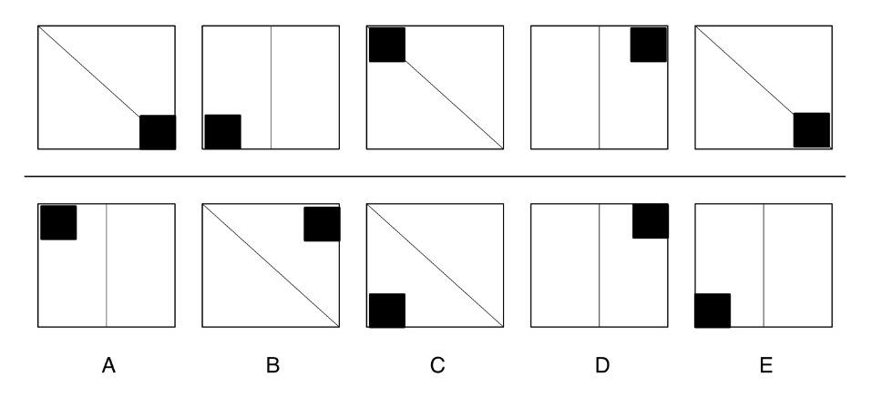

# LogicVista：一项针对视觉环境中多模态大型语言模型的逻辑推理基准测试

发布时间：2024年07月06日

`LLM应用` `人工智能`

> LogicVista: Multimodal LLM Logical Reasoning Benchmark in Visual Contexts

# 摘要

> 我们推出了 LogicVista 评估基准，旨在全面检验多模态大型语言模型 (MLLMs) 在视觉环境中的逻辑推理能力。随着 MLLMs 技术的进步，它们已能从图像中创作诗歌，甚至进行数学推理。但针对这些模型在逻辑推理任务上的表现，尤其是对导航和解谜等关键活动的影响，仍缺乏系统性评估。为此，我们设计了包含 448 道多选题的测试集，覆盖 5 大逻辑推理任务和 9 项不同能力，每个问题附有正确答案及人类推理解释，便于开放式和多选题评估。LogicVista 已对 8 个 MLLMs 进行了详尽测试，相关代码和数据已公开于 https://github.com/Yijia-Xiao/LogicVista。

> We propose LogicVista, an evaluation benchmark that assesses the integrated logical reasoning capabilities of multimodal large language models (MLLMs) in Visual contexts. Recent advancements in MLLMs have demonstrated various fascinating abilities, from crafting poetry based on an image to performing mathematical reasoning. However, there is still a lack of systematic evaluation of MLLMs' proficiency in logical reasoning tasks, which are essential for activities like navigation and puzzle-solving. Thus we evaluate general logical cognition abilities across 5 logical reasoning tasks encompassing 9 different capabilities, using a sample of 448 multiple-choice questions. Each question is annotated with the correct answer and the human-written reasoning behind the selection, enabling both open-ended and multiple-choice evaluation. A total of 8 MLLMs are comprehensively evaluated using LogicVista. Code and Data Available at https://github.com/Yijia-Xiao/LogicVista.

[Arxiv](https://arxiv.org/abs/2407.04973)