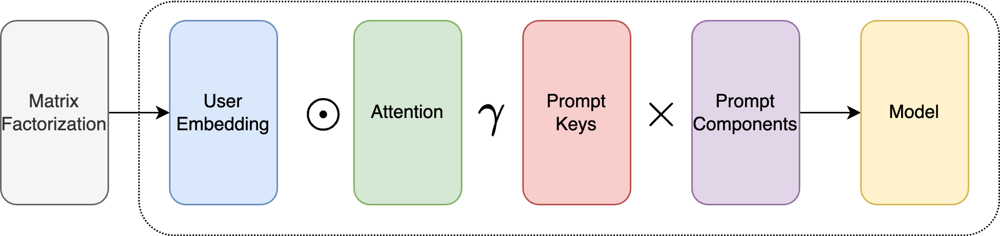
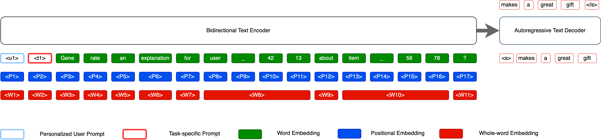
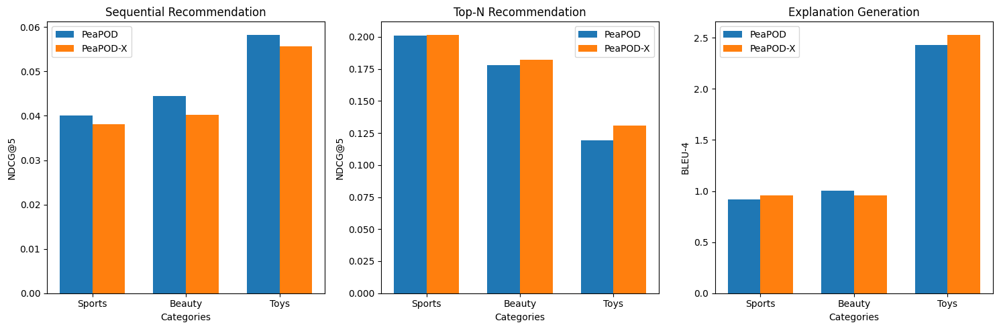

# 个性化生成推荐中的偏好蒸馏

发布时间：2024年07月06日

`LLM应用` `推荐系统` `个性化服务`

> Preference Distillation for Personalized Generative Recommendation

# 摘要

> 近期，研究者们探索了大型语言模型（LLM）在推荐系统中的应用。现有基于LLM的推荐模型通过在离散模板中加入用户和物品ID进行训练，但ID与自然语言的脱节限制了LLM学习用户关系的能力。为此，我们提出了个性化提示蒸馏（PeaPOD）方法，将用户偏好转化为个性化软提示。鉴于用户偏好的复杂性，我们采用一组动态加权的可学习提示，以组合方式构建个性化提示。实验表明，PeaPOD模型在序列推荐、top-n推荐及解释生成等任务中表现出色。

> Recently, researchers have investigated the capabilities of Large Language Models (LLMs) for generative recommender systems. Existing LLM-based recommender models are trained by adding user and item IDs to a discrete prompt template. However, the disconnect between IDs and natural language makes it difficult for the LLM to learn the relationship between users. To address this issue, we propose a PErsonAlized PrOmpt Distillation (PeaPOD) approach, to distill user preferences as personalized soft prompts. Considering the complexities of user preferences in the real world, we maintain a shared set of learnable prompts that are dynamically weighted based on the user's interests to construct the user-personalized prompt in a compositional manner. Experimental results on three real-world datasets demonstrate the effectiveness of our PeaPOD model on sequential recommendation, top-n recommendation, and explanation generation tasks.

[Arxiv](https://arxiv.org/abs/2407.05033)