# 是进步还是退步？训练后的自我提升出现了逆转现象。

发布时间：2024年07月06日

`LLM理论` `人工智能`

> Progress or Regress? Self-Improvement Reversal in Post-training

# 摘要

> 迭代偏好学习等训练后方法的自我改进，无需人工干预就能提升LLM的解题能力，如数学推理，备受赞誉。但深入探究后，我们需评估这些进步是否真能应对更难题，或可能导致意外退步。为此，我们设计了超越表面指标的全面评估框架，深入剖析训练后自我改进的实质。实验分析显示，“自我改进逆转”现象：虽在基准测试中表现提升，模型却在输出多样性和OOD泛化等关键能力上退步。这表明，当前训练后自我改进尚不足以应对复杂问题，并凸显了我们评估指标在区分LLM自我改进中进步与退步的必要性。

> Self-improvement through post-training methods such as iterative preference learning has been acclaimed for enhancing the problem-solving capabilities (e.g., mathematical reasoning) of Large Language Models (LLMs) without human intervention. However, as exploration deepens, it becomes crucial to assess whether these improvements genuinely signify progress in solving more challenging problems or if they could lead to unintended regressions. To address this, we propose a comprehensive evaluative framework that goes beyond the superficial pass@1 metric to scrutinize the underlying enhancements of post-training paradigms for self-improvement. Through rigorous experimentation and analysis across diverse problem-solving tasks, the empirical results point out the phenomenon of \emph{self-improvement reversal}, where models showing improved performance across benchmarks will paradoxically exhibit declines in broader, essential capabilities, like output diversity and out-of-distribution (OOD) generalization. These findings indicate that current self-improvement practices through post-training are inadequate for equipping models to tackle more complex problems. Furthermore, they underscore the necessity of our critical evaluation metrics in discerning the \emph{progress or regress} dichotomy for self-improving LLMs.

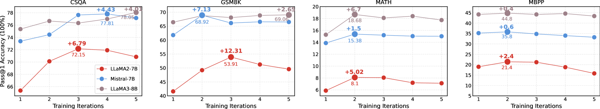

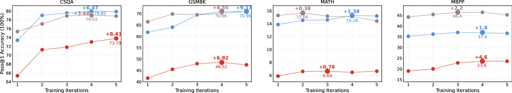

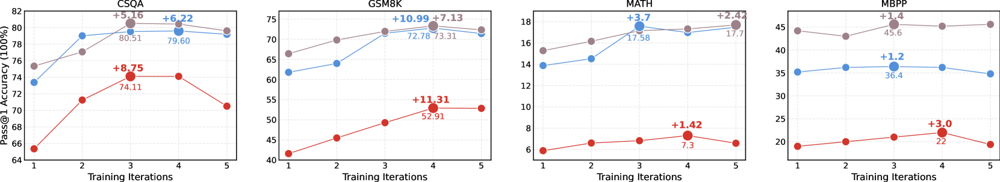

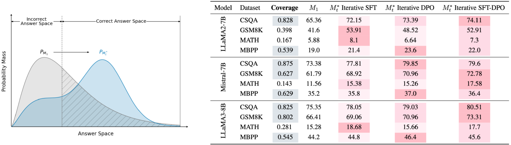

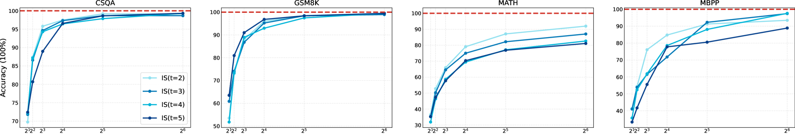

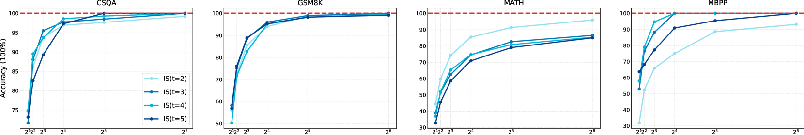

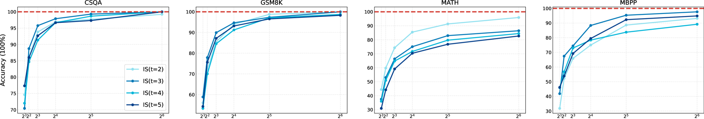

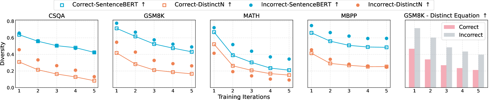

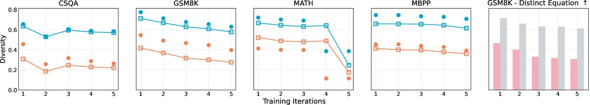

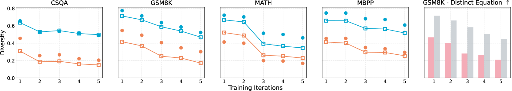

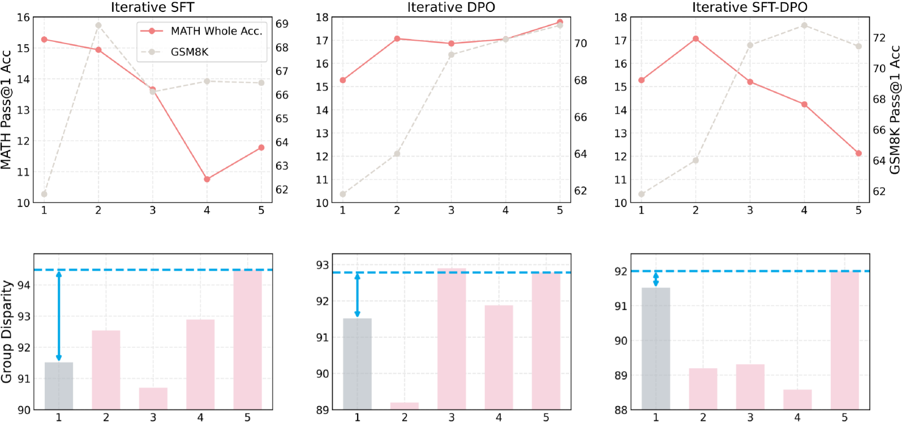

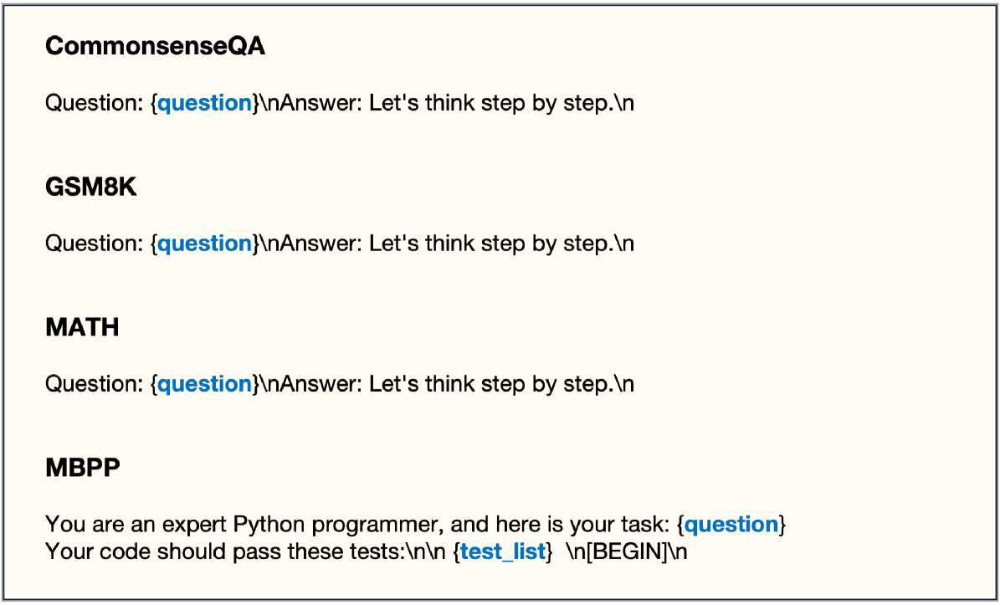

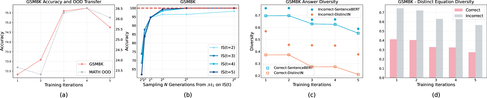

[Arxiv](https://arxiv.org/abs/2407.05013)