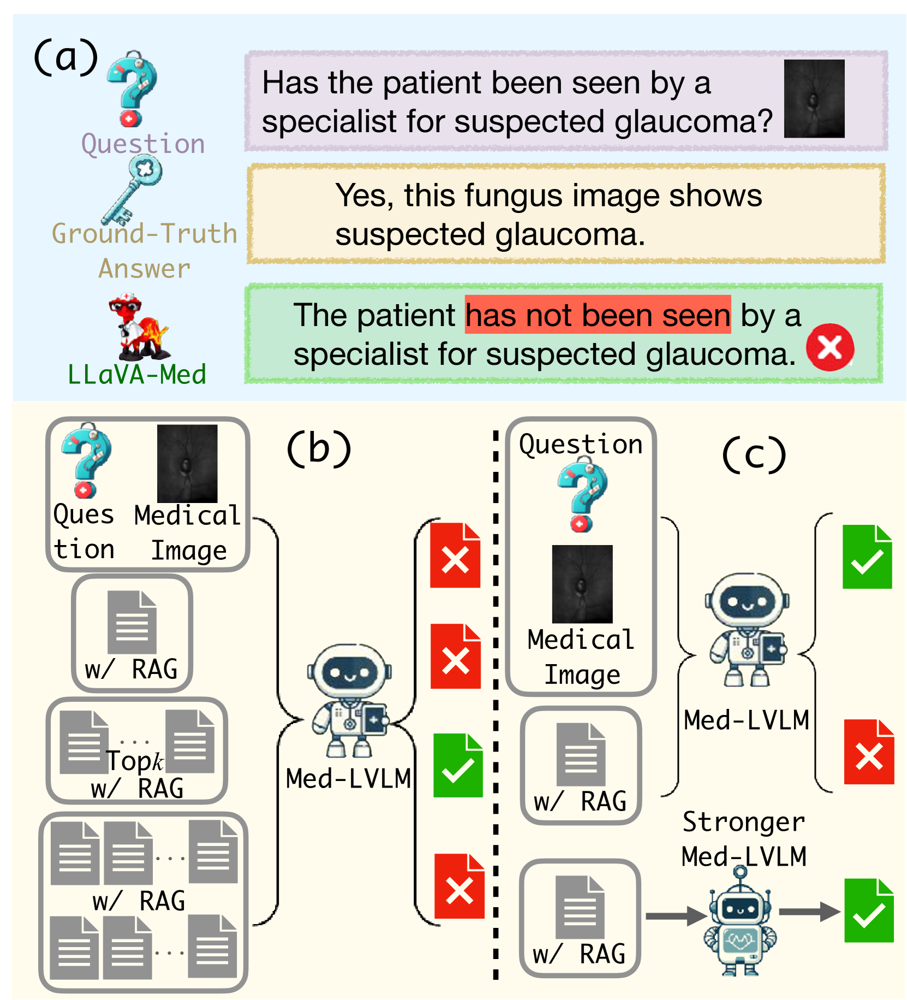
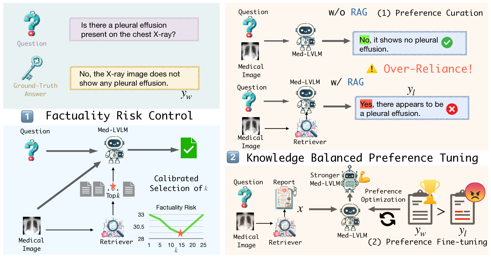
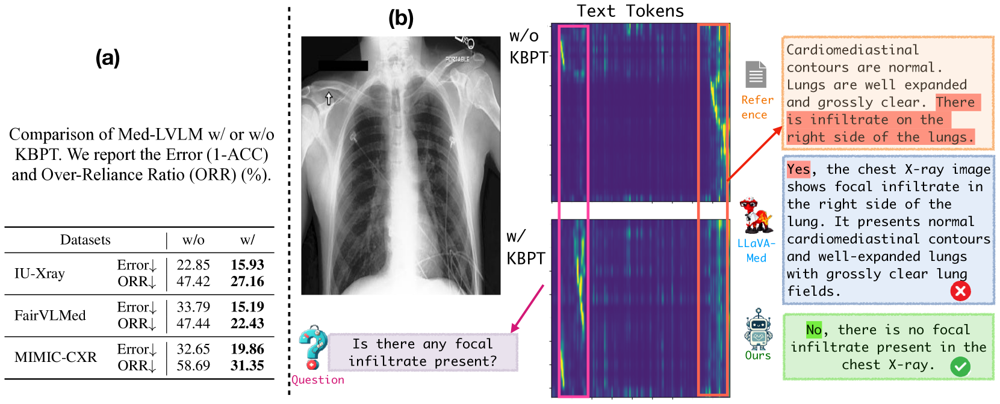
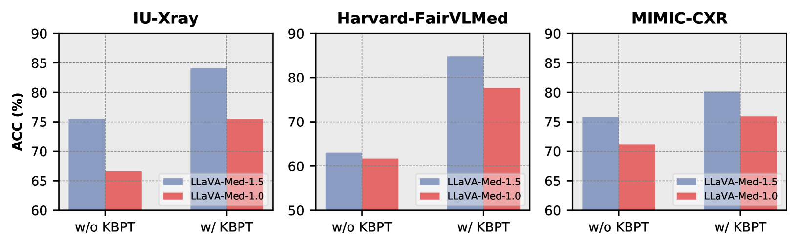
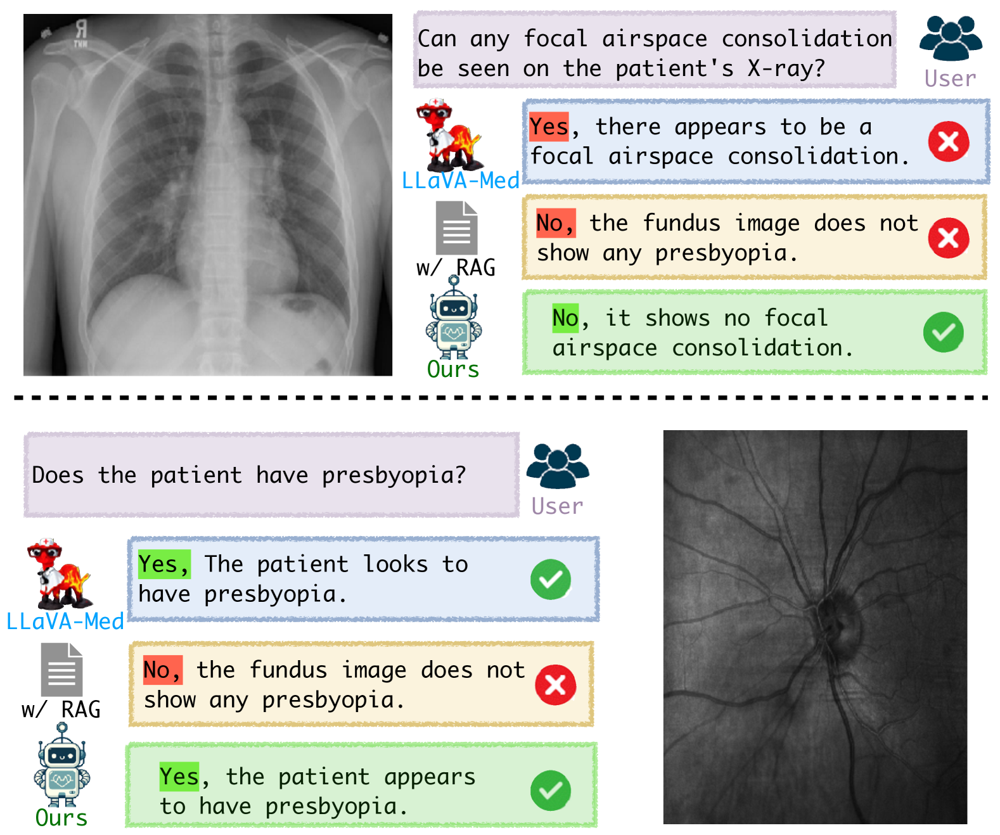

# RULE：医学视觉语言模型中事实性的可靠多模态 RAG

发布时间：2024年07月06日

`RAG` `人工智能`

> RULE: Reliable Multimodal RAG for Factuality in Medical Vision Language Models

# 摘要

> 近期，医疗大型视觉语言模型（Med-LVLMs）在医疗诊断领域崭露头角，但它们在生成与医学事实不符的回答时屡见不鲜。检索增强生成（RAG）虽能借助外部知识提升事实准确性，却也带来了两大难题：一是检索内容可能不足或过多，导致信息不全或干扰生成；二是过度依赖检索内容，反而可能引发错误。为此，我们设计了RULE系统，通过精准控制检索数量来降低事实风险，并利用错误样本构建数据集进行模型微调，以平衡固有知识与检索内容的依赖。实验表明，RULE在三个医疗VQA数据集上平均提升了20.8%的事实准确性，相关基准和代码已公开于https://github.com/richard-peng-xia/RULE。

> The recent emergence of Medical Large Vision Language Models (Med-LVLMs) has enhanced medical diagnosis. However, current Med-LVLMs frequently encounter factual issues, often generating responses that do not align with established medical facts. Retrieval-Augmented Generation (RAG), which utilizes external knowledge, can improve the factual accuracy of these models but introduces two major challenges. First, limited retrieved contexts might not cover all necessary information, while excessive retrieval can introduce irrelevant and inaccurate references, interfering with the model's generation. Second, in cases where the model originally responds correctly, applying RAG can lead to an over-reliance on retrieved contexts, resulting in incorrect answers. To address these issues, we propose RULE, which consists of two components. First, we introduce a provably effective strategy for controlling factuality risk through the calibrated selection of the number of retrieved contexts. Second, based on samples where over-reliance on retrieved contexts led to errors, we curate a preference dataset to fine-tune the model, balancing its dependence on inherent knowledge and retrieved contexts for generation. We demonstrate the effectiveness of RULE on three medical VQA datasets, achieving an average improvement of 20.8% in factual accuracy. We publicly release our benchmark and code in https://github.com/richard-peng-xia/RULE.

[Arxiv](https://arxiv.org/abs/2407.05131)