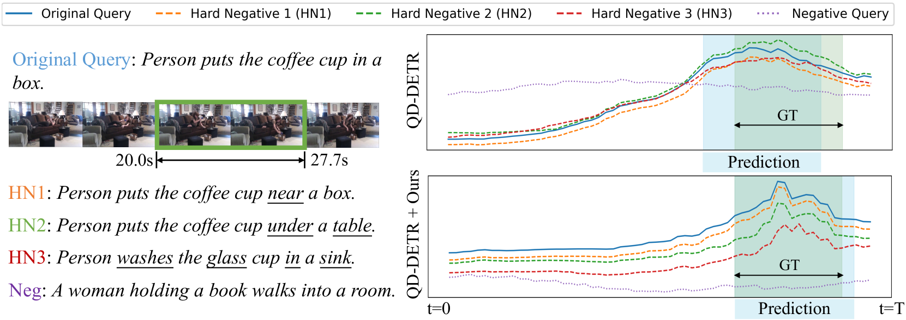
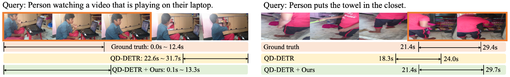

# SHINE：基于显著性感知的层次负排序技术，用于组合时态定位任务

发布时间：2024年07月06日

`LLM应用` `视频处理`

> SHINE: Saliency-aware HIerarchical NEgative Ranking for Compositional Temporal Grounding

# 摘要

> 时间定位（视频时刻检索）旨在找到与查询句子匹配的视频片段。自然语言的组合特性使得定位超越预设事件成为可能，但也对现有方法的组合泛化能力构成挑战。近期研究通过分解-重建方式建立视频与查询的关联，以实现组合泛化。然而，这些研究仅关注主导原语，并通过随机采样与重组构建负查询，导致语义上不合理的负样本，妨碍模型学习合理组合。此外，基于DETR的方法在处理组合时间定位时仍显不足，面对与正查询细微不同的负查询时，显示出不合逻辑的显著性响应。为克服这些局限，我们首先提出一种利用GPT-3.5-Turbo生成语义合理硬负查询的大型语言模型驱动方法。接着，我们引入从粗到细的显著性排序策略，促使模型学习视频与层次化负查询间的多粒度语义关系，从而增强组合泛化能力。在两个挑战性基准上的广泛实验证实了我们方法的有效性与泛化性。代码已公开于https://github.com/zxccade/SHINE。

> Temporal grounding, a.k.a video moment retrieval, aims at locating video segments corresponding to a given query sentence. The compositional nature of natural language enables the localization beyond predefined events, posing a certain challenge to the compositional generalizability of existing methods. Recent studies establish the correspondence between videos and queries through a decompose-reconstruct manner to achieve compositional generalization. However, they only consider dominant primitives and build negative queries through random sampling and recombination, resulting in semantically implausible negatives that hinder the models from learning rational compositions. In addition, recent DETR-based methods still underperform in compositional temporal grounding, showing irrational saliency responses when given negative queries that have subtle differences from positive queries. To address these limitations, we first propose a large language model-driven method for negative query construction, utilizing GPT-3.5-Turbo to generate semantically plausible hard negative queries. Subsequently, we introduce a coarse-to-fine saliency ranking strategy, which encourages the model to learn the multi-granularity semantic relationships between videos and hierarchical negative queries to boost compositional generalization. Extensive experiments on two challenging benchmarks validate the effectiveness and generalizability of our proposed method. Our code is available at https://github.com/zxccade/SHINE.

[Arxiv](https://arxiv.org/abs/2407.05118)