# 大型语言模型能否破解包含多于两个未知数的复杂数学难题？这一挑战正待揭晓。

发布时间：2024年07月06日

`LLM应用`

> Solving for X and Beyond: Can Large Language Models Solve Complex Math Problems with More-Than-Two Unknowns?

# 摘要

> 大型语言模型 (LLM) 在解决数学问题方面表现出色，但现有基准多聚焦于简单问题，未能充分考验其推理能力。为此，我们推出了 BeyondX 基准，通过引入多未知数问题来挑战 LLM。利用自动化流程，我们逐步增加问题复杂度，发现即使经过数学任务微调的 LLM，其性能也随未知数增多而大幅下降。针对这一难题，我们提出了 Formulate-and-Solve 策略，有效应对任意未知数问题。实证显示，该策略不仅提升了 LLM 在 BeyondX 上的表现，更深化了对 LLM 应对复杂数学挑战时计算极限的理解。

> Large Language Models (LLMs) have demonstrated remarkable performance in solving math problems, a hallmark of human intelligence. Despite high success rates on current benchmarks; however, these often feature simple problems with only one or two unknowns, which do not sufficiently challenge their reasoning capacities. This paper introduces a novel benchmark, BeyondX, designed to address these limitations by incorporating problems with multiple unknowns. Recognizing the challenges in proposing multi-unknown problems from scratch, we developed BeyondX using an innovative automated pipeline that progressively increases complexity by expanding the number of unknowns in simpler problems. Empirical study on BeyondX reveals that the performance of existing LLMs, even those fine-tuned specifically on math tasks, significantly decreases as the number of unknowns increases - with a performance drop of up to 70\% observed in GPT-4. To tackle these challenges, we propose the Formulate-and-Solve strategy, a generalized prompting approach that effectively handles problems with an arbitrary number of unknowns. Our findings reveal that this strategy not only enhances LLM performance on the BeyondX benchmark but also provides deeper insights into the computational limits of LLMs when faced with more complex mathematical challenges.

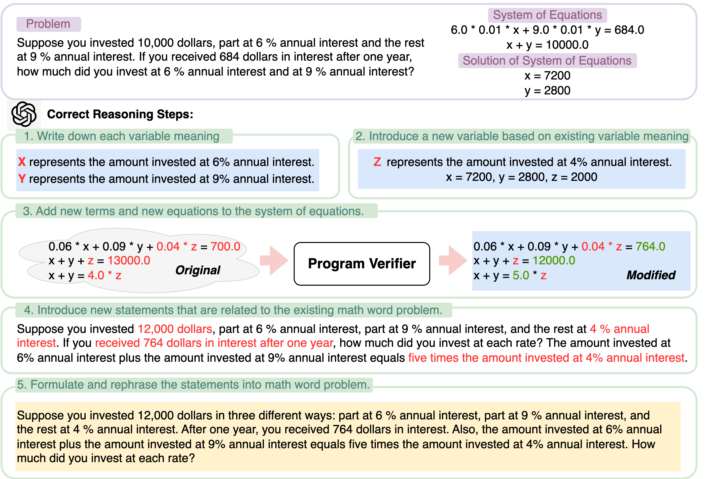

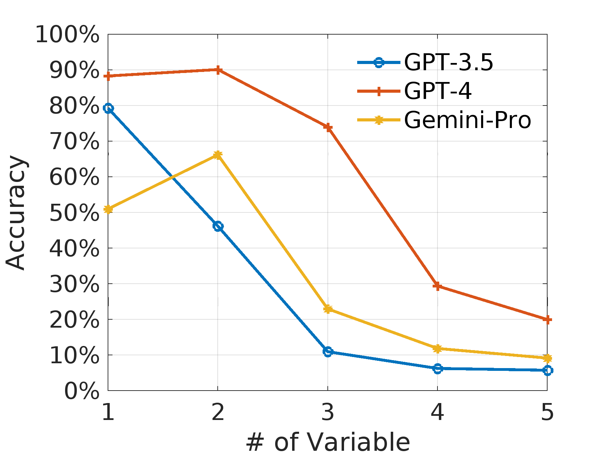

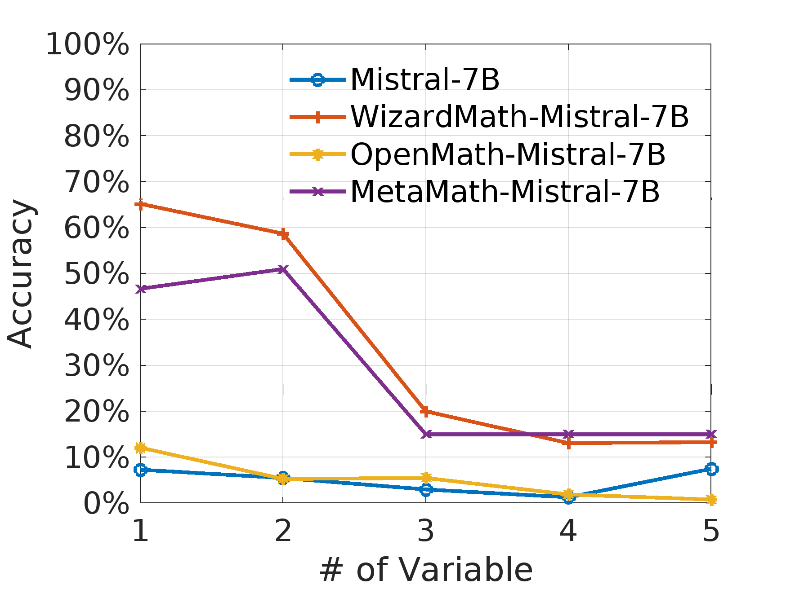

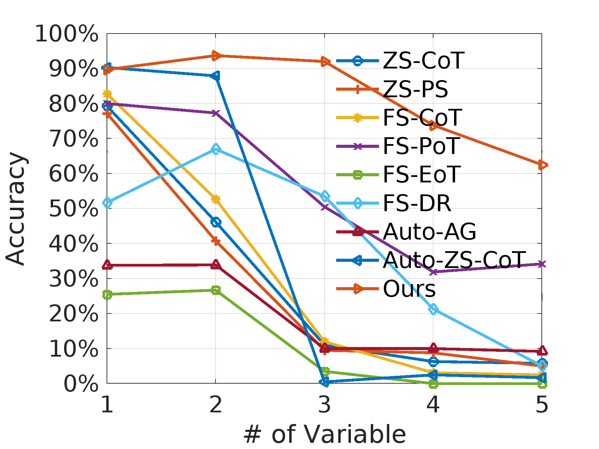

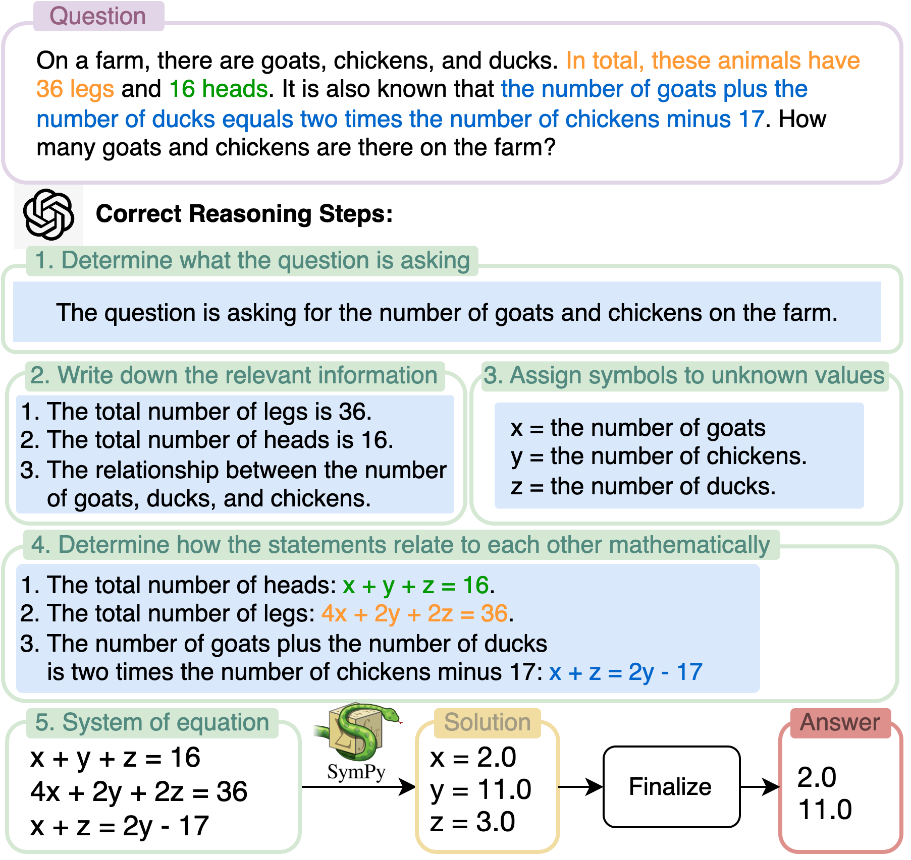

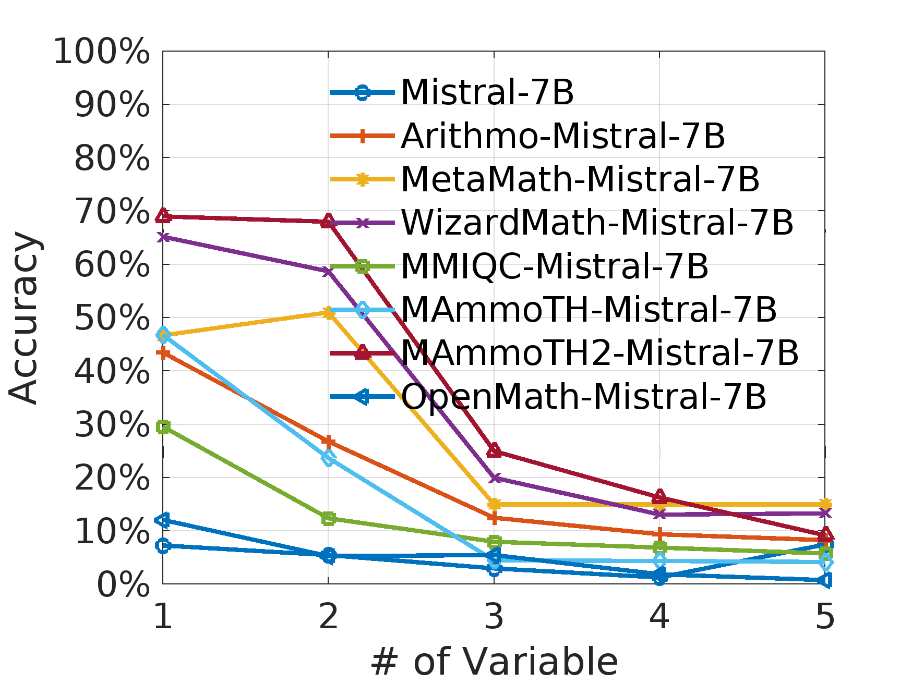

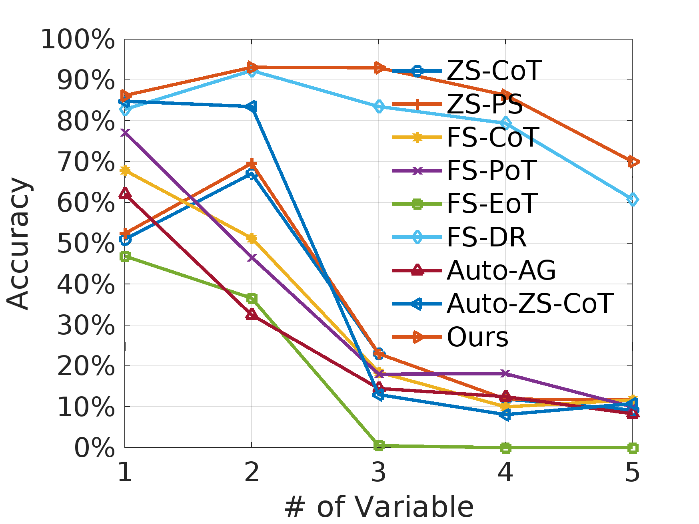

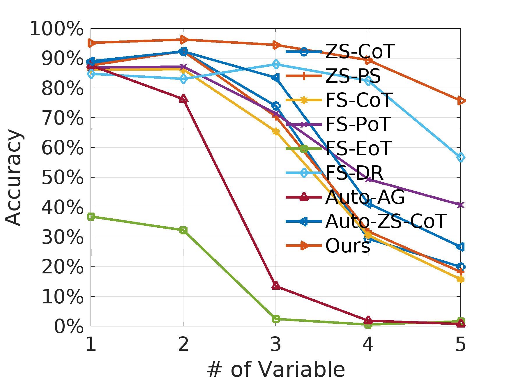

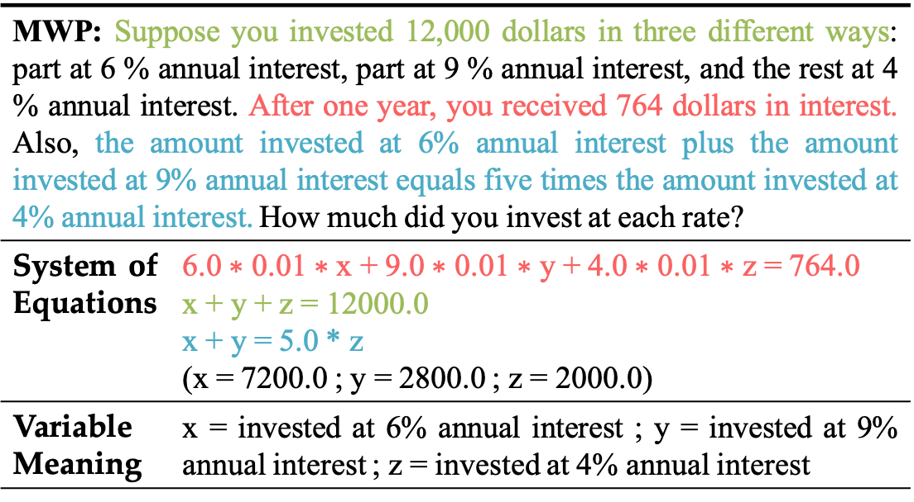

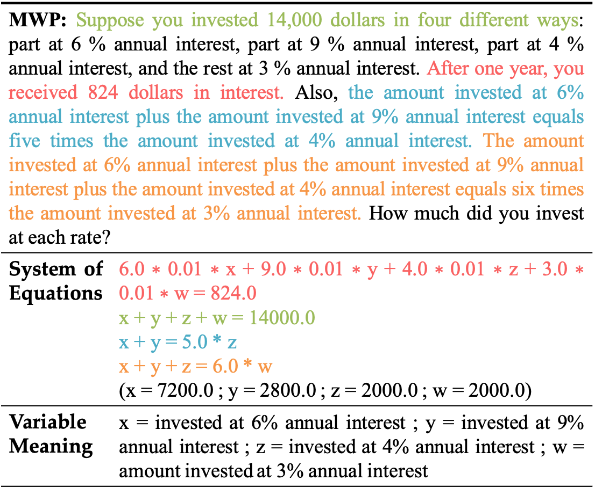

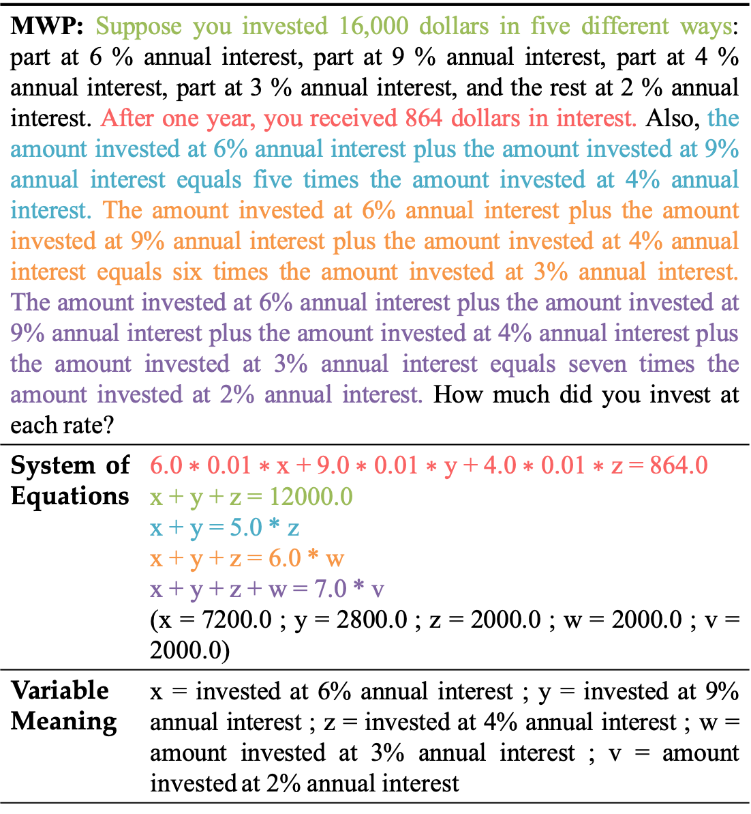

[Arxiv](https://arxiv.org/abs/2407.05134)