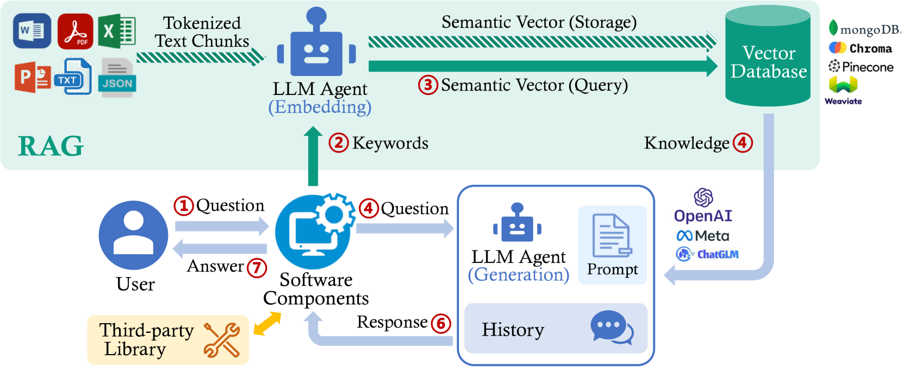
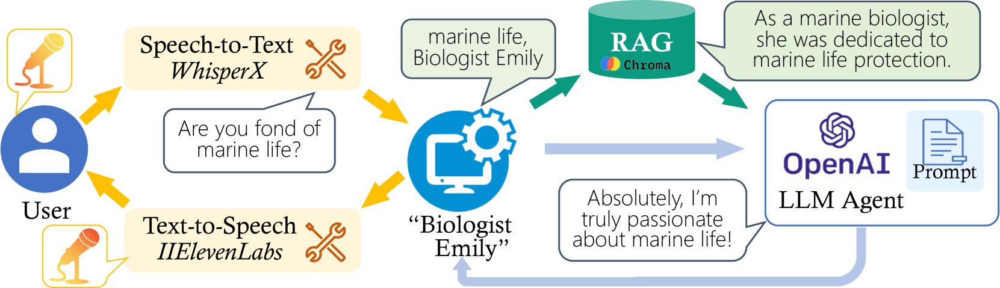

# Ripplet下的涡旋：RAG应用实证研究

发布时间：2024年07月06日

`LLM应用` `软件开发` `人工智能`

> Vortex under Ripplet: An Empirical Study of RAG-enabled Applications

# 摘要

> RAG增强的LLM在多种应用场景中表现出色，但开发者在集成过程中遇到诸多难题，如接口规范缺失、软件环境要求复杂等。我们深入分析了100个开源应用案例，发现几乎所有应用都存在集成缺陷，影响软件性能。为此，我们归纳了19种常见缺陷，并提供了解决方案。期待这些发现能助力LLM技术在软件开发中的应用，并推动相关领域的进一步研究。

> Large language models (LLMs) enhanced by retrieval-augmented generation (RAG) provide effective solutions in various application scenarios. However, developers face challenges in integrating RAG-enhanced LLMs into software systems, due to lack of interface specification, requirements from software context, and complicated system management. In this paper, we manually studied 100 open-source applications that incorporate RAG-enhanced LLMs, and their issue reports. We have found that more than 98% of applications contain multiple integration defects that harm software functionality, efficiency, and security. We have also generalized 19 defect patterns and proposed guidelines to tackle them. We hope this work could aid LLM-enabled software development and motivate future research.

[Arxiv](https://arxiv.org/abs/2407.05138)