# 从排队理论视角出发，解析大型语言模型在可变令牌长度下的低延迟推理

发布时间：2024年07月07日

`LLM应用` `人工智能` `计算机科学`

> A Queueing Theoretic Perspective on Low-Latency LLM Inference with Variable Token Length

# 摘要

> 大型语言模型（LLM）如 ChatGPT 推动了交互式 AI 应用的繁荣，但这些模型在推理时既计算密集又内存密集，不当的参数配置可能延长推理时间。本文探讨了 LLM 输出令牌分布对推理排队延迟的影响，并引入了最大令牌剪裁和批量推理策略。通过构建 M/G/1 模型，我们发现对少数请求设置最大输出令牌限制能显著减少排队延迟，并有助于选择最佳限制。对于批量推理，我们将其服务过程视为受批量大小和内部最大令牌大小影响的批量队列。我们分析了动态、固定和弹性三种批处理方式的排队延迟，实验结果验证了我们的数学模型与实际模拟的一致性。

> Large language models (LLMs) propel the prosperity of interactive AI applications showcased by ChatGPT that demand timely response of inference services. However, LLM inference is computation intensive and memory intensive, and improper parameter configuration at LLM platforms may exacerbate the inference time. In this paper, we analyze the impact of LLM output token distribution on the inference queueing delay, where the max-token clipping and the batched inference are considered. By formulating an M/G/1 model, we observe that enforcing a maximum output token limit on a very small fraction of inference requests can significantly reduce the queueing delay, and our model facilitates the selection of the optimal limit. For the batch inference, we model the service process as a bulk queue in which the batch processing time is affected by the batch size and the maximum token size inside this batch jointly. The queueing delays of the batching of all buffered requests (dynamic batching), the batching of constant number of requests (fixed batching), and the batching without intra-batch waiting (elastic batching) are derived. Experimental results show that our mathematical models coincide with the event-driven simulations well.

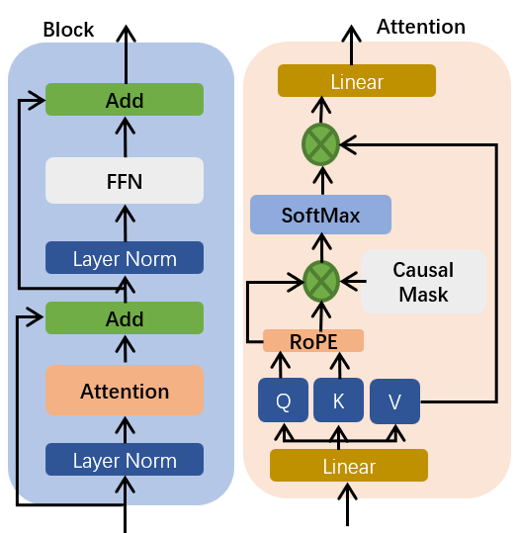

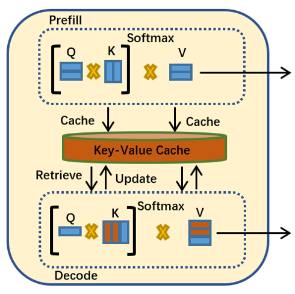

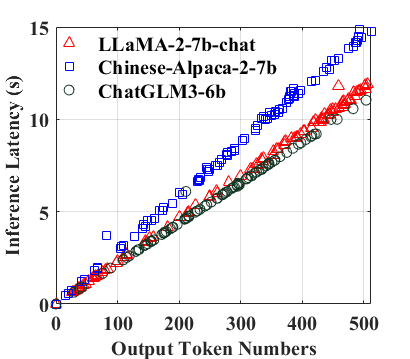

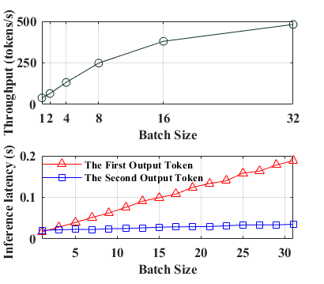

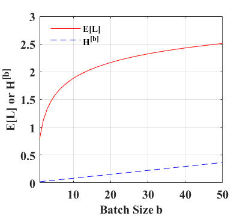

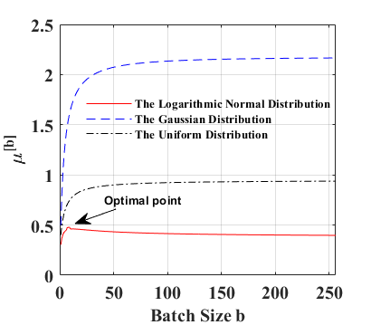

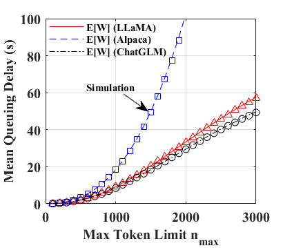

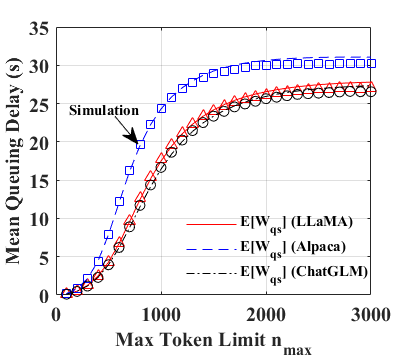

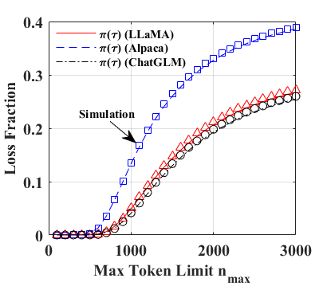

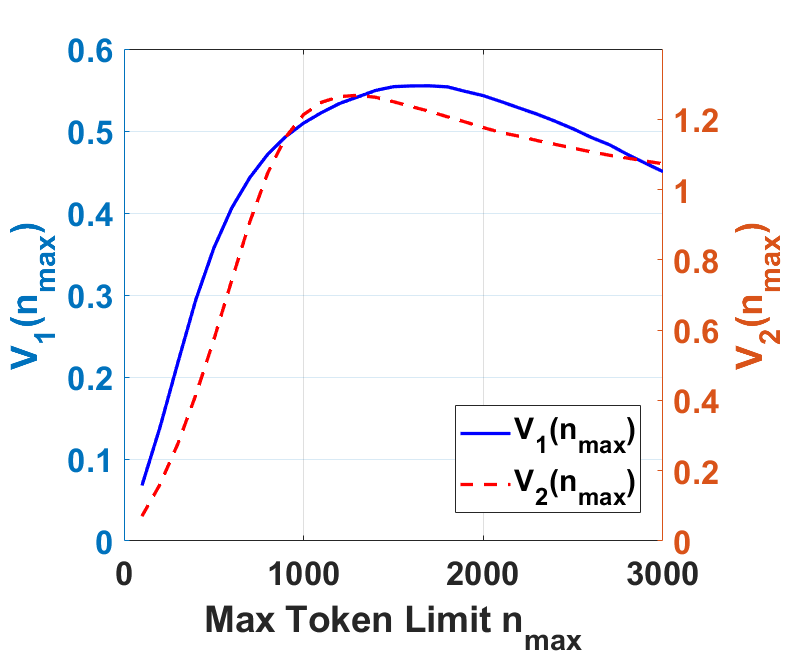

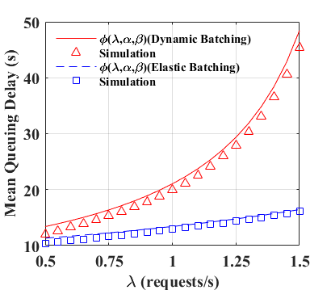

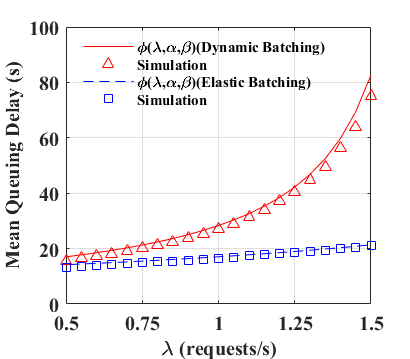

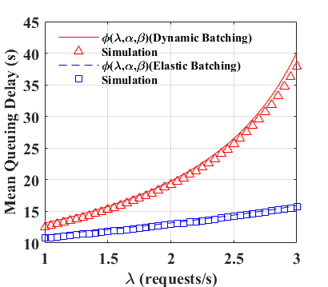

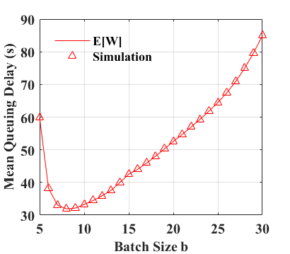

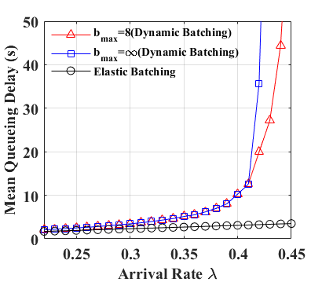

[Arxiv](https://arxiv.org/abs/2407.05347)