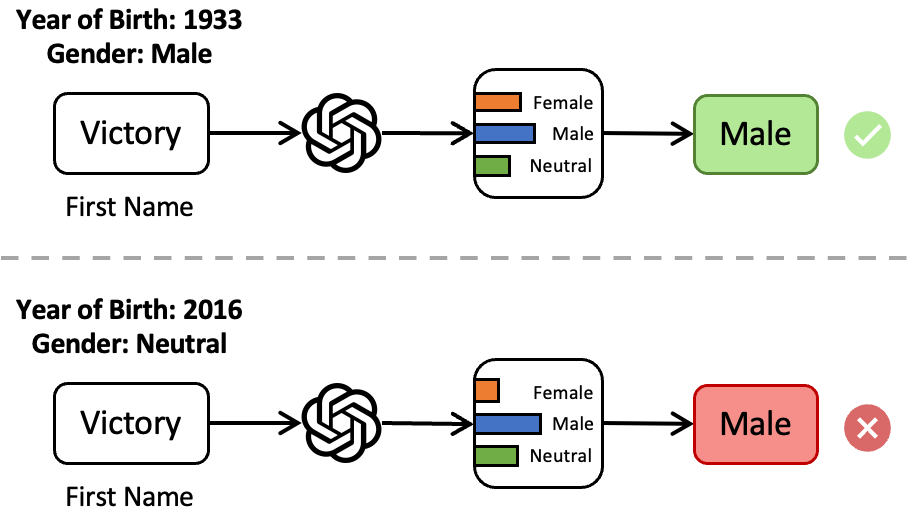
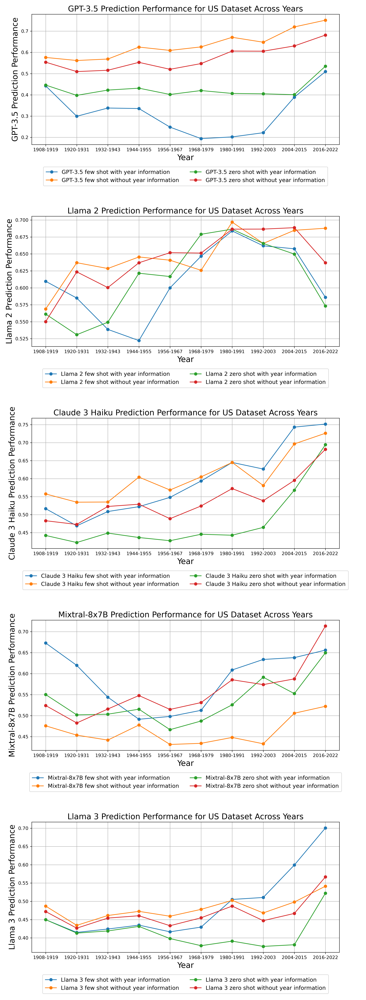
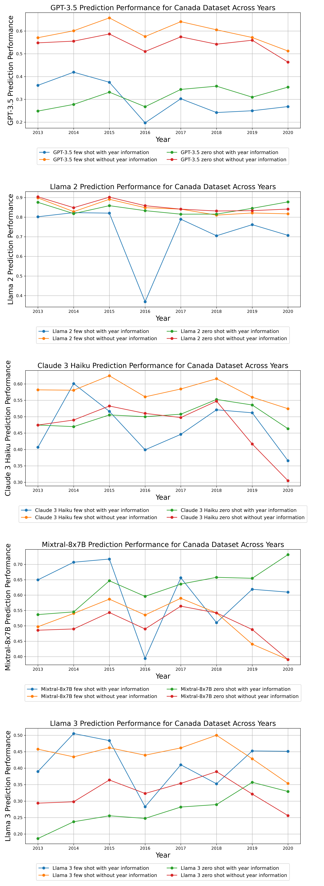
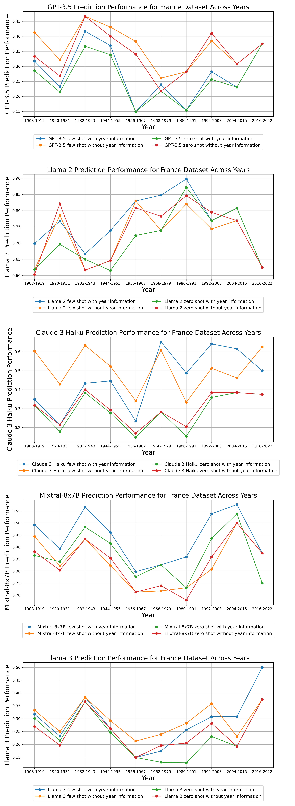

# 揭秘 LLM 中的性别偏见：从无性别标签的名字预测出发

发布时间：2024年07月07日

`LLM应用` `性别研究` `人工智能`

> Beyond Binary Gender Labels: Revealing Gender Biases in LLMs through Gender-Neutral Name Predictions

# 摘要

> 传统上，基于名字的性别预测采用二元分类系统，将个人简单划分为女性或男性。然而，这种做法在处理性别中性名字时显得力不从心，且忽视了性别多样性。为此，我们新增“中性”类别，旨在探索并纠正大型语言模型（LLM）中的性别偏见。我们测试了多个基础及大型模型仅凭名字进行性别预测的能力，并探讨了加入出生年份对预测准确性的影响，以适应名字与性别关联的时代变迁。结果显示，多数LLM在识别传统性别名字时准确率超过80%，但对性别中性名字的识别率不足40%，且英语名字的预测准确性优于非英语名字。实验还表明，引入出生年份并未显著提升预测准确性，尤其是对性别含义随时间变化的名字。因此，我们建议在涉及非二元性别标签的下游任务中，使用LLM进行性别识别时应持谨慎态度。

> Name-based gender prediction has traditionally categorized individuals as either female or male based on their names, using a binary classification system. That binary approach can be problematic in the cases of gender-neutral names that do not align with any one gender, among other reasons. Relying solely on binary gender categories without recognizing gender-neutral names can reduce the inclusiveness of gender prediction tasks. We introduce an additional gender category, i.e., "neutral", to study and address potential gender biases in Large Language Models (LLMs). We evaluate the performance of several foundational and large language models in predicting gender based on first names only. Additionally, we investigate the impact of adding birth years to enhance the accuracy of gender prediction, accounting for shifting associations between names and genders over time. Our findings indicate that most LLMs identify male and female names with high accuracy (over 80%) but struggle with gender-neutral names (under 40%), and the accuracy of gender prediction is higher for English-based first names than non-English names. The experimental results show that incorporating the birth year does not improve the overall accuracy of gender prediction, especially for names with evolving gender associations. We recommend using caution when applying LLMs for gender identification in downstream tasks, particularly when dealing with non-binary gender labels.

[Arxiv](https://arxiv.org/abs/2407.05271)