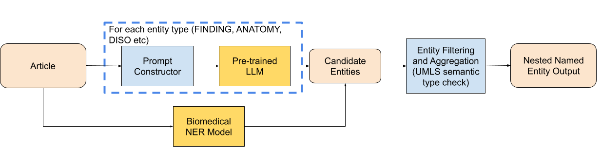
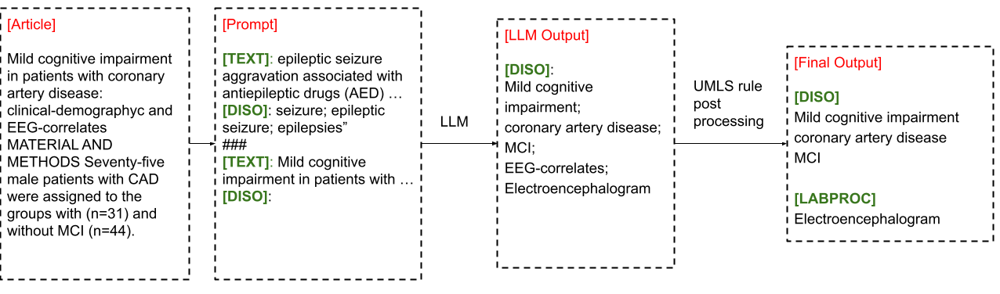

# 结合大型语言模型与UMLS启发式方法的生物医学嵌套NER研究

发布时间：2024年07月07日

`LLM应用` `生物医学`

> Biomedical Nested NER with Large Language Model and UMLS Heuristics

# 摘要

> 本文介绍了一个专为 BioNNE 英语赛道设计的系统，旨在从生物医学文本中提取 8 种嵌套命名实体。我们结合大型语言模型（Mixtral 8x7B instruct）和 ScispaCy NER 模型进行实体识别，并利用 UMLS 语义类型定制分类策略。文章还探讨了系统的性能与局限，并展望了未来的优化方向。该系统在验证集和测试集上的 F1 分数分别为 0.39 和 0.348。

> In this paper, we present our system for the BioNNE English track, which aims to extract 8 types of biomedical nested named entities from biomedical text. We use a large language model (Mixtral 8x7B instruct) and ScispaCy NER model to identify entities in an article and build custom heuristics based on unified medical language system (UMLS) semantic types to categorize the entities. We discuss the results and limitations of our system and propose future improvements. Our system achieved an F1 score of 0.39 on the BioNNE validation set and 0.348 on the test set.

[Arxiv](https://arxiv.org/abs/2407.05480)