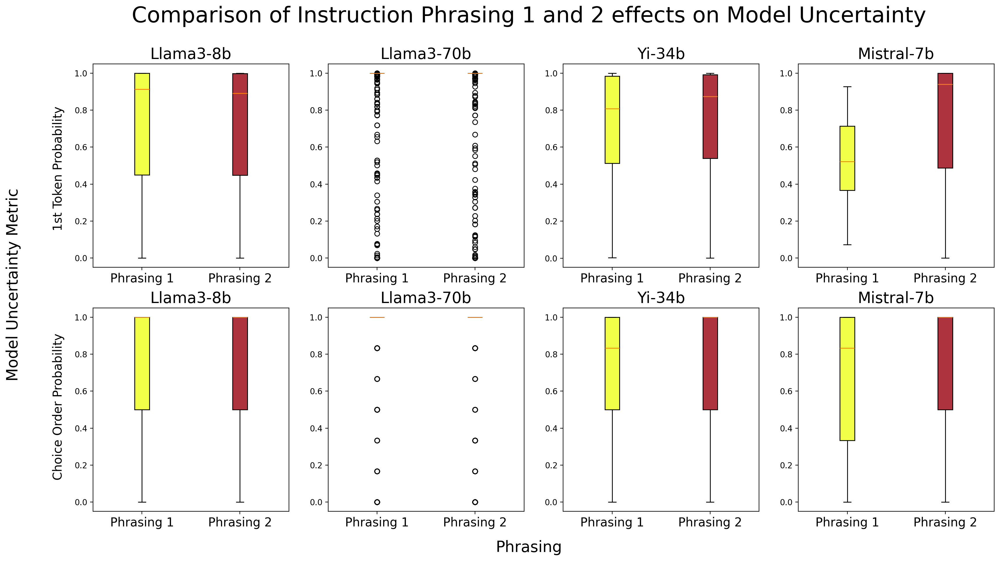

# 模型不确定性是否能代表多项选择题的难度？

发布时间：2024年07月07日

`LLM应用` `人工智能`

> Can Model Uncertainty Function as a Proxy for Multiple-Choice Question Item Difficulty?

# 摘要

> 估计多项选择题的难度对教育者和学习者都极为有益。然而，监督方法在难度估计上的表现参差不齐。本研究巧妙利用生成模型在回答问题时的不确定性，探索其与学生实际反应分布间的关联。我们发现，尽管相关性不强，但模型在答对与答错时的行为迥异，且不同题型的相关性差异显著。基于这些发现，我们提出，进一步挖掘模型不确定性，或能为评估题目难度提供新的视角。

> Estimating the difficulty of multiple-choice questions would be great help for educators who must spend substantial time creating and piloting stimuli for their tests, and for learners who want to practice. Supervised approaches to difficulty estimation have yielded to date mixed results. In this contribution we leverage an aspect of generative large models which might be seen as a weakness when answering questions, namely their uncertainty, and exploit it towards exploring correlations between two different metrics of uncertainty, and the actual student response distribution. While we observe some present but weak correlations, we also discover that the models' behaviour is different in the case of correct vs wrong answers, and that correlations differ substantially according to the different question types which are included in our fine-grained, previously unused dataset of 451 questions from a Biopsychology course. In discussing our findings, we also suggest potential avenues to further leverage model uncertainty as an additional proxy for item difficulty.

[Arxiv](https://arxiv.org/abs/2407.05327)