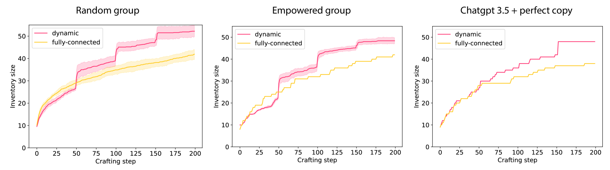

# 大型语言模型群体中的集体创新

发布时间：2024年07月07日

`Agent` `人工智能` `游戏开发`

> Collective Innovation in Groups of Large Language Models

# 摘要

> 人类文化根植于集体创新，即我们不断探索如何将环境中的现有元素重新组合以创造新事物的能力。语言在这一过程中被认为起着核心作用，它不仅推动个体认知发展，还塑造了我们的交流方式。然而，大多数集体创新模型并未考虑代理的认知或语言能力。为此，我们开展了一项计算研究，其中代理是大型语言模型（LLM），它们参与《小炼金术2》这款创意游戏，该游戏能有效模拟创新环境中的关键要素。我们首先单独分析了一个LLM的表现，发现它既有显著技能也存在明显局限。随后，我们考察了共享信息的LLM群体，并深入探讨了社交连接对集体创新表现的影响。研究结果显示，具有动态连接的群体在创新竞赛中超越了完全连接的群体，这与先前的研究相呼应。我们的研究不仅揭示了未来探索集体创新的新机遇，也指出了面临的挑战，特别是在生成式人工智能与人类共同创新的背景下，这些发现显得尤为重要。

> Human culture relies on collective innovation: our ability to continuously explore how existing elements in our environment can be combined to create new ones. Language is hypothesized to play a key role in human culture, driving individual cognitive capacities and shaping communication. Yet the majority of models of collective innovation assign no cognitive capacities or language abilities to agents. Here, we contribute a computational study of collective innovation where agents are Large Language Models (LLMs) that play Little Alchemy 2, a creative video game originally developed for humans that, as we argue, captures useful aspects of innovation landscapes not present in previous test-beds. We, first, study an LLM in isolation and discover that it exhibits both useful skills and crucial limitations. We, then, study groups of LLMs that share information related to their behaviour and focus on the effect of social connectivity on collective performance. In agreement with previous human and computational studies, we observe that groups with dynamic connectivity out-compete fully-connected groups. Our work reveals opportunities and challenges for future studies of collective innovation that are becoming increasingly relevant as Generative Artificial Intelligence algorithms and humans innovate alongside each other.

[Arxiv](https://arxiv.org/abs/2407.05377)