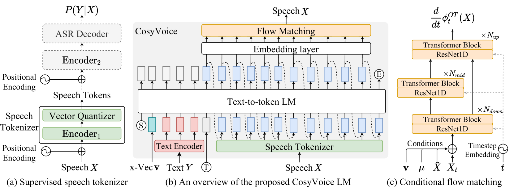
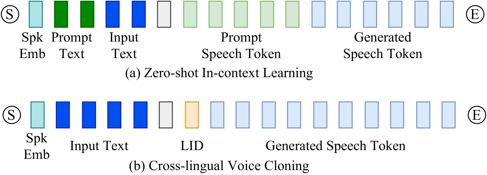

# CosyVoice：一款基于监督语义令牌的，可扩展的多语言零-shot 文本转语音合成器。

发布时间：2024年07月07日

`LLM应用` `语音技术` `人工智能`

> CosyVoice: A Scalable Multilingual Zero-shot Text-to-speech Synthesizer based on Supervised Semantic Tokens

# 摘要

> 近年来，基于大型语言模型的文本到语音技术因其高自然度和零-shot能力而成为主流。我们提出用监督语义令牌表示语音，并基于此开发了可扩展的零-shot TTS合成器CosyVoice。实验表明，监督语义令牌在零-shot语音克隆中表现更优，且利用大规模数据可进一步提升合成性能。这是首次尝试将监督语音令牌引入TTS模型。

> Recent years have witnessed a trend that large language model (LLM) based text-to-speech (TTS) emerges into the mainstream due to their high naturalness and zero-shot capacity. In this paradigm, speech signals are discretized into token sequences, which are modeled by an LLM with text as prompts and reconstructed by a token-based vocoder to waveforms. Obviously, speech tokens play a critical role in LLM-based TTS models. Current speech tokens are learned in an unsupervised manner, which lacks explicit semantic information and alignment to the text. In this paper, we propose to represent speech with supervised semantic tokens, which are derived from a multilingual speech recognition model by inserting vector quantization into the encoder. Based on the tokens, we further propose a scalable zero-shot TTS synthesizer, CosyVoice, which consists of an LLM for text-to-token generation and a conditional flow matching model for token-to-speech synthesis. Experimental results show that supervised semantic tokens significantly outperform existing unsupervised tokens in terms of content consistency and speaker similarity for zero-shot voice cloning. Moreover, we find that utilizing large-scale data further improves the synthesis performance, indicating the scalable capacity of CosyVoice. To the best of our knowledge, this is the first attempt to involve supervised speech tokens into TTS models.

[Arxiv](https://arxiv.org/abs/2407.05407)