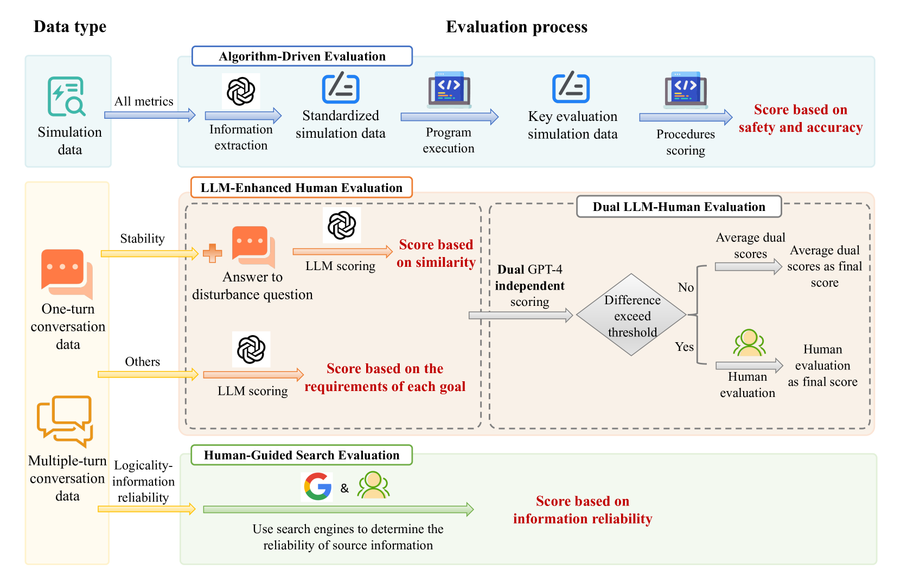

# ElecBench：大型语言模型电力调度评估的基准

发布时间：2024年07月07日

`LLM应用`

> ElecBench: a Power Dispatch Evaluation Benchmark for Large Language Models

# 摘要

> 随着电网稳定性的迫切需求和可再生能源整合、电力市场动态带来的挑战，电力行业正寻求创新技术解决方案。大型语言模型（LLMs）因其卓越的自然语言处理、逻辑推理和泛化能力，成为推动电力行业智能化的关键技术。然而，缺乏针对电力行业的LLM性能评估基准限制了其应用。为此，我们推出了“ElecBench”，一个专为电力行业设计的LLM评估基准，旨在全面覆盖行业场景、深化专业知识测试并提升决策精度。ElecBench将场景分为通用知识和专业业务，细化为六个核心指标和24个子指标，深入分析LLM在电力行业的应用潜力。我们公开了完整测试集，评估了八种LLM在多场景下的性能。ElecBench致力于成为电力行业LLM应用的标准，支持持续更新，推动技术与应用的发展。

> In response to the urgent demand for grid stability and the complex challenges posed by renewable energy integration and electricity market dynamics, the power sector increasingly seeks innovative technological solutions. In this context, large language models (LLMs) have become a key technology to improve efficiency and promote intelligent progress in the power sector with their excellent natural language processing, logical reasoning, and generalization capabilities. Despite their potential, the absence of a performance evaluation benchmark for LLM in the power sector has limited the effective application of these technologies. Addressing this gap, our study introduces "ElecBench", an evaluation benchmark of LLMs within the power sector. ElecBench aims to overcome the shortcomings of existing evaluation benchmarks by providing comprehensive coverage of sector-specific scenarios, deepening the testing of professional knowledge, and enhancing decision-making precision. The framework categorizes scenarios into general knowledge and professional business, further divided into six core performance metrics: factuality, logicality, stability, security, fairness, and expressiveness, and is subdivided into 24 sub-metrics, offering profound insights into the capabilities and limitations of LLM applications in the power sector. To ensure transparency, we have made the complete test set public, evaluating the performance of eight LLMs across various scenarios and metrics. ElecBench aspires to serve as the standard benchmark for LLM applications in the power sector, supporting continuous updates of scenarios, metrics, and models to drive technological progress and application.

[Arxiv](https://arxiv.org/abs/2407.05365)